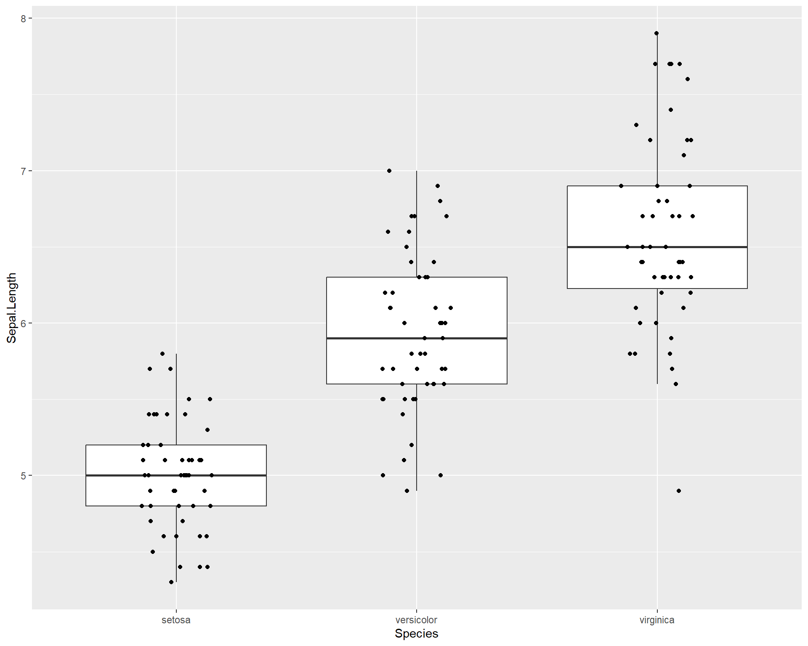

# Data vizualization and review of linear models

After completing this module, students will be able to:

* 2.1 Create figures for graphing continuous and categorical variable

* 2.2 Analyze continuous data using linear models (aka regression) in R

* 2.3 Analyze categorical data using linear models (aka ANOVA) in R 


## Introduction to Data Visualization

Data visualization is a great way to start a statistics course because it is a powerful form of communication. Think about this, where do your eyes normally go to when you read a peer-reviewed paper? For most people its the figures. Oftentimes many academics will structure their papers around several key figures allowing these figures to tell the "story" of the manuscript. As such, effective data viz is a powerful tool for any scientist. Additionally, by setting up the x- and y-axes, it makes us think about the statistical model that we will eventually use to analyze the data. 

In this section, we will begin by practicing plotting data in RStudtio using the iris dataset. The iris dataset contains measurements of plant floral traits across several species. Let's take a look.


``` r
data(iris) # load data (already exists in base R)
```

Quick note: the *#* allows us to make comments in the code without R reading it.  


``` r
str(iris)
```

```
## 'data.frame':	150 obs. of  5 variables:
##  $ Sepal.Length: num  5.1 4.9 4.7 4.6 5 5.4 4.6 5 4.4 4.9 ...
##  $ Sepal.Width : num  3.5 3 3.2 3.1 3.6 3.9 3.4 3.4 2.9 3.1 ...
##  $ Petal.Length: num  1.4 1.4 1.3 1.5 1.4 1.7 1.4 1.5 1.4 1.5 ...
##  $ Petal.Width : num  0.2 0.2 0.2 0.2 0.2 0.4 0.3 0.2 0.2 0.1 ...
##  $ Species     : Factor w/ 3 levels "setosa","versicolor",..: 1 1 1 1 1 1 1 1 1 1 ...
```

The `str()` function allows us to see the structure of the data. The iris dataframe has measurements of 4 traits on 3 species. The traits (Sepal.Lenth, Sepal.Width, Petal.Length, Petal.Width) are continuous, or numeric, variables, whereas the Species column is a factor with three levels (three species). Below we can use the `head()` function to print the first 6 rows of the dataframe.


``` r
head(iris)
```

```
##   Sepal.Length Sepal.Width Petal.Length Petal.Width Species
## 1          5.1         3.5          1.4         0.2  setosa
## 2          4.9         3.0          1.4         0.2  setosa
## 3          4.7         3.2          1.3         0.2  setosa
## 4          4.6         3.1          1.5         0.2  setosa
## 5          5.0         3.6          1.4         0.2  setosa
## 6          5.4         3.9          1.7         0.4  setosa
```

### Continuous Variables

#### Scatterplots with base R

We can start with a simple plot where we plot sepal length by width:


``` r
plot(Sepal.Length~Sepal.Width, data=iris)
```

<div class="figure" style="text-align: center">

<p class="caption">(\#fig:unnamed-chunk-4)Plot of Sepal.Length by Sepal.Width</p>
</div>

We can also specify colors using the "col =" argument within the plot function wrapper.


``` r
plot(Sepal.Length~Sepal.Width, data=iris, col="blue")
```

<div class="figure" style="text-align: center">

<p class="caption">(\#fig:unnamed-chunk-5)Plot of Sepal.Length by Sepal.Width with blue points</p>
</div>

We can get more complex by specifying solid dots with separate colors for each species.


``` r
plot(Sepal.Length~Sepal.Width, 
     data=iris, 
     pch=16,
     col=c("red","blue","purple")[iris$Species]) 
```

<div class="figure" style="text-align: center">

<p class="caption">(\#fig:unnamed-chunk-6)Plot of Sepal.Length by Sepal.Width with different colored points for each of the three species</p>
</div>

We can specify to plot only one species by editing the "data=" argument. The "==" in the code means "exactly equals". Using just "=" will not work.


``` r
### plot only the data for Iris virginica
plot(Sepal.Length~Sepal.Width, 
     data=iris[iris$Species=='virginica',]) ## use brackets to select the columns you want
```

<div class="figure" style="text-align: center">

<p class="caption">(\#fig:unnamed-chunk-7)Plot of Sepal.Length by Sepal.Width for only viriginica species</p>
</div>

Finally, we can add a standard linear trend line across the data. These trend lines can be used to both explore potential relationships in the data and to also show readers or viewers of an established and existing trend.


``` r
plot(Sepal.Length~Sepal.Width, 
     data=iris[iris$Species=='virginica',])
abline(lm(Sepal.Length~Sepal.Width,
          data=iris[iris$Species=='virginica',]))  ## adds trend line for linear model
```

<div class="figure" style="text-align: center">

<p class="caption">(\#fig:unnamed-chunk-8)Plot of Sepal.Length by Sepal.Width with trendline for viriginica species</p>
</div>

#### Scatter plots with ggplot2

In the previous plots we used the basic R commands to plot. But we can also use other packages to ease the coding and specification of plot types. One of these packages is called gpplot2. ggplot2 comes with the metapackage (a package of packages) called the 'tidyverse' package.


``` r
library(tidyverse) ## install tidyverse if necessary
```

More information on how to use ggplot2 can be found [here](https://r4ds.had.co.nz/data-visualisation.html). For the sake of time, we provide a very bare bones but basic introduction to this powerful package in the next few lines.

+------------------------------------------------------------------------------------------------------------------------------------------------------------------------------------------------------------------------------------------------------------------------------------------------------------------------------------------------------------------------------------------+
| **Box 1. ggplot2** is a popular package for many life science researchers because it offer an intuitive way to code graphics. The ggplot language structure uses layers of different *geom* objects. A geom object is essentially what the structure of a ggplot plot object. So a scatter plot would include a geom object for points which is created with the `geom_points()` function. |
+------------------------------------------------------------------------------------------------------------------------------------------------------------------------------------------------------------------------------------------------------------------------------------------------------------------------------------------------------------------------------------------+

The basic framework that ggplot2 revolves around specifying a data set and plotting those data using arguments in the aesthetic section of the ggplot2 code. The data set is specified with the **data=** argument. The aesthetic section of code is specified by the function `aes()`. Within the parentheses of this function you will be able to choose and manipulate a variety of variables from your chosen data set.

Let's start by recreating the simple plot of sepal length by width. Here we set the data = argument to iris because we are plotting data from the iris data set. Noticed we specify the x and y axes within the `aes()` function in the code below. The `ggplot()` merely draws the axes; we need to add the points using the `geom_point()' function. The aestetics will carry through from the main ggplot call.


``` r
ggplot(data=iris, 
       aes(x=Sepal.Width, 
           y=Sepal.Length)) +              
  geom_point() 
```

<div class="figure" style="text-align: center">

<p class="caption">(\#fig:unnamed-chunk-10)Sepal.Length by Sepal.Width made with ggplot</p>
</div>

We can also add colors to the points just like base R using the "color =" argument within the geom_point function. Here we specify the color to be blue. If you want to explore colors and choose different ones, this [website](https://www.datanovia.com/en/blog/awesome-list-of-657-r-color-names/) is an excellent resource.


``` r
ggplot(data=iris, aes(x=Sepal.Width, 
                      y=Sepal.Length)) +                                               
  geom_point(color='blue') 
```

<div class="figure" style="text-align: center">

<p class="caption">(\#fig:unnamed-chunk-11)Sepal.Length by Sepal.Width made using ggplot with blue points</p>
</div>

We can also color the points by species identify by including the "color =" argument within the **aes()** wrapper in the first ggplot line. As previously mentioned, **aes()** sets the aesthetics of the plot based on the data that is being used. The data is specified with the "data =". Therefore, to change colors, sizes etc. of the plot in the context of your data, all arguments should be done typed within the aes() wrapper.


``` r
ggplot(data=iris, aes(x=Sepal.Width, 
                      y=Sepal.Length, 
                      color=Species)) +
  geom_point() 
```

<div class="figure" style="text-align: center">

<p class="caption">(\#fig:unnamed-chunk-12)Sepal.Length by Sepal.Width made using ggplot with different colored points for each species</p>
</div>

What if we want to see the different species in different plot panels? We can do this by using the argument `facet_wrap()`. **facet_wrap()** allows you to facet the plot by a a categorical variable from the data set. In the example below, we facet the plot above by species.


``` r
ggplot(data=iris, aes(x=Sepal.Width, 
                      y=Sepal.Length, 
                      color=Species)) +
  geom_point() +
  facet_wrap(~Species) 
```

<div class="figure" style="text-align: center">

<p class="caption">(\#fig:unnamed-chunk-13)Sepal.Length by Sepal.Width made with ggplot facet-wrapped so each species is in a seperate panel</p>
</div>

Now finally let's redo the plots we did in base R. Let's first plot only one species. We can do this by manipulating the data set being used within the "data =" argument. We filter the original data set "iris" so that only a specific species is being used in the plot. To make things clear, we should also add a title stating how the plot reflects only one species. In the below code we do all this and also show how to change the size of the plot title using the `theme()` function.


``` r
ggplot(data=iris %>% filter(Species=='virginica'),
       aes(x=Sepal.Width, 
           y=Sepal.Length)) +                                       
  geom_point() +
  labs(title = "Plot with only Virginica")  +#we can add a title to the plot using the labs() and specifying the "title =" argument
  theme(plot.title = element_text(size = 25))
```

<div class="figure" style="text-align: center">

<p class="caption">(\#fig:unnamed-chunk-14)Sepal.Length by Sepal.Width made with ggplot with only species viriginica</p>
</div>

Now let's plot the data and add a linear trend line. To do this we use geom_smooth(). Within geom_smooth() we use the argument "method =" to specify the type of trend line. Since we want a linear one based on a linear model we use "lm".


``` r
ggplot(data=iris %>% filter(Species=='virginica'), 
       aes(x=Sepal.Width, 
           y=Sepal.Length)) +                                     
  geom_point() +
  geom_smooth(method='lm')
```

<div class="figure" style="text-align: center">

<p class="caption">(\#fig:unnamed-chunk-15)Sepal.Length by Sepal.Width made using ggplot with trendline for species virginica</p>
</div>

We can also add a separate trend line for all three species. ggplot2 can do this in a very user friendly way. By specifying different colors for different species in the first `ggplot()` line, the usage of `geom_smooth()` automatically applies the categorization by colors to the trend line resulting in separate trend lines for each species.


``` r
ggplot(data=iris, aes(x=Sepal.Width,
                      y=Sepal.Length, 
                      color=Species)) +
  geom_point() +
  geom_smooth(method='lm')
```

<div class="figure" style="text-align: center">

<p class="caption">(\#fig:unnamed-chunk-16)Sepal.Length by Sepal.Width made using ggplot with trendline for each species</p>
</div>

Notice that if we move the "color =" argument to the outside of the aes() and just specify a single color. it changes the colors of all points. This happens because any arguments (e.g. color = ) that are entered out of the **aes()** wrapper do not apply to the data (e.g. species types).


``` r
ggplot(data=iris, aes(x=Sepal.Width,
                      y=Sepal.Length)) + 
  geom_point(color="blue") +   
  facet_wrap(~Species) +
  geom_smooth(method='lm')
```

<div class="figure" style="text-align: center">

<p class="caption">(\#fig:unnamed-chunk-17)Sepal.Length by Sepal.Width made using ggplot with each species on a seperate panel with all blue points</p>
</div>

### Fancy Scatter plots

For more appealing color options we use the 'viridis' package. This package comes with several pre-made colorways or palettes that work well with a variety of plot and data types. Furthermore, many of their palettes are geared to be color-blind friendly which is important especially when publishing visuals.


``` r
library(viridis) ## install viridis package if necassary
```

Let's set up a basic plot from the previous examples shown above. The default colors work fine but could be better and the plot background could also be cleaner and more improved.


``` r
ggplot(data=iris, aes(x=Sepal.Width, 
                      y=Sepal.Length, color=Species)) +
  geom_point() + 
  geom_smooth(method='lm')
```

<div class="figure" style="text-align: center">

<p class="caption">(\#fig:unnamed-chunk-19)Sepal.Length by Sepal.Width made using ggplot with trendline for each species</p>
</div>

We can change the background elements of the plot (a.k.a the "theme") with preset defaults such as `theme_bw()`. These defaults are a quick way to improve the general plot appearance and to also remove possibly distracting plot elements.


``` r
ggplot(data=iris, 
       aes(x=Sepal.Width, 
           y=Sepal.Length, 
           color=Species)) +
  geom_point() + 
  geom_smooth(method='lm') +
  theme_bw()
```

<div class="figure" style="text-align: center">

<p class="caption">(\#fig:unnamed-chunk-20)Sepal.Length by Sepal.Width made using ggplot with trendline for each species and a black and white theme</p>
</div>

We can change the size of the points by adding a "size =" argument in the geom_point(). But what about colors? To change the colors and make the visualization more accessible to people (e.g. making them more color-blind friendly) using the scale_color_virdis(). Within the virdis function, we specify that we want a discrete color scale with "discreet = TRUE". This is because we want to split our regressions and show differences between species which is a categorical variable. If we were hoping to use viridis for continuous variables we would use "discreet = FALSE".


``` r
ggplot(data=iris, aes(x=Sepal.Width, 
                      y=Sepal.Length, color=Species)) +
  geom_point(size=3) + # change point size to make them bigger
  geom_smooth(method='lm') + 
  scale_color_viridis(discrete = TRUE) + # change points to a color-blind friendly palette. Can specify specific colors
  theme_bw() # new theme
```

<div class="figure" style="text-align: center">

<p class="caption">(\#fig:unnamed-chunk-21)Sepal.Length by Sepal.Width made using ggplot with trendline for each species, a black and white theme, and an accessible color palette</p>
</div>

We can change the shapes of the points based on species with the "shape =" argument in the first ggplot() line. We specify that this argument equals "Species" which basically means, set different shapes for different species. We can further specify which shapes we want for the three species with the scale_shape_manual().


``` r
ggplot(data=iris, aes(x=Sepal.Width,
                      y=Sepal.Length,
                      shape=Species)) +
  geom_point(size=3) + 
  geom_smooth(method='lm') +                               
  scale_shape_manual(values=c("circle","square","triangle")) +
  theme_bw()
```

<div class="figure" style="text-align: center">

<p class="caption">(\#fig:unnamed-chunk-22)Sepal.Length by Sepal.Width made using ggplot with trendline and shapes for each species and a black and white theme</p>
</div>

Let's specify with colors and shapes. Here's an annotated code chunk to show exactly what components are being specified for the plot.


``` r
ggplot(data=iris, aes(x=Sepal.Width, #Sets x axis variable
                      y=Sepal.Length, #Sets y axis variable
                      shape=Species, #use different shapes for species
                      color=Species #use different colors for species
                      )) +          
  geom_point(size=3) + #set size if points
  geom_smooth(method='lm') +  #set a linear model trendline           
  scale_color_viridis(discrete=T) + #color palette
  scale_shape_manual(values=c("circle","square","triangle")) + #specify which shapes       
  theme_bw() #different more black and white theme
```

<div class="figure" style="text-align: center">

<p class="caption">(\#fig:unnamed-chunk-23)Sepal.Length by Sepal.Width plot with many specialized features.</p>
</div>

We can also facet the plot above and increase the font size


``` r
ggplot(data=iris, aes(x=Sepal.Width, 
                      y=Sepal.Length,
                      shape=Species,
                      color=Species)) + 
  geom_point(size=3) + 
  geom_smooth(method='lm') +    
  scale_color_viridis(discrete=T) +  
  scale_shape_manual(values=c("circle","square","triangle")) +      
  facet_wrap(~Species) + #facet by species
  theme_bw(base_size = 14) # increase font size for the entire plot
```

<div class="figure" style="text-align: center">

<p class="caption">(\#fig:unnamed-chunk-24)Sepal.Length by Sepal.Width plot with many specialized features, facet-wrapped.</p>
</div>

Some people have to render multiple plots and retyping your theme settings can be a pain! So this is where the beauty of working in R and RStudio come into play. You can set your own theme as a object in R:


``` r
my_theme<-theme(axis.title = element_text(face = "bold",size = 12),
                legend.position = "top",
                axis.ticks = element_blank(),
                axis.text = element_text(color = "blue", size = 11),
                title = element_text(color = "dodgerblue", size = 15))
```

Now you can call on this object `my_theme` any time when making a plot and avoid typing out the several lines of code over and over again:


``` r
ggplot(data=iris, aes(x=Sepal.Width, 
                      y=Sepal.Length,
                      shape=Species,
                      color=Species)) + 
  geom_point(size=3) + 
  geom_smooth(method='lm') +    
  scale_color_viridis(discrete=T) +
  my_theme
```

<div class="figure" style="text-align: center">

<p class="caption">(\#fig:unnamed-chunk-26)Sepal.Length by Sepal.Width plot with specialized features from my theme.</p>
</div>

### Categorical Variables

Categorical variables are usually things with names. In the iris dataset, **Species** is a factor, or a categorical, variable. When plotting with categorical variables, we can no longer use scatterplots, so here we will go through a few different types of plots. 

#### Boxplots with base R

This line of code will make a simple boxplot. Notice the usage of `~`. To avoid errors, make sure your continuous variable comes before `~` and your categorical variable comes after.


``` r
plot(Sepal.Length~Species, data=iris) #make boxplot
```

<div class="figure" style="text-align: center">

<p class="caption">(\#fig:unnamed-chunk-27)Boxplot showing Sepal.Length by the three Species.</p>
</div>

We can add colors to the different boxplots.


``` r
plot(Sepal.Length~Species, data=iris, col=c("red","blue","purple")) #make boxplot with color
```

<div class="figure" style="text-align: center">

<p class="caption">(\#fig:unnamed-chunk-28)Boxplot showing Sepal.Length by the three Species with colors.</p>
</div>

### Plots for categorical data with ggplot2

ggplot2 is also a great tool for plotting categorical data. Boxplots show the distribution of data based on the median and interquartile ranges. To make a boxplot with ggplot we use 'geom_boxplot()'.


``` r
ggplot(iris, aes(x=Species, #variable on x axis
                 y=Sepal.Length #variable on y axis
                 )) + 
  geom_boxplot() #specify boxplot option
```

<div class="figure" style="text-align: center">

<p class="caption">(\#fig:unnamed-chunk-29)Boxplot showing Sepal.Length by the three Species using ggplot.</p>
</div>

If the width of the boxplots are too wide, this can be changed with the "width =" argument:


``` r
ggplot(iris, aes(x=Species, #variable on x axis
                 y=Sepal.Length #variable on y axis
                 )) + 
  geom_boxplot(width = 0.5) #specify boxplot option
```

<div class="figure" style="text-align: center">

<p class="caption">(\#fig:unnamed-chunk-30)Boxplot showing Sepal.Length by the three Species in ggplot.</p>
</div>

We can also overlay points on the boxplots.


``` r
ggplot(iris, aes(x=Species,
                 y=Sepal.Length
                 )) + 
  geom_boxplot() + 
  geom_point()
```

<div class="figure" style="text-align: center">

<p class="caption">(\#fig:unnamed-chunk-31)Boxplot showing Sepal.Length by the three Species in ggplot with points added.</p>
</div>

If there are many overlapping points then the plot above could be misleading i.e. 100 points with the same value would still appear to be one single data point. To clearly assess the scatter of the points we can jitter their position with geom_jitter():


``` r
ggplot(iris, aes(x=Species, y=Sepal.Length)) + 
  geom_boxplot() + 
  geom_jitter()
```

<div class="figure" style="text-align: center">

<p class="caption">(\#fig:unnamed-chunk-32)Boxplot showing Sepal.Length by the three Species in ggplot with points jittered.</p>
</div>

We may want to adjust how much jitter we give the points. This can be done with the "height =" and "width =" arguments.


``` r
ggplot(iris, aes(x=Species, 
                 y=Sepal.Length)) +
  geom_boxplot(outlier.shape=NA) + 
  geom_jitter(height=0, width=.15)
```

<div class="figure" style="text-align: center">

<p class="caption">(\#fig:unnamed-chunk-33)Boxplot showing Sepal.Length by the three Species in ggplot with points jittered.</p>
</div>

We can also make dot plots for the data using geom_dotplot().


``` r
ggplot(iris, aes(x=Species, 
                 y=Sepal.Length)) + 
  geom_dotplot(binaxis = "y", stackdir = "center") 
```

<div class="figure" style="text-align: center">

<p class="caption">(\#fig:unnamed-chunk-34)Dotplot showing Sepal.Length by the three Species in ggplot.</p>
</div>

There are also violin plots with geom_violin(). Violin plots are useful because they show a more user-friendly visual of the distribution of data.


``` r
ggplot(iris, aes(x=Species, y=Sepal.Length)) + 
  geom_violin(trim=F)  
```

<div class="figure" style="text-align: center">

<p class="caption">(\#fig:unnamed-chunk-35)Violin plot showing Sepal.Length by the three Species in ggplot.</p>
</div>

A combination of violin plots with dot plots is also possible.


``` r
ggplot(iris, aes(x=Species, y=Sepal.Length)) + 
  geom_violin(trim=F) + 
  geom_dotplot(binaxis = "y", stackdir = "center") 
```

<div class="figure" style="text-align: center">

<p class="caption">(\#fig:unnamed-chunk-36)Violin plot showing Sepal.Length by the three Species in ggplot with dotplot added.</p>
</div>

Finally, we can also plot violin plots with boxplots! This is very useful because we not only get distribution information from both but we can also roughly see the median values and the inter-quartile ranges!


``` r
ggplot(iris, aes(x=Species, y=Sepal.Length)) + 
  geom_violin(trim=F, bw=.5) + 
  geom_boxplot(width=.1)
```

<div class="figure" style="text-align: center">

<p class="caption">(\#fig:unnamed-chunk-37)Boxplot showing Sepal.Length by the three Species in ggplot with violin plot added.</p>
</div>

#### Adding colors and summary statistics (e.g. averages) to plots

Let's change the color of the boxes. Note we don't use the "color =" argument but instead use the "fill =" argument. This is because fill will affect the fill color inside the box while color will affect the color of the border of the box. Given this, when we use the viridis function for the nicer colors, we specify scale_fill_virdis rather than scale_color_virdis.


``` r
ggplot(iris, aes(x=Species, 
                 y=Sepal.Length, 
                 fill=Species)) + 
  geom_boxplot(outlier.shape=NA) + 
  geom_jitter(height=0, width=.15) + 
  scale_fill_viridis(discrete=T) 
```

<div class="figure" style="text-align: center">

<p class="caption">(\#fig:unnamed-chunk-38)Boxplot showing Sepal.Length by the three Species in ggplot with viridis colors.</p>
</div>

If we want to see the averages or means per species we can do this by using stat_summary() and specifying "mean" with the "fun =" argument. Let's also change the viridis color palette to something different. To do this we can enter the "options=" argument in the viridis function. The options span from A to H but for a details on specific palette options see this [website](https://cran.r-project.org/web/packages/viridis/vignettes/intro-to-viridis.html).


``` r
ggplot(iris, aes(x=Species, y=Sepal.Length, fill=Species)) + 
  geom_boxplot(outlier.shape=NA) + 
  geom_jitter(height=0, width=.15) + 
  scale_fill_viridis(discrete=T, option = "A")  +             
  stat_summary(fun=mean, geom="point", size=4, color="red") ## add point for mean
```

<div class="figure" style="text-align: center">

<p class="caption">(\#fig:unnamed-chunk-39)Boxplot showing Sepal.Length by the three Species in ggplot with means added.</p>
</div>

Let's edit the theme of the plot above


``` r
ggplot(iris, aes(x=Species, y=Sepal.Length, fill=Species)) + 
  geom_boxplot(outlier.shape=NA) + 
  geom_jitter(height=0, width=.15) + 
  scale_fill_viridis(discrete=T, option = "D")  +             
  stat_summary(fun=mean, geom="point", size=4, color="red") +
  theme_bw(base_size = 16) #theme change
```

<div class="figure" style="text-align: center">

<p class="caption">(\#fig:unnamed-chunk-40)Boxplot showing Sepal.Length by the three Species in ggplot with means added.</p>
</div>

To save a plot like this as a .tiff we should first assign the plot as an object in the environment. In the example below we assign is as an object called "plot1" using the "\<-" or "=".


``` r
plot1 <- ggplot(iris, aes(x=Species, 
                          y=Sepal.Length, 
                          fill=Species)) +  ## plot now saved as object called 'plot1'
  geom_boxplot(outlier.shape=NA) + 
  geom_jitter(height=0, width=.15) + 
  scale_fill_viridis(discrete=T)  +             
  stat_summary(fun=mean, geom="point", size=3, color="red") +
  theme_bw(base_size = 16) 
```

Then we use ggsave() function to save the plot into whatever working directory you are using. We can set the dimensions of the image and we specify the plot we want to save using "plot1".


``` r
ggsave("ExamplePlot.tiff", #file name to be used
       plot1, #what plot being saved
       width=4, #width
       height=3, #height
       units="in", #units being used for width and height
       dpi=300) #resolution of photo, higher number = higher res
```

Note that tiff files can often take up a lot of space. This can be a problem when sending quick emails to collaborators. I recommend using the **portable network graphic** format also known as **.png** files. These files are smaller and retain much of the quality of the visualizations.

### Breakout group challenge

For this challenge use the mtcars dataset:


``` r
data(mtcars)
head(mtcars)
```

```
##                    mpg cyl disp  hp drat    wt  qsec vs am gear carb
## Mazda RX4         21.0   6  160 110 3.90 2.620 16.46  0  1    4    4
## Mazda RX4 Wag     21.0   6  160 110 3.90 2.875 17.02  0  1    4    4
## Datsun 710        22.8   4  108  93 3.85 2.320 18.61  1  1    4    1
## Hornet 4 Drive    21.4   6  258 110 3.08 3.215 19.44  1  0    3    1
## Hornet Sportabout 18.7   8  360 175 3.15 3.440 17.02  0  0    3    2
## Valiant           18.1   6  225 105 2.76 3.460 20.22  1  0    3    1
```

1.  Plot x=mpg by y=hp\
2.  Color code points by wt
3.  Add trend line. Make the background white. theme_bw is okay, if time try playing around with other themes.
4.  Make a boxplot of mpg for the three cyl groups. You should have three boxes. If only one, why?
5.  Change colors, themes, add data points, etc.

If data visualization is an interest to you then be sure to check out the following resources for useful code, information, and methods!

[R graph gallery](https://r-graph-gallery.com/ggplot2-package.html)

[Cedric Sherer](https://www.cedricscherer.com/), an amazing ggplot2 user who frequently posts his newest projects and the code

[3-Dimensional Plots](https://www.rayshader.com/)


## Regression as a linear model

Regression analysis is a form of analysis that allows the user to evaluate a response variable as a function of predictor variable in a quantitative and statistical manner. Most people are accustomed to seeing regressions in the form of simple linear regressions, also known as ordinary least squares (OLS) regression. The equation $$y = \beta_{0} + \beta_{1}*x + \varepsilon$$ is the basic linear regression equation, where the terms mean the following:  
  $y$ is the **response variable**  
  $\beta_{0}$ is the **intercept**  
  $\beta_{1}$ is the **slope**  
  $x$ is the **predictor variable** and  
  $\varepsilon$ are the residuals.  

The key features that make this type of linear model a *regression* are that the response variable and predictor variables are both continuous variables. We will use different versions of this linear model throughout the book.

### An Example of Linear Regression in R

For this section we will use the tidyverse, car, and glmmTMB packages. For constructing the linear model we will use the function `glmmTMB()`. There are simpler alternatives to `glmmTMB` but we will start with this because it is very flexible and we will use it throughout the course for more complex models. The more simple alternative to run a linear regression is the function `lm()`, which is built into the base R libraries. The results from `lm()` and `glmmTMB()` should be nearly identical. The limitation of `lm()` is that is can only run a linear regression and not more complex models. Starting with `glmmTMB()` will allow us to use this throughout the course without switching functions for different types of linear models. More later, but let's get started.


``` r
library(tidyverse)
library(car)
library(glmmTMB)
```

For this example, we will generate random numbers to create a data set that we can use to apply a linear model to. To make things reproducible (ie. so everyone gets the same results from the random numbers) we will need to set a seed. To do this we use the function `set.seed()`. If everyone uses the same seed they will get the same random numbers that are generated from the following code. Setting seeds is an important practice for scientific reproducibility and will be more common as your analyses become more complex.


``` r
#Set Seed
set.seed(21)
```


``` r
# Generate random data
temp <- round(runif(20,12,30), 2)            
mass <- round(rnorm(20,5*temp,25), 2)
r1 <- as.data.frame(cbind(temp,mass)) 
```

This is the data set we will now use for the example:


``` r
head(r1)
```

```
##    temp   mass
## 1 26.15  73.83
## 2 16.54 101.64
## 3 24.59 109.24
## 4 15.32  80.91
## 5 29.27 160.42
## 6 28.54 180.50
```

In this dataset, **temp** represent rearing temperature in Celsius and **mass** is the mass of adults in milligrams. Basically, we want to know if adult mass increases with warmer temperatures. Let's plot this data:


``` r
ggplot(r1, aes(x=temp, y=mass))+
  geom_point(size = 5, 
             pch = 21, 
             fill = "gray", 
             color = "black", width = 2)+
  theme_bw(base_size = 14)
```

<div class="figure" style="text-align: center">

<p class="caption">(\#fig:unnamed-chunk-48)temp by mass.</p>
</div>

Definitely looks like a positive correlation. Now let's construct a linear model to estimate the change in average adult mass per degree Celsius of temperature increase. For a continuous variable (temperature in Celsius), we are interested in estimating the slope ($\beta_{1}$) between mass and temperature.

We can set up the model using the `lm()` function. The variable specified before (ie. left-hand size) "\~" is your response (mass in this case) and the variable specified after (ie. right-hand side) is your predictor (temperature in this case).


``` r
lm1 <- glmmTMB(mass~temp, data=r1) # all  "calculations" are saved in an object we called 'lm1'
```

We can construct an ANOVA table of this model. The ANOVA table tests the null hypothesis that the slope is different than zero. It's not not as useful for regressions compared to actual categorical variable analyses but still worth to look at.


``` r
Anova(lm1, type=2)  
```

```
## Analysis of Deviance Table (Type II Wald chisquare tests)
## 
## Response: mass
##       Chisq Df Pr(>Chisq)    
## temp 25.707  1  3.973e-07 ***
## ---
## Signif. codes:  0 '***' 0.001 '**' 0.01 '*' 0.05 '.' 0.1 ' ' 1
```

To see the summary of the model coefficients we use `summary()`.


``` r
summary(lm1)
```

```
##  Family: gaussian  ( identity )
## Formula:          mass ~ temp
## Data: r1
## 
##      AIC      BIC   logLik deviance df.resid 
##    187.3    190.3    -90.6    181.3       17 
## 
## 
## Dispersion estimate for gaussian family (sigma^2):  506 
## 
## Conditional model:
##             Estimate Std. Error z value Pr(>|z|)    
## (Intercept)   9.8625    19.0484   0.518    0.605    
## temp          4.3716     0.8622   5.070 3.97e-07 ***
## ---
## Signif. codes:  0 '***' 0.001 '**' 0.01 '*' 0.05 '.' 0.1 ' ' 1
```

The coefficients allow you rebuild the means from the linear model equation (same as above): $$y = \beta_{0} + \beta_{1}*x + \varepsilon$$ 
In this case, the intercept ($\beta_{0}$) is conveniently labeled *(Intercept)* and the slope ($\beta_{1}$) is labeled *temp*. The estimated coefficients are displayed under *Estimate*, along with the standard error and tests of significance.

We can also look at the model coefficients with `fixef()`.


``` r
fixef(lm1)
```

```
## 
## Conditional model:
## (Intercept)         temp  
##       9.862        4.372
```

We can take these coefficients and plug them into our linear model equation, like this: 

$$y = 9.86 + 4.37*x + \varepsilon$$

We can make a plot with the best-fit regression line and intercept. 


``` r
ggplot(r1, aes(x=temp, y=mass))+
  geom_point(size=3)+
  geom_smooth(method="lm")+
  theme_bw()
```

<div class="figure" style="text-align: center">

<p class="caption">(\#fig:unnamed-chunk-53)mass plotted against temp with linear regression line.</p>
</div>

The intercept value of 9.86 is where the prediction line cross the y-intercept when x=0. We can't quite see that on the figure above, but you can imagine it. The slope value of 4.37 is perhaps a little more interesting. It means that for each 1 degree C increase in temp, the average adult mass increases by 4.37mg. With those two parameters, we can make predictions about the average adult mass at any temperature. These predictions of average mass is what is represented by the blue line in the figure above. 

To check assumptions of the model, we examine residuals.

+--------------------------------------------------------------------------------------------------------------------------------------------------------------------------------------------------------------------------------------------------------------------------------------------------------------------------------------------------------------------------------------------------+
| **Box 2. Residuals.**                                                                                                                                                                                                                                                                                                                                                                            |
|                                                                                                                                                                                                                                                                                                                                                                                                  |
| A quick note on residuals. Many people assume the normality assumption can be assessed by assessing the normality of the response variables. This is a common mistake as the assumption of normality rests on the residuals or the error term of the model, essentially what is not explained by the model. Therefore, to assess normality in a model you assess the normality of the residuals/ |
+--------------------------------------------------------------------------------------------------------------------------------------------------------------------------------------------------------------------------------------------------------------------------------------------------------------------------------------------------------------------------------------------------+

We can check normality of residuals with a histogram. Note others sometimes use a Shapiro-Wilkes test on the residuals to statistically test for significance in the normality of residuals, which can be problematic (we will return to those problems in Module 3). Visual assessment of the residuals is almost always sufficient to assess model fit.


``` r
hist(resid(lm1))
```

<div class="figure" style="text-align: center">

<p class="caption">(\#fig:unnamed-chunk-54)Histogram of residuals.</p>
</div>

We can check the homogeneity of the residuals by plotting the residuals against the model's fitted values. The residuals should be evenly dispersed around 0 across the range of x values. Funnel shapes or curvature in the dispersion would indicate violations.


``` r
plot(resid(lm1)~fitted(lm1)) 
abline(h=0)  
```

<div class="figure" style="text-align: center">

<p class="caption">(\#fig:unnamed-chunk-55)Residuals plotted against fitted values.</p>
</div>

Using the car package we can also make a qqplot (quantile-quantile plot). Residuals should line up pretty closely to the blue line and points that drift from line may be outlier points.


``` r
qqPlot(resid(lm1))
```

<div class="figure" style="text-align: center">

<p class="caption">(\#fig:unnamed-chunk-56)QQplot of residuals.</p>
</div>

```
## [1] 1 6
```


In our example, the residuals look fine; no problems. Problems with residuals indicate assumptions of the linear model are violated and may cause problems with coefficients and p-values. These problems can span a variety of examples such as: inaccurate model estimates, high errors in model predictions, false-positive statistical significance etc. To alleviate potential issues applying transformations to the data may help. It's useful to note that assumptions can be slightly violated without causing problems. For more reading check this [paper](https://pubmed.ncbi.nlm.nih.gov/33963496/) out!

Finally, we can now make a fancy plot of this model.


``` r
ggplot(r1, aes(x=temp,
               y=mass)) +
  geom_point(size=3,color='blue') +
  geom_smooth(method='lm', fill="blue", alpha=.1) +
  labs(x = "Temperature", y = "Mass") +
  theme_bw() +
  theme(axis.title = element_text(face = "bold", size = 14)) 
```

<div class="figure" style="text-align: center">

<p class="caption">(\#fig:unnamed-chunk-57)Nice looking plot of mass by temp.</p>
</div>

### Regression Challenge

Run the code shown below to answer questions regarding the orange data set. The data set has measurements of circumference on five trees at seven time points.


``` r
data("Orange")  ## load Orange dataset from base R
head(Orange)  
```

```
## Grouped Data: circumference ~ age | Tree
##   Tree  age circumference
## 1    1  118            30
## 2    1  484            58
## 3    1  664            87
## 4    1 1004           115
## 5    1 1231           120
## 6    1 1372           142
```

Healthy orange trees typically produce fruit at 100 cm in circumference. A homeowner calls and says their orange tree is 3 years old (1095 days), but isn't fruiting. They didn't measure it. They also said their are some white spots on the leaves.

Build a linear model (and make plot) to answer the following questions.

1.  What circumference should their tree be, on average?
2.  Should their tree be fruiting by now?
3.  What advice would you give the grower?
4.  Are the model assumptions met?
5.  Make a nice figure.

## ANOVA as a linear model

Let's load the necessary packages for an introduction to ANOVAs (Analysis of Variance).


``` r
library(tidyverse)
library(car) 
library(glmmTMB)
library(emmeans)     # emmeans package, helpful for getting means from linear models
```

### Example of a one-way ANOVA in R

For this section we will use the insect spray data set. The dataset contains counts of insects in plots with different insecticides applied. We want to know which insecticides, if any, are effective at reducing insect counts. Each insecticide treatment is replicated in eight plots.


``` r
data("InsectSprays")
str(InsectSprays)
```

```
## 'data.frame':	72 obs. of  2 variables:
##  $ count: num  10 7 20 14 14 12 10 23 17 20 ...
##  $ spray: Factor w/ 6 levels "A","B","C","D",..: 1 1 1 1 1 1 1 1 1 1 ...
```

``` r
head(InsectSprays)
```

```
##   count spray
## 1    10     A
## 2     7     A
## 3    20     A
## 4    14     A
## 5    14     A
## 6    12     A
```

Let's filter the data to just 4 treatments using some 'dplyr' functions. We filter *InsectSprays* and create a new dataframe called *d*. Spray *F* if the the control and the other three are experimental sprays.


``` r
d <- InsectSprays %>% filter(spray=='A'|spray=='B'|spray=='C'|spray=='F') %>%
  droplevels()
```

After that, we can plot the data using boxplots.


``` r
ggplot(d, aes(x=spray,y=count)) + 
  geom_boxplot(outlier.shape = NA) + # need to suppress outliers if you jitter plot points
  geom_jitter(height=0,width=.1) 
```

<div class="figure" style="text-align: center">

<p class="caption">(\#fig:unnamed-chunk-62)Boxplot showing counts of insects in the different treatments.</p>
</div>

Let's construct linear model to examine the effect of the different sprays on insect counts. For a categorical variable (spray with four levels), we are interested in comparing group means. We use a model very similar to the regression we used in the previous section, but here our predictor variable is just different groups rather than a continuous *x* variable. Here is the modified model: $$y = \beta_{0} + \beta_{i} + \varepsilon$$ is the basic linear regression equation, where the terms mean the following:  
  $y$ is the **response variable**  
  $\beta_{0}$ is the **intercept**  
  $\beta_{i}$ is the **adjustment to the intercept** for each group $_{i}$ and  
  $\varepsilon$ are the residuals.  
For this example, we have four groups and so also four coefficients. The first alphabetical group (Spray *A*) will be assigned the intercept ($\beta_{0}$) and the other three sprays will be adjustments to the intercept ($\beta_{1:3}$). First lets setup the model:


``` r
lm2 <- glmmTMB(count~spray, data=d) 
```

To compare group means we can use the `Anova()`.


``` r
Anova(lm2, type=2) 
```

```
## Analysis of Deviance Table (Type II Wald chisquare tests)
## 
## Response: count
##        Chisq Df Pr(>Chisq)    
## spray 86.656  3  < 2.2e-16 ***
## ---
## Signif. codes:  0 '***' 0.001 '**' 0.01 '*' 0.05 '.' 0.1 ' ' 1
```

In the above case, the null hypothesis is that all group means are equal (group means would be the means of treatment types). With the low p-value, we can say at least one of the sprays is different than one other spray. But which ones? 

+--------------------------------------------------------------------------------------------------------------------------------------------------------------------------------------------------------------------------------------------------------------------------------------------------------------------------------------------------------------------------------------------------+
| **Box 3. Sums of Squares**                                                                                                                                                                                                                                                                                                                                                                                                                                                                  |
|                                                                                                                                                                                                                                                                                                                                                                                                  |
| A quick note on Sums of Squares. Specifying the argument, "`type = 2`", provides Type II sums of squares, which is usually better than the default Type I, especially for more complicated models. Note that Type II Sums of Squares is different than how they are calculated in SAS (in SAS, Type III is often preferred). In the car package in R Type II is usually preferred. Other functions (`anova()`, `aov()`, etc.) will provide similar ANOVA tables, but the `Anova()` is more flexible./ |
+--------------------------------------------------------------------------------------------------------------------------------------------------------------------------------------------------------------------------------------------------------------------------------------------------------------------------------------------------------------------------------------------------+


Now let's look at the summary of the model to examine the coefficients.


``` r
summary(lm2)
```

```
##  Family: gaussian  ( identity )
## Formula:          count ~ spray
## Data: d
## 
##      AIC      BIC   logLik deviance df.resid 
##    287.6    297.0   -138.8    277.6       43 
## 
## 
## Dispersion estimate for gaussian family (sigma^2):   19 
## 
## Conditional model:
##             Estimate Std. Error z value Pr(>|z|)    
## (Intercept)  14.5000     1.2592  11.516  < 2e-16 ***
## sprayB        0.8333     1.7807   0.468    0.640    
## sprayC      -12.4167     1.7807  -6.973 3.11e-12 ***
## sprayF        2.1667     1.7807   1.217    0.224    
## ---
## Signif. codes:  0 '***' 0.001 '**' 0.01 '*' 0.05 '.' 0.1 ' ' 1
```

We can plug these coefficients into our equation above to get the means for each group. For example, the means for "*Spray A*" is the intercept, so 14.5. The mean for "*Spray B*" we have to calculate as 14.5 + 0.8333 = 15.333 and so on for the other sprays. In this example, rebuilding the model from the coefficients is not super helpful and the p-values aren't very meaningful. To address this, we can use the package 'emmeans' and the function `emmeans()` which will rebuild the model for you. It will print off the means, SE, and confidence intervals for each treatment group! While this can be done with manual coding, the package allows this to be done across different types of models with just one function!


``` r
emmeans(lm2, ~spray) 
```

```
##  spray emmean   SE df lower.CL upper.CL
##  A      14.50 1.26 43   11.961    17.04
##  B      15.33 1.26 43   12.794    17.87
##  C       2.08 1.26 43   -0.456     4.62
##  F      16.67 1.26 43   14.127    19.21
## 
## Confidence level used: 0.95
```

We can also look at pairwise differences between groups and automatically adjust p-values using "tukey" adjust. Pairwise comparisons are useful as they allow us to understand the full extent of differences in means between specific treatment types.


``` r
emmeans(lm2, pairwise~spray) 
```

```
## $emmeans
##  spray emmean   SE df lower.CL upper.CL
##  A      14.50 1.26 43   11.961    17.04
##  B      15.33 1.26 43   12.794    17.87
##  C       2.08 1.26 43   -0.456     4.62
##  F      16.67 1.26 43   14.127    19.21
## 
## Confidence level used: 0.95 
## 
## $contrasts
##  contrast estimate   SE df t.ratio p.value
##  A - B      -0.833 1.78 43  -0.468  0.9657
##  A - C      12.417 1.78 43   6.973  <.0001
##  A - F      -2.167 1.78 43  -1.217  0.6198
##  B - C      13.250 1.78 43   7.441  <.0001
##  B - F      -1.333 1.78 43  -0.749  0.8767
##  C - F     -14.583 1.78 43  -8.190  <.0001
## 
## P value adjustment: tukey method for comparing a family of 4 estimates
```

We should also check assumptions of the model.


``` r
hist(resid(lm2)) ## residuals should be normally distributed
```

<div class="figure" style="text-align: center">

<p class="caption">(\#fig:unnamed-chunk-68-1)Residual plots.</p>
</div>

``` r
plot(resid(lm2)~fitted(lm2))  ## residuals should be evenly dispersed
abline(h=0)                           
```

<div class="figure" style="text-align: center">

<p class="caption">(\#fig:unnamed-chunk-68-2)Residual plots.</p>
</div>


``` r
qqPlot(resid(lm2))
```

<div class="figure" style="text-align: center">

<p class="caption">(\#fig:unnamed-chunk-69)QQplot of residuals.</p>
</div>

```
## [1] 45 46
```

Boxplots of residuals across treatment types should show that the variances should be homogeneous for each group.


``` r
boxplot(resid(lm2) ~ d$spray)  
```

<div class="figure" style="text-align: center">

<p class="caption">(\#fig:unnamed-chunk-70)Boxplot of residuals.</p>
</div>

Problems with residuals indicate assumptions of the linear model are violated and may cause problems with coefficients and p-values. Transforming the data or using a different type of model may help (we will return to this example later in the book to improve it). Again, assumptions can be slightly violated without causing problems, for example this model is totally fine but could be better. It is best practice to be transparent with residual diagnostics.

### ANOVA Challenge

Have a look at the dataset below. Baby chickens were fed different diets and they were weighed after 10 days. The variable 'weight' is the weight of a baby chicken (g); 'feed' is the type of type of diet the chicken was fed.


``` r
d1 <- chickwts
head(d1)
```

```
##   weight      feed
## 1    179 horsebean
## 2    160 horsebean
## 3    136 horsebean
## 4    227 horsebean
## 5    217 horsebean
## 6    168 horsebean
```

1.  Construct a linear model to analyze the data. Is there evidence at least one mean is different than another?

2.  How much variation in the data does the model explain?

3.  The feed 'casein' is the standard chicken diet. What types of feed are significantly worse than 'casein'. By how much are they worse?

4.  Are the assumptions met?

5.  Make a nice looking figure. show all the data.

## Extra Data Visualization

This section covers some more advanced plotting with ggplots

Let's load the necessary libraries or packages


``` r
library(tidyverse)
library(emmeans)
```

### Adding Model Averages to Plots

In the previous section of data visualization we learned how to create a boxplot with averages based on species. Just like this:


``` r
ggplot(iris, aes(x=Species, y=Sepal.Length, fill=Species)) + geom_boxplot(outlier.shape=NA) + 
  geom_jitter(height=0, width=.15) + 
  scale_fill_manual(values=c("#E69F00", "#56B4E9", "#009E73"))  +     
  stat_summary(fun=mean, geom="point", size=5, color="red")
```


The `stat_summary` option doens't allow a lot of flexibility. We can do better by calculating the means and SE ourself to use in the plot. We can do this by constructing a linear model to estimate means and standard errors of the means for plotting. First we construct the model.


``` r
sl1 <- lm(Sepal.Length~Species, data=iris)
```

Then we use `emmeans()` to calculate the means and also pipe it as a data.frame. Basically what this is doing if we were to verbally explain is: "We first calculate the averages and the errors of those averages from the model. We then turn this information into a data.frame so we can access individual values for plotting".


``` r
sl_means <- emmeans(sl1, ~Species) %>% as.data.frame() ## saves emmeans as dataframe
head(sl_means)
```

```
##  Species    emmean         SE  df lower.CL upper.CL
##  setosa      5.006 0.07280222 147 4.862126 5.149874
##  versicolor  5.936 0.07280222 147 5.792126 6.079874
##  virginica   6.588 0.07280222 147 6.444126 6.731874
## 
## Confidence level used: 0.95
```

With the object sl_means we can make bar plots with standard error bars.


``` r
ggplot(sl_means, aes(x=Species, y=emmean)) + 
  geom_bar(stat="identity", color="black", fill='grey') + 
  geom_errorbar(aes(ymin=(emmean-SE), ymax=(emmean+SE)), width=.2)
```


We can tidy up the plot.


``` r
ggplot(data = sl_means, 
       aes(x=Species, y=emmean)) +
  geom_bar(stat="identity", 
           color="black", 
           fill='grey', 
           width=.5) + 
  geom_errorbar(aes(ymin=(emmean-SE), 
                    ymax=(emmean+SE)),
                width=.2) + ## make bars thinner
  geom_hline(yintercept = 0) + 
  theme(panel.background = element_blank(), 
        panel.border = element_rect(color="black",
                                    fill=NA, 
                                    size=2)) +            ## change "theme" so the background is blank and the border is thicker
  theme(axis.ticks.length=unit(0.3, "cm"),  
        axis.text.x = element_text(margin=margin(5,5,5,5,"pt"),colour="black"),
        axis.text.y = element_text(margin=margin(5,5,5,5,"pt"),colour="black")) +  ## change axis tick marks to make them a little longer
  theme(text = element_text(size=20)) 
```


We can also add points to the barplot.


``` r
ggplot() + 
  geom_bar(data=sl_means, 
           aes(x=Species, y=emmean), 
           stat="identity", 
           color="black", 
           fill='grey', 
           width=.5) + 
  geom_errorbar(data=sl_means ,
                aes(x=Species, 
                    y=emmean, 
                    ymin=(emmean-SE), 
                    ymax=(emmean+SE)), 
                width=.2) + ## make bars thinner
  geom_jitter(data=iris, 
              aes(x=Species,
                  y=Sepal.Length), 
              height=0, 
              width=.15) +
  theme(panel.background = element_blank(),  
        panel.border = element_rect(color="black", 
                                    fill=NA, 
                                    size=2)) +            ## change "theme" so the background is blank and the border is thicker
  theme(axis.ticks.length=unit(0.3, "cm"),  
        axis.text.x = element_text(margin=margin(5,5,5,5,"pt"),
                                   colour="black"),
        axis.text.y = element_text(margin=margin(5,5,5,5,"pt"),
                                   colour="black")) +  ## change axis tick marks to make them a little longer
  theme(text = element_text(size=20)) 
```


We can also try a dot plot with standard error bars.


``` r
ggplot() + 
  geom_jitter(data=iris,
              aes(x=Species,
                  y=Sepal.Length), 
              height=0, 
              width=.1) +
  geom_point(data=sl_means, 
             aes(x=Species, y=emmean),
             color="red", 
             size=5) + 
  geom_errorbar(data=sl_means,
                aes(x=Species,
                    y=emmean, 
                    ymin=(emmean-SE), 
                    ymax=(emmean+SE)), 
                width=.2, 
                color="red", 
                lwd=2) + ## make bars thinner
  theme(panel.background = element_blank(), 
        panel.border = element_rect(color="black", 
                                    fill=NA, 
                                    size=2)) +            ## change "theme" so the background is blank and the border is thicker
  theme(axis.ticks.length=unit(0.3, "cm"),  
        axis.text.x = element_text(margin=margin(5,5,5,5,"pt"),colour="black"),
        axis.text.y = element_text(margin=margin(5,5,5,5,"pt"),colour="black")) +  ## change axis tick marks to make them a little longer
  theme(text = element_text(size=20)) 
```


### Extra R Challenge

1.  From R file 1c_R Intro_anova #5. Make a nice looking plot that includes the mean and SE of chick weight for the six feeds.
2.  Try making a boxplot with jittered points and then overlay the mean +/- SE in a large dot of a different color.
3.  Try changing the color of each box. Customize the colors, themes, etc. to make it look nice and readable.

## ggplot2 app via Shiny

This shinyapp will allow you to practice and implement ggplot2 commands. You can specify custom plot commands and view the actual product (the plot) as well as the code necessary to generate that plot.


``` r
knitr::include_app("https://leoohyama.shinyapps.io/ggplot_practice/",
  height = 800)
```

<iframe src="https://leoohyama.shinyapps.io/ggplot_practice/?showcase=0" width="100%" height="800" data-external="1"></iframe>
