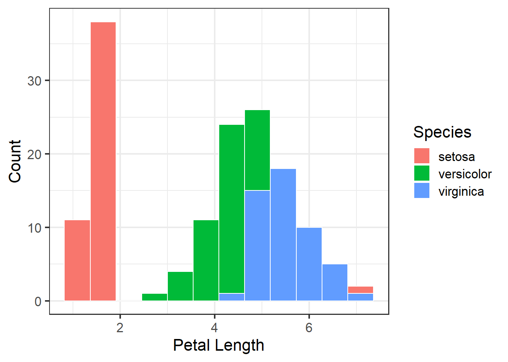
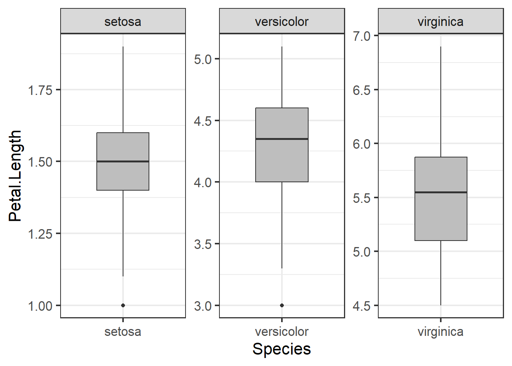
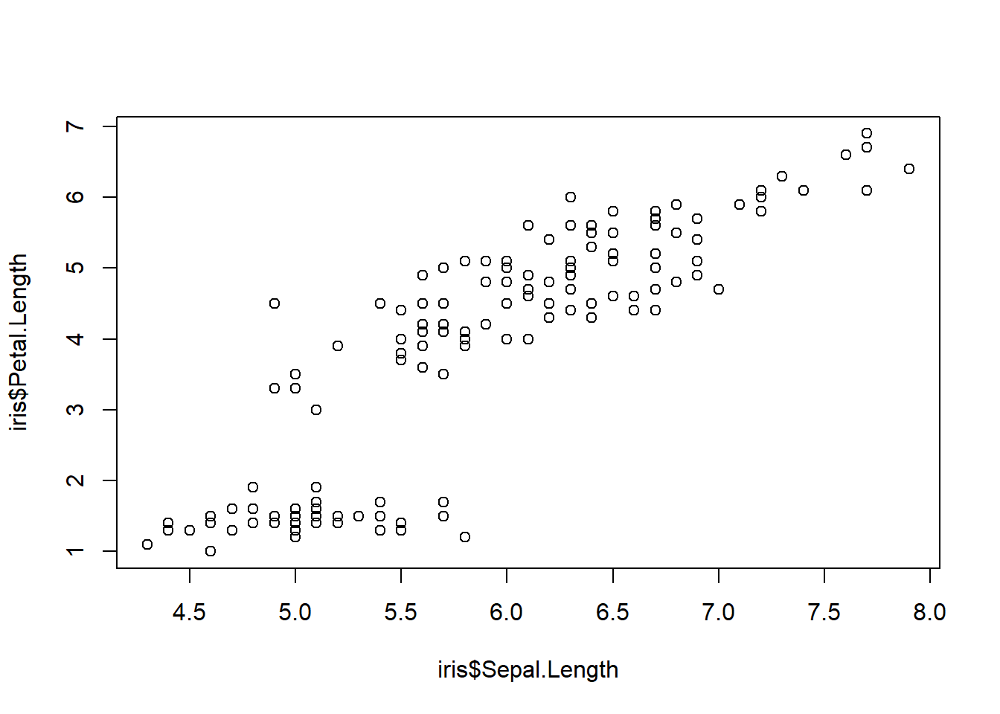
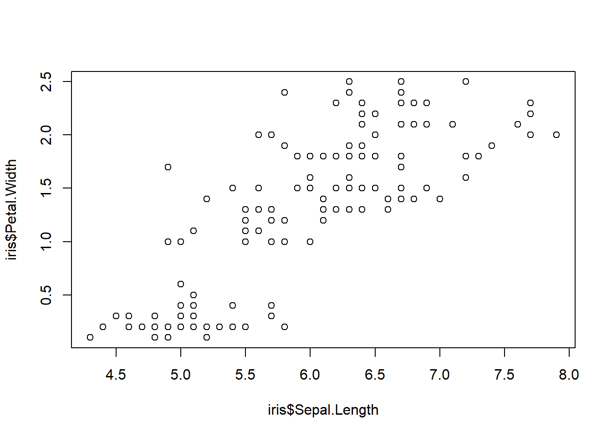

# Data Management and Exploration

After completing this module, students will be able to:

* 3.1 Describe the structure of data set and variables

* 3.2 Summarize variables in a dataset

* 3.3 Conduct exploratory analyses using tidyverse in R

* 3.4 Compare AIC scores to select among competing models


## Data Management

A key element to managing data in the RStudio GUI (graphic user interface) is to understand the structure of the data set(s) you are working with. While there are plenty of ways to do this, the basic and important functions will be explained in this section. First, we will go over examining your data set at a very basic level.

We will practice using the iris dataset, which we used in the previous chapter.


``` r
data(iris) # load data (already exists in base R)
```

Sometimes, we want to see the data that make up our data set. The best way may be to simply just skim the top or bottom rows of the data set or dataframe. To do this we can use the `head()` and `tail()` function in R. These functions will print out the first or last several lines of the data set.


``` r
head(iris) # print first 6 lines of dataset
```

```
##   Sepal.Length Sepal.Width Petal.Length Petal.Width Species
## 1          5.1         3.5          1.4         0.2  setosa
## 2          4.9         3.0          1.4         0.2  setosa
## 3          4.7         3.2          1.3         0.2  setosa
## 4          4.6         3.1          1.5         0.2  setosa
## 5          5.0         3.6          1.4         0.2  setosa
## 6          5.4         3.9          1.7         0.4  setosa
```

``` r
tail(iris) # print last 6 lines of dataset
```

```
##     Sepal.Length Sepal.Width Petal.Length Petal.Width   Species
## 145          6.7         3.3          5.7         2.5 virginica
## 146          6.7         3.0          5.2         2.3 virginica
## 147          6.3         2.5          5.0         1.9 virginica
## 148          6.5         3.0          5.2         2.0 virginica
## 149          6.2         3.4          5.4         2.3 virginica
## 150          5.9         3.0          5.1         1.8 virginica
```

But perhaps we want to examine the type of data we have in each column. Do we have numerical data? Do we have count data that are only integers? What about categories? For large data sets, getting this information can be difficult through scanning the first or last several rows. So instead we can implement the `str()` function to look at the structure of the data set. When this function is used, R will print out a summary of each variable (column) in your dataframe along with its variable designation.


``` r
str(iris) # print 'structure' of dataset giving you info about each column
```

```
## 'data.frame':	150 obs. of  5 variables:
##  $ Sepal.Length: num  5.1 4.9 4.7 4.6 5 5.4 4.6 5 4.4 4.9 ...
##  $ Sepal.Width : num  3.5 3 3.2 3.1 3.6 3.9 3.4 3.4 2.9 3.1 ...
##  $ Petal.Length: num  1.4 1.4 1.3 1.5 1.4 1.7 1.4 1.5 1.4 1.5 ...
##  $ Petal.Width : num  0.2 0.2 0.2 0.2 0.2 0.4 0.3 0.2 0.2 0.1 ...
##  $ Species     : Factor w/ 3 levels "setosa","versicolor",..: 1 1 1 1 1 1 1 1 1 1 ...
```

### Making and modifying variables

We can also quickly add new variables (columns) or exist pre-existing variables in a dataframe. Here's how we make a new column that is a unique number. 


``` r
iris$Plant <- 1:nrow(iris)
```

The `<-` is the assignment command; anything on the left-hand side of the `<-` will be created and everything on the right-hand side is what we will command R to create. In this example we are creating a new column in the 'iris' dataset called 'Plant'. The `"$"` is how we tell R the dataset (before `"$"` is the data set) and the column within that dataset (after `"$"`). So, the bit of code `iris$Plant` you can read as "within the data.frame 'iris' create a new column called 'Plant'. Then, on the right-hand side of the `<-` we are assigning this column values from 1 to the total number of rows in the data (150 rows).

We can also create columns based on other columns. Here's how we make a new column that is total petal and sepal length:


``` r
iris$PetSep.Length <- iris$Petal.Length+iris$Sepal.Length
```

Modifying columns is also another aspect of working with data. Here's how to make a new column called 'lnPS.Len' that log-transforms PetSep.Length:


``` r
iris$lnPS.Len <- log(iris$PetSep.Length)
```

Here's how to make a new column for "genus". The only values you want is "Iris":


``` r
iris$Genus <- 'Iris'
```

Here's how to combine two columns:


``` r
iris$GenSpp <- paste(iris$Genus, iris$Species, sep="_")
```

Here's how to change Species 'versicolor' to 'versi' in the GenSpp column using `gsub`:


``` r
iris$GenSpp <- gsub('versicolor', 'versi', iris$GenSpp )  ## looks for 'versicolor' and replaces it with 'versi' in the column iris$GenSpp
```

`sub()` can be used for replacement but will only do 1 replacement and `gsub()` can also be used for replacement but with all matching instances.

You can use `gsub()` to add genus name to species column (alternative to making new column and then pasting together).


``` r
iris$GenSpp1 <- gsub('.*^', 'Iris_', iris$Species)
```

### Variables with the tidyverse

Everything so far in terms of modifying or making variables have been done with base R functions. However, sometimes these functions are not very intuitive. Take for example this new variable I created from the iris dataset:


``` r
iris$new_var <-unique(mean(c(log10(iris$Petal.Width), sqrt(iris$Petal.Width+5)), na.rm =T))
```

While the new variable is random mess, the more important issue is whether or not you understand what I did? If you know what the functions do you may be able to figure it out but nonetheless it takes a longer time because you are forced to read the code inside out. This is where the 'tidyverse' metapackage comes in. This metapackage offers a variety of ways to modify and create new variables.

One thing to note is that the functions that are used here are often slow to process when working with extremely large and complicated data. For the purpose of this class, we do not deal with such large high dimensional data and therefore tidyverse is more than capable of providing what we need at reliable and consistent speeds. However, if one were to start working with large data or what we call "big data" (e.g. 'omics' data, sequence data, large ecological monitoring datasets) then we advise you to get comfortable with base R functions as they are extremely fast but not as intuitive.


``` r
library(tidyverse)      # load package tidyverse (install if needed)
```

```
## Warning: package 'ggplot2' was built under R version 4.3.3
```

```
## Warning: package 'tidyr' was built under R version 4.3.3
```

```
## Warning: package 'readr' was built under R version 4.3.3
```

```
## Warning: package 'lubridate' was built under R version 4.3.3
```

```
## ── Attaching core tidyverse packages ──────────────────────── tidyverse 2.0.0 ──
## ✔ dplyr     1.1.4     ✔ readr     2.1.5
## ✔ forcats   1.0.0     ✔ stringr   1.5.1
## ✔ ggplot2   3.5.1     ✔ tibble    3.2.1
## ✔ lubridate 1.9.4     ✔ tidyr     1.3.1
## ✔ purrr     1.0.2     
## ── Conflicts ────────────────────────────────────────── tidyverse_conflicts() ──
## ✖ dplyr::filter() masks stats::filter()
## ✖ dplyr::lag()    masks stats::lag()
## ℹ Use the conflicted package (<http://conflicted.r-lib.org/>) to force all conflicts to become errors
```

``` r
library(viridis)        # viridis package for color palates
```

```
## Warning: package 'viridis' was built under R version 4.3.3
```

```
## Loading required package: viridisLite
```

``` r
data(iris)               # reload iris to clear changes from above
iris1 <- as_tibble(iris) # load iris and convert to tibble
```


``` r
glimpse(iris1)     ## similar to str(), just glimpses data
```

```
## Rows: 150
## Columns: 5
## $ Sepal.Length <dbl> 5.1, 4.9, 4.7, 4.6, 5.0, 5.4, 4.6, 5.0, 4.4, 4.9, 5.4, 4.…
## $ Sepal.Width  <dbl> 3.5, 3.0, 3.2, 3.1, 3.6, 3.9, 3.4, 3.4, 2.9, 3.1, 3.7, 3.…
## $ Petal.Length <dbl> 1.4, 1.4, 1.3, 1.5, 1.4, 1.7, 1.4, 1.5, 1.4, 1.5, 1.5, 1.…
## $ Petal.Width  <dbl> 0.2, 0.2, 0.2, 0.2, 0.2, 0.4, 0.3, 0.2, 0.2, 0.1, 0.2, 0.…
## $ Species      <fct> setosa, setosa, setosa, setosa, setosa, setosa, setosa, s…
```

The `mutate()` function will allow you create and modify variables. Notice in this example we create all the new variables we had made in the previous section all within one chunk of code:


``` r
iris1 <- iris1 %>% mutate(Plant = 1:length(Species), 
                          PetSep.Length = Petal.Length+Sepal.Length,
                          lnPS.Len =log(PetSep.Length), 
                          Genus='Iris', 
                          GenSpp=gsub('.*^', 'Iris_', Species)) 
        ## note that I am overwriting iris1. Overwrite data.frames/tibbles with caution
```

The 'summarize()' function can calculate means, sd, min, max, etc. of a dataset:


``` r
iris1 %>% summarize(mean(Petal.Length))  ## mean of Petal.Length in dplyr
```

```
## # A tibble: 1 × 1
##   `mean(Petal.Length)`
##                  <dbl>
## 1                 3.76
```


``` r
mean(iris1$Petal.Length) ## mean of Petal.Length in base R
```

```
## [1] 3.758
```

Producing one mean is fine, but often we want to summarize by groups to get means for different groups or categories. `summarize()` can do this no problem, with a few other commands. Here we summarize 'Petal.Length' by Species with both Tidyverse and base R:


``` r
means_PetLen1 <- iris1 %>% group_by(Species) %>%
  summarize(Petal.Length=mean(Petal.Length)) ## tidy code
means_PetLen1 ## means are saved in this new tibble
```

```
## # A tibble: 3 × 2
##   Species    Petal.Length
##   <fct>             <dbl>
## 1 setosa             1.46
## 2 versicolor         4.26
## 3 virginica          5.55
```


``` r
means_PetLen2 <- aggregate(Petal.Length~Species, FUN="mean", data=iris1) ## base R
means_PetLen2  ## means are saved in this data.frame
```

```
##      Species Petal.Length
## 1     setosa        1.462
## 2 versicolor        4.260
## 3  virginica        5.552
```

Here we summarize multiple variables by species use `summarize_all()`:


``` r
means1 <- iris1 %>% 
  select(Sepal.Length, Sepal.Width, Petal.Length,
         Petal.Width, lnPS.Len, Species) %>%  
  group_by(Species) %>% 
  summarize_all(list(mean=mean,sd=sd,n=length))
means1
```

```
## # A tibble: 3 × 16
##   Species  Sepal.Length_mean Sepal.Width_mean Petal.Length_mean Petal.Width_mean
##   <fct>                <dbl>            <dbl>             <dbl>            <dbl>
## 1 setosa                5.01             3.43              1.46            0.246
## 2 versico…              5.94             2.77              4.26            1.33 
## 3 virgini…              6.59             2.97              5.55            2.03 
## # ℹ 11 more variables: lnPS.Len_mean <dbl>, Sepal.Length_sd <dbl>,
## #   Sepal.Width_sd <dbl>, Petal.Length_sd <dbl>, Petal.Width_sd <dbl>,
## #   lnPS.Len_sd <dbl>, Sepal.Length_n <int>, Sepal.Width_n <int>,
## #   Petal.Length_n <int>, Petal.Width_n <int>, lnPS.Len_n <int>
```

### Reshape data for better usability

Sometimes the data we are working with needs to be completely reorganized. For example you may have a dataframe containing ecological community data where you have different plots as rows and different species as columns. Within this hypothetical dataframe you have different abundances of species by site. Something like this:


``` r
spxsite<-data.frame(Site_ID = 1:20, sp1 = round(runif(1:20)), sp2 = round(runif(1:20)),sp3 = round(runif(1:20)))
head(spxsite)
```

```
##   Site_ID sp1 sp2 sp3
## 1       1   0   1   0
## 2       2   1   0   1
## 3       3   0   0   0
## 4       4   0   0   1
## 5       5   0   1   0
## 6       6   0   0   1
```

But you may want to reorganize the data so that you had a total count of species for each site in one column. In other words, we want to reshape from "wide" format to "long" format. We can do this using the `pivot_longer` function:


``` r
spxsite %>% pivot_longer( 
             cols = c(sp1, sp2, sp3),
             names_to = "Species",
             values_to = "Occurrence")
```

```
## # A tibble: 60 × 3
##    Site_ID Species Occurrence
##      <int> <chr>        <dbl>
##  1       1 sp1              0
##  2       1 sp2              1
##  3       1 sp3              0
##  4       2 sp1              1
##  5       2 sp2              0
##  6       2 sp3              1
##  7       3 sp1              0
##  8       3 sp2              0
##  9       3 sp3              0
## 10       4 sp1              0
## # ℹ 50 more rows
```

Ta da! Very simple to reshape.
Here is how we reshape the iris data from wide to long:


``` r
iris_long <- iris1 %>% group_by(Species) %>% 
  pivot_longer(cols=c(Sepal.Length, Sepal.Width, Petal.Length,
                      Petal.Width, lnPS.Len), 
               names_to = 'Trait', 
               values_to = 'value')
head(iris_long)
```

```
## # A tibble: 6 × 7
## # Groups:   Species [1]
##   Species Plant PetSep.Length Genus GenSpp      Trait        value
##   <fct>   <int>         <dbl> <chr> <chr>       <chr>        <dbl>
## 1 setosa      1           6.5 Iris  Iris_setosa Sepal.Length  5.1 
## 2 setosa      1           6.5 Iris  Iris_setosa Sepal.Width   3.5 
## 3 setosa      1           6.5 Iris  Iris_setosa Petal.Length  1.4 
## 4 setosa      1           6.5 Iris  Iris_setosa Petal.Width   0.2 
## 5 setosa      1           6.5 Iris  Iris_setosa lnPS.Len      1.87
## 6 setosa      2           6.3 Iris  Iris_setosa Sepal.Length  4.9
```

With this new form of data we can calculate the mean, sd, and n (sample size) for each Species by trait combination and then calculate the standard error (se). Note that we need to use the `group_by()` function to tell R how we want the data to be grouped.


``` r
means2 <- iris_long %>% 
  group_by(Species,Trait) %>% 
  summarize(mean=mean(value), 
            sd=sd(value), 
            n=length(value)) %>% 
  mutate(se=sd/sqrt(n)) %>%
  filter(Trait!='lnPS.Len')
```

```
## `summarise()` has grouped output by 'Species'. You can override using the
## `.groups` argument.
```

``` r
head(means2)
```

```
## # A tibble: 6 × 6
## # Groups:   Species [2]
##   Species    Trait         mean    sd     n     se
##   <fct>      <chr>        <dbl> <dbl> <int>  <dbl>
## 1 setosa     Petal.Length 1.46  0.174    50 0.0246
## 2 setosa     Petal.Width  0.246 0.105    50 0.0149
## 3 setosa     Sepal.Length 5.01  0.352    50 0.0498
## 4 setosa     Sepal.Width  3.43  0.379    50 0.0536
## 5 versicolor Petal.Length 4.26  0.470    50 0.0665
## 6 versicolor Petal.Width  1.33  0.198    50 0.0280
```

Note that all the previous code could all be done in one piped command:


``` r
means2a <- iris1 %>% 
  group_by(Species) %>% 
  pivot_longer(cols=c(Sepal.Length, Sepal.Width, Petal.Length,
                      Petal.Width, lnPS.Len), names_to = 'Trait',
               values_to = 'value') %>% 
  group_by(Species,Trait) %>% 
  summarize(mean=mean(value), 
            sd=sd(value),
            n=length(value)) %>% 
  mutate(se=sd/sqrt(n)) %>%
  filter(Trait!='lnPS.Len')
```

```
## `summarise()` has grouped output by 'Species'. You can override using the
## `.groups` argument.
```

``` r
means2a
```

```
## # A tibble: 12 × 6
## # Groups:   Species [3]
##    Species    Trait         mean    sd     n     se
##    <fct>      <chr>        <dbl> <dbl> <int>  <dbl>
##  1 setosa     Petal.Length 1.46  0.174    50 0.0246
##  2 setosa     Petal.Width  0.246 0.105    50 0.0149
##  3 setosa     Sepal.Length 5.01  0.352    50 0.0498
##  4 setosa     Sepal.Width  3.43  0.379    50 0.0536
##  5 versicolor Petal.Length 4.26  0.470    50 0.0665
##  6 versicolor Petal.Width  1.33  0.198    50 0.0280
##  7 versicolor Sepal.Length 5.94  0.516    50 0.0730
##  8 versicolor Sepal.Width  2.77  0.314    50 0.0444
##  9 virginica  Petal.Length 5.55  0.552    50 0.0780
## 10 virginica  Petal.Width  2.03  0.275    50 0.0388
## 11 virginica  Sepal.Length 6.59  0.636    50 0.0899
## 12 virginica  Sepal.Width  2.97  0.322    50 0.0456
```

Before getting further into this, notice the code written above. It is by far easier to read and understand what is being done to the data compared to base R functions that are wrapped within one another! This improves our ability to communicate code and more importantly develop REPRODUCIBLE analytical pipelines. It's important that your code is not only legible to you but to others as well.

We can make plots (and do other things) not possible without reshaping and summarizing the data. Below are two plots to start with. Note that one is more effective than the other, but demonstrate two ways you can plot the data using the summarized and long-format data, respectively.


``` r
ggplot(data=means2, aes(x=Species, y=mean, fill=Trait)) + 
  geom_point(size=5, position=position_dodge(width=0.25), pch=22) +
  labs(y="Floral part measurement (mm)") +
  geom_errorbar(aes(ymin=(mean-sd), ymax=(mean+sd)), width=.2,
                position=position_dodge(width=0.25), lwd=1.5) +
  scale_fill_viridis(discrete = T, 
                     labels=c("Petal Length","Petal Width",
                              "Sepal Length", "Sepal Width"),
                     option="magma") +
  theme(panel.border=element_rect(color="black",size=2, fill=NA)) +
  xlab("Species")
```

```
## Warning: The `size` argument of `element_rect()` is deprecated as of ggplot2 3.4.0.
## ℹ Please use the `linewidth` argument instead.
## This warning is displayed once every 8 hours.
## Call `lifecycle::last_lifecycle_warnings()` to see where this warning was
## generated.
```

<div class="figure">

<p class="caption">(\#fig:unnamed-chunk-25)Means and SE for species and floral traits made with ggplot</p>
</div>


``` r
ggplot(data=iris_long %>% 
         filter(Trait!='lnPS.Len'), aes(x=Species, 
                                        y=value, 
                                        fill=Species)) + 
  geom_boxplot() + 
  facet_wrap(~Trait, scales = 'free_y') +
  labs(y="Floral part measurement (mm)") +
  scale_fill_viridis(discrete = T, 
                     option = "plasma", 
                     direction = -1, begin=.2) +
  theme_bw()
```

<div class="figure">

<p class="caption">(\#fig:unnamed-chunk-26)Means and SE for species and floral traits made with ggplot</p>
</div>

Which of the above plots do you think is more effective in conveying data and summary statistics?


## Data Exploration

For data exploration we need to load the following libraries:


``` r
library(tidyverse) 
library(agridat)
```

```
## Warning: package 'agridat' was built under R version 4.3.3
```

``` r
library(corrplot) 
```

```
## Warning: package 'corrplot' was built under R version 4.3.3
```

```
## corrplot 0.95 loaded
```

``` r
library(EnvStats) 
```

```
## Warning: package 'EnvStats' was built under R version 4.3.3
```

```
## 
## Attaching package: 'EnvStats'
```

```
## The following objects are masked from 'package:stats':
## 
##     predict, predict.lm
```

Data exploration is an important part of cleaning, understanding, and dealing with your data. Data exploration encompasses a variety of processes that often revolve around visualization and bigger picture perspectives of the data you are working with. It's also a useful time to identify key patterns in your dataset that may be interesting in later analyses or highlight bias in your dataset.

We will still use the Iris dataset for our data exploration.


``` r
data(iris) # load data (already exists in base R)
iris[8,3] <- 7 # plant data point for demo
head(iris) # print first 6 lines of dataset
```

```
##   Sepal.Length Sepal.Width Petal.Length Petal.Width Species
## 1          5.1         3.5          1.4         0.2  setosa
## 2          4.9         3.0          1.4         0.2  setosa
## 3          4.7         3.2          1.3         0.2  setosa
## 4          4.6         3.1          1.5         0.2  setosa
## 5          5.0         3.6          1.4         0.2  setosa
## 6          5.4         3.9          1.7         0.4  setosa
```

``` r
tail(iris) # print last 6 lines of dataset
```

```
##     Sepal.Length Sepal.Width Petal.Length Petal.Width   Species
## 145          6.7         3.3          5.7         2.5 virginica
## 146          6.7         3.0          5.2         2.3 virginica
## 147          6.3         2.5          5.0         1.9 virginica
## 148          6.5         3.0          5.2         2.0 virginica
## 149          6.2         3.4          5.4         2.3 virginica
## 150          5.9         3.0          5.1         1.8 virginica
```

Here we use `str()` to print the 'structure' of dataset giving you info about each column as shown earlier. There is also another function, `glimpse()` that is the tidyverse equivalent of `str()`.


``` r
str(iris)
```

```
## 'data.frame':	150 obs. of  5 variables:
##  $ Sepal.Length: num  5.1 4.9 4.7 4.6 5 5.4 4.6 5 4.4 4.9 ...
##  $ Sepal.Width : num  3.5 3 3.2 3.1 3.6 3.9 3.4 3.4 2.9 3.1 ...
##  $ Petal.Length: num  1.4 1.4 1.3 1.5 1.4 1.7 1.4 7 1.4 1.5 ...
##  $ Petal.Width : num  0.2 0.2 0.2 0.2 0.2 0.4 0.3 0.2 0.2 0.1 ...
##  $ Species     : Factor w/ 3 levels "setosa","versicolor",..: 1 1 1 1 1 1 1 1 1 1 ...
```


``` r
glimpse(iris) # glimpse is similar to str() in tidyverse
```

```
## Rows: 150
## Columns: 5
## $ Sepal.Length <dbl> 5.1, 4.9, 4.7, 4.6, 5.0, 5.4, 4.6, 5.0, 4.4, 4.9, 5.4, 4.…
## $ Sepal.Width  <dbl> 3.5, 3.0, 3.2, 3.1, 3.6, 3.9, 3.4, 3.4, 2.9, 3.1, 3.7, 3.…
## $ Petal.Length <dbl> 1.4, 1.4, 1.3, 1.5, 1.4, 1.7, 1.4, 7.0, 1.4, 1.5, 1.5, 1.…
## $ Petal.Width  <dbl> 0.2, 0.2, 0.2, 0.2, 0.2, 0.4, 0.3, 0.2, 0.2, 0.1, 0.2, 0.…
## $ Species      <fct> setosa, setosa, setosa, setosa, setosa, setosa, setosa, s…
```

### Distributions & summary statistics

Distribution of data are important to visualize and understand in your data sets. For example, these distributions can help inform the types of models you may need to rely on or can also help identify distinct clustering of different values based on different categories.

We can view histograms of petal lengths and also calculate where the mean and median of this distribution are:


``` r
ggplot(iris, aes(x = Petal.Length)) + 
  geom_histogram(bins=12, color="white") +
  theme_bw(base_size = 16) +
  geom_vline(aes(xintercept = mean(Petal.Length)),
             color = "blue",
             size = 2) +
  geom_vline(aes(xintercept= median(Petal.Length)), 
             color = "orange", 
             size = 2)
```

```
## Warning: Using `size` aesthetic for lines was deprecated in ggplot2 3.4.0.
## ℹ Please use `linewidth` instead.
## This warning is displayed once every 8 hours.
## Call `lifecycle::last_lifecycle_warnings()` to see where this warning was
## generated.
```

<div class="figure">

<p class="caption">(\#fig:unnamed-chunk-31)Histogram of petal length with mean and median shown</p>
</div>

We can also facet the histograms:


``` r
ggplot(iris, aes(x = Petal.Length)) + 
  geom_histogram(bins=12, color="white") + 
  facet_wrap(~Species, scales="free") + 
  theme_bw(base_size = 16) +
  labs(x = "Petal Length", 
       y = "Count")
```

<div class="figure">

<p class="caption">(\#fig:unnamed-chunk-32)Histogram of petal length with mean and median shown</p>
</div>

Or we can put them all in one plot and split them by color, this would allow for a more easier and quicker evaluation of how the different species stack up to one another.


``` r
ggplot(iris, aes(x = Petal.Length)) + 
  geom_histogram(bins=12, color="white",
                 aes(fill = Species, color = Species)) + 
  theme_bw(base_size = 16) +
  labs(x = "Petal Length", 
       y = "Count")
```

<div class="figure">

<p class="caption">(\#fig:unnamed-chunk-33)Histogram of petal length with mean and median shown</p>
</div>

We can use `summary()` to examine mean, median, and ranges of each of the columns:


``` r
summary(iris)
```

```
##   Sepal.Length    Sepal.Width     Petal.Length    Petal.Width   
##  Min.   :4.300   Min.   :2.000   Min.   :1.000   Min.   :0.100  
##  1st Qu.:5.100   1st Qu.:2.800   1st Qu.:1.600   1st Qu.:0.300  
##  Median :5.800   Median :3.000   Median :4.400   Median :1.300  
##  Mean   :5.843   Mean   :3.057   Mean   :3.795   Mean   :1.199  
##  3rd Qu.:6.400   3rd Qu.:3.300   3rd Qu.:5.100   3rd Qu.:1.800  
##  Max.   :7.900   Max.   :4.400   Max.   :7.000   Max.   :2.500  
##        Species  
##  setosa    :50  
##  versicolor:50  
##  virginica :50  
##                 
##                 
## 
```

If we need a table of these summary stats then we can also get a table of means and medians with this tidyverse code:


``` r
iris %>%
  pivot_longer(cols=c(1:4)) %>% 
  group_by(Species,name) %>% 
  summarize(mean=mean(value),median=median(value)) 
```

```
## `summarise()` has grouped output by 'Species'. You can override using the
## `.groups` argument.
```

```
## # A tibble: 12 × 4
## # Groups:   Species [3]
##    Species    name          mean median
##    <fct>      <chr>        <dbl>  <dbl>
##  1 setosa     Petal.Length 1.57    1.5 
##  2 setosa     Petal.Width  0.246   0.2 
##  3 setosa     Sepal.Length 5.01    5   
##  4 setosa     Sepal.Width  3.43    3.4 
##  5 versicolor Petal.Length 4.26    4.35
##  6 versicolor Petal.Width  1.33    1.3 
##  7 versicolor Sepal.Length 5.94    5.9 
##  8 versicolor Sepal.Width  2.77    2.8 
##  9 virginica  Petal.Length 5.55    5.55
## 10 virginica  Petal.Width  2.03    2   
## 11 virginica  Sepal.Length 6.59    6.5 
## 12 virginica  Sepal.Width  2.97    3
```

### Examining for outliers

Outliers can cause a lot of distortion in the data as well as any downstream analyses. Therefore, the ability to quickly identify and potentially remove outliers from a data set is important.

Boxplots can be used to examine distribution and look for outliers:


``` r
ggplot(iris, aes(x=Species, y = Petal.Length)) + 
  geom_boxplot(fill="grey", width=.5) + 
  facet_wrap(~Species, scales="free") + 
  theme_bw(base_size = 16)
```

<div class="figure">

<p class="caption">(\#fig:unnamed-chunk-36)Boxplot of petal length by species</p>
</div>

We can use a Dixon test for outliers or other tests like the grubbs test or Rosner test (for multiple outliers):


``` r
library(outliers)
```


``` r
## grubbs test for outliers, highest then lowest. Other functions EnvStats::rosnerTest() can test for multiple outliers
grubbs.test(iris$Petal.Length) ## full dataset
```

```
## 
## 	Grubbs test for one outlier
## 
## data:  iris$Petal.Length
## G = 1.80564, U = 0.97797, p-value = 1
## alternative hypothesis: highest value 7 is an outlier
```

``` r
grubbs.test(iris$Petal.Length[iris$Species=='setosa']) ## just species setosa
```

```
## 
## 	Grubbs test for one outlier
## 
## data:  iris$Petal.Length[iris$Species == "setosa"]
## G = 6.765525, U = 0.046807, p-value < 2.2e-16
## alternative hypothesis: highest value 7 is an outlier
```

``` r
grubbs.test(iris$Petal.Length[iris$Species=='setosa'], opposite=T) ## test lower outlier for species setosa
```

```
## 
## 	Grubbs test for one outlier
## 
## data:  iris$Petal.Length[iris$Species == "setosa"]
## G = 0.71295, U = 0.98941, p-value = 1
## alternative hypothesis: lowest value 1 is an outlier
```

Here we can remove outliers and remake boxplots. We can remove data entries where the species was 'setosa' and the petal length was less than four. Filtering with `|` (OR) will select all observations where one condition is met but not the other.


``` r
iris1 <- iris %>% filter(Petal.Length<4 | !Species=='setosa')
```

Plotting data:


``` r
ggplot(iris1, aes(x=Species, y = Petal.Length)) + 
  geom_boxplot(fill="grey", width=.5) + 
  facet_wrap(~Species, scales="free") + 
  theme_bw(base_size = 16)
```

<div class="figure">

<p class="caption">(\#fig:unnamed-chunk-40)Boxplot of petal length by species with outlier removed</p>
</div>

Not the usage of `scales = 'free'` in the code above. What this does is it allows the scales to vary across the facetted variables, in this case the three different types of species. When we don't call upon this in the code, all the species will be on the same scale, in this case y - axis. While this may make things more comparable across facets, it will make it more difficult to examine specific species' distributions:


``` r
ggplot(iris1, aes(x=Species, y = Petal.Length)) + 
  geom_boxplot(fill="grey", width=.5) + 
  facet_wrap(~Species) + 
  theme_bw(base_size = 16)
```

<div class="figure">

<p class="caption">(\#fig:unnamed-chunk-41)Boxplot of petal length by species with outlier removed</p>
</div>

### Exploring relationships in data

Correlations and trends across different variables in a data set are important to explore because they allow us to intuitively understand how our data is structured; e.g. which variables are so alike relative to other variables. Yet plotting multiple scatter plots of pairwise comparisons across all variables in a data set is exhausting. For example, below we plot three different pairwise comparisons with the iris data.


``` r
data(iris)
plot(iris$Sepal.Length, iris$Sepal.Width)
```

<div class="figure">

<p class="caption">(\#fig:unnamed-chunk-42-1)Three scatter plots</p>
</div>

``` r
plot(iris$Sepal.Length, iris$Petal.Length)
```

<div class="figure">

<p class="caption">(\#fig:unnamed-chunk-42-2)Three scatter plots</p>
</div>

``` r
plot(iris$Sepal.Length, iris$Petal.Width)
```

<div class="figure">

<p class="caption">(\#fig:unnamed-chunk-42-3)Three scatter plots</p>
</div>

What if we could examine these plots with a few lines of code and what if we could get all the plots onto one plot panel? We can first use the GGally package. The `ggpairs()` code provides us with scatter plots that plot variables against one another in a pairwise fashion. We also see the distribution of the data and the correlation coefficients between a pair of variables.


``` r
library(GGally) ## install and load GGally package, if necessary
```

```
## Warning: package 'GGally' was built under R version 4.3.3
```

```
## Registered S3 method overwritten by 'GGally':
##   method from   
##   +.gg   ggplot2
```


``` r
ggpairs(iris1)   ## Make a big panel plot for exploration!!!
```

<div class="figure">

<p class="caption">(\#fig:unnamed-chunk-44-1)ggpairs plots</p>
</div>

``` r
ggpairs(iris1, aes(color=Species, alpha=.75)) ## add color to seperate by species
```

<div class="figure">

<p class="caption">(\#fig:unnamed-chunk-44-2)ggpairs plots</p>
</div>

Alternative to `ggpairs()` is the `cor()` function which can be even more effective for quickly scanning complex datasets:


``` r
library(corrplot)
iris_cor <- cor(iris1 %>% select(-Species) %>% as.matrix()) ## first make correlation matrix
corrplot(iris_cor, method = "circle", type = "upper") ## plots strength of correlation as color-coded circles
```

<div class="figure">

<p class="caption">(\#fig:unnamed-chunk-45)corrplot matrix</p>
</div>

## Model Selection

This section will include a quick overview on how to rank models based on AIC (Akaike Information Criterion). For this we need to load a few libraries:


``` r
library(glmmTMB)
```

```
## Warning: package 'glmmTMB' was built under R version 4.3.3
```

```
## Warning in check_dep_version(): ABI version mismatch: 
## lme4 was built with Matrix ABI version 1
## Current Matrix ABI version is 0
## Please re-install lme4 from source or restore original 'Matrix' package
```

``` r
library(bbmle)
```

```
## Loading required package: stats4
```

```
## 
## Attaching package: 'bbmle'
```

```
## The following object is masked from 'package:dplyr':
## 
##     slice
```

``` r
library(viridis)
```

### Quick introduction

Model selection is the process in choosing a statistical model from a set of models given your data. Keep in mind that model selection can get messy and its implementation (including approaches and methods) is often debated. Model selection can be used in the context of **exploration**, **inference**, and **prediction**. For today's section we focus a widely-used inferential approach with AIC.

### Basic calculations

AIC was developed by Hirotogu Akaike and is a metric of relative model quality for a given set of data.

AIC is calculated using the following formula: $$
AIC = -2 * ln(model\ likelihood) + 2K
$$ K = number of parameters in the model

-   Note: your data and your response variable have to be the same for AIC selection!

We can manually calculate AIC in R. Let's do this with an example dataset. We will use the `mtcars` dataset, which is already loaded into base R:


``` r
data(mtcars)
?mtcars
```

```
## starting httpd help server ... done
```

Let's run a regression between miles per gallon (mpg) and horsepower (hp):


``` r
m1<-glmmTMB(data = mtcars, mpg ~ hp)
```

Now that we ran the model, saved as `m1` let's calculate the AIC by hand:


``` r
AIC = 2*3 - 2*logLik(m1)
AIC[1]
```

```
## [1] 181.2386
```

-   Note: K = 3 in this case because the model 'm1' has 3 degrees of freedom which can be checked when running the logLik() as seen here:


``` r
logLik(m1)
```

```
## 'log Lik.' -87.61931 (df=3)
```

Now let's see what the regular AIC() gives us:


``` r
AIC(m1)
```

```
## [1] 181.2386
```

Looks like our calculations are the same!

So why use AIC? The lectures that follow along this section provides more detail but to quickly sum it up: 

1.  AIC is commonly used and accepted

2.  Works well within a multiple competing hypothesis framework

3.  A step forward in getting away from the p-value problem

### AICc

Small sample sizes can bias AIC to select for models with too many parameters. To account for this AICc (Akaike Information Criterion Corrected for Small Sample Sizes) was developed and the equation for that goes as follows:

$$
AICc = AIC + \frac{2K^2 + 2K}{n - K -1}
$$ Where:

n = sample size

K = no. of parameters

### Case study with AIC

Let's load in some beetle size data:


``` r
df<-readRDS("size_data.rds")
```

This data includes global coverage of average beetle sizes (geo_avg). The cell number represents an individual hexagonal bin and within each bin the average beetle size (based on species lists), species richness (SR), average temperature (MAT), temperature range (ATR), and net primary productivity (NPP_men) was calculated.


``` r
glimpse(df)
```

```
## Rows: 309
## Columns: 6
## $ cell    <chr> "1", "9", "10", "12", "13", "22", "23", "31", "32", "33", "41"…
## $ SR      <int> 56, 7, 50, 15, 22, 19, 18, 3, 90, 13, 66, 91, 5, 134, 160, 88,…
## $ geo_avg <dbl> 1.0912129, 1.6880459, 1.2090465, 1.2123414, 1.0968534, 1.12845…
## $ MAT     <dbl> 4.7616038, 1.1910487, 0.9827181, -0.6845881, -7.2203846, -3.78…
## $ NPP_men <dbl> 550.4055, 332.4632, 420.8561, 418.0304, 287.1639, 330.6352, 36…
## $ ATR     <dbl> 26.58891, 23.71292, 29.55614, 34.34307, 46.19601, 38.76278, 48…
```

If we wanted to plot the data to show the average beetle size across the planet it would like this:


It seems like there's a weak but detectable trend of larger sized assemblages in northern/temperate areas. Although the continent of Australia really pops up as well.

What could be causing this pattern? Based on the literature there are several hypotheses we could test with models and AIC! They are as follows:

1.  Larger assemblages are just an artifact of undersampling. Sampling is more extensive in North America and Europe and therefore, size is simply a function of sampling. A proxy to measure sampling could be species richness.


``` r
sample<-glmmTMB(log(geo_avg) ~ SR, data = df)
```

2.  Areas that experience harsher environments (larger ranges in temperature) likely have larger sized organisms that can weather such conditions.


``` r
seasonality<-glmmTMB(log(geo_avg) ~ ATR, data = df)
```

3.  Areas that are colder have larger organisms due to thermoregulatory properties where larger organisms are able to trap and effectively conserve heat.


``` r
TEMP<-glmmTMB(log(geo_avg) ~ MAT, data = df)
```

4.  Resource availability. Organisms can grow larger in resource rich areas.


``` r
NPP<-glmmTMB(log(geo_avg) ~ NPP_men, data = df)
```

5.  Finally, there could be no statistical pattern and therefore there is no effect on size i.e. a statistical null.


``` r
nullm<-glmmTMB(log(geo_avg) ~ 1, data = df)
```

Now let's calculate the AIC scores of the models:


``` r
bbmle::AICtab(sample, seasonality, TEMP, NPP, nullm, weights = T, 
              delta = T, base = T)
```

```
##             AIC    dAIC   df weight
## seasonality -124.1    0.0 3  1     
## TEMP         -96.1   28.0 3  <0.001
## NPP          -89.4   34.7 3  <0.001
## sample       -89.3   34.8 3  <0.001
## nullm        -73.2   50.9 2  <0.001
```

The seasonality hypothesis seems like the best or most likely model while the null and the sampling effect models show the least support. We also see that the next closest model is the temperature model but is beyond a $\Delta$ AIC difference of 2. All in all we show strong support for the seasonality hypothesis.

We also see another metric labelled as "weight". The AIC weight represents the probability that the model is best from the set of competing models and it's another metric that can be used to assess models other than raw AIC scores.

We can make a nice plot with this data along a seasonality axis:


``` r
ggplot(data = df) +
  geom_point(aes(x = ATR, y = geo_avg, fill = log(SR)),
             pch = 21,
             size = 5,
             color = 'grey',
             alpha = 0.8) +
  geom_rug(aes(x = ATR, y = geo_avg)) +
  scale_fill_viridis_c() +
  scale_y_log10() +
  labs(x = "Annual Temp. Range",
       y = "Size", fill = "Log(SR)") +
  geom_smooth(aes(x = ATR, y = geo_avg), method = "lm",
              color = "black") +
  ylim(c(0, 2)) +
  theme_minimal() +
  theme(axis.title = element_text(size = 22, face = 'bold'),
        legend.title = element_text(size = 15, face = 'bold'),
        legend.position = "top") 
```

```
## Scale for y is already present.
## Adding another scale for y, which will replace the existing scale.
## `geom_smooth()` using formula = 'y ~ x'
```

<div class="figure">

<p class="caption">(\#fig:unnamed-chunk-61)Average beetle size plotted against annual temperature range</p>
</div>
