# Generalized Linear Models

After completing this module, students will be able to:

-   4.1 Describe common statistical distributions and types of data they generate

-   4.2 Analyze data using non-normal distributions in R

-   4.3 Evaluate and justify model fit

-   4.4 Interpret and report results from statistical analysis

## Overview of Generalized Linear Models

Generalized linear models (GLMs) are a class of linear models developed to handle varying types of error distributions. These class of models are extremely useful for data types that may not conform to what is typically expected given Gaussian expectations or assumptions. For example, data that is binary (e.g. 0 or 1, alive or dead) or count data that is never negative all have different properties. While data transformations prior to model implementation can be done to improve model fit, it may be difficult to interpret results or may not totally help in meeting the assumptions of the model. On the other hand, GLM's have a transformation built into them through what is called a **link** function. The model's are linear on the link (or transformed) scale and can easily be back-transformed to the original scale of the data for interpretation while still retaining the other properties of linear models. Therefore, they are called **generalized** linear models because they are more general or flexible than ordinary linear models.

The beauty of the GLM is that the link function works on the model predictions rather than on the actual data and therefore does not change or transform the raw data in any way. This provides a better and more natural fit between the model and data than raw transformations directly on the data. We will get into the details of how this works in this section. The table below describes some common statistical distributions, the type of data they are useful for analyzing, the overdispersion parameter (more on this later), and the link function.

| Distribution | Type of data | Overdispersion parameter? | Link |
|----------------|------------------------|----------------|----------------|
| Gaussian | Continuous numeric variable | No | Identity |
| Log-normal | Continuous numeric variable | No | Identity |
| Poisson | Integers, counts | No | Natural log |
| Negative binomial | Integers, counts | Yes | Natural log |
| Binomial | Success/failure, presence/absence, ratio | No | Logit, cloglog |
| Beta-binomial | Success/failure, presence/absence, ratio | Yes | Logit, cloglog |
| Beta | Proportion (when the denominator is not known) | Yes | Logit |
| ordbeta | Proportion (when the denominator is not known), can have zeros | Yes | Logit |
| Gamma | Continuous, positive variable | Yes | Inverse, log |
| ziGamma | Continuous, positive variable, can have zeros | Yes | Log |

We will start with basic data transformations that can be applied to ordinary linear models and then move into different types of GLMs. Let's load some packages.


``` r
library(tidyverse)
library(emmeans)
library(car)
library(agridat)
library(glmmTMB)
library(viridis)
```

### Example: One-way ANOVA with non-normal data

In this example we will run an ANOVA with non-normal (count) data. To do this we first must load the InsectSprays data:


``` r
data("InsectSprays")# available from base R  
```

Now we need to filter the data to just 4 treatments (A, B, C, F):


``` r
d <- InsectSprays %>% filter(spray=='A'|spray=='B'|spray=='C'|spray=='F') %>% 
  droplevels()
```

Let's plot out data:


``` r
ggplot(d, aes(x=spray,y=count)) + 
  geom_boxplot(outlier.shape = NA, width = 0.5) + 
  geom_jitter(height=0,width=.1, size = 3, pch = 21) +
  labs(x = "Spray Treatment Type",
       y = "Count") +
  theme_bw() +
  theme(axis.title = element_text(face= 'bold', size = 15),
        axis.text = element_text(face= 'bold', size = 15))
```

<div class="figure">

<p class="caption">(\#fig:unnamed-chunk-4)Insect count data by spray type</p>
</div>

Let's examine a histogram of the response variable 'count'.


``` r
hist(d$count)
```

<div class="figure">

<p class="caption">(\#fig:unnamed-chunk-5)Histogram of insect counts.</p>
</div>

The distribution does not quite look normal. Remember that with linear models the assumption of normality is not necessarily with the response variable but is instead about the errors (residuals of the model). Therefore, this histogram can hint of what sort of transformations (or distribution) we may want to use to have a model that better meets assumptions.

While not ideal let's construct a linear model to examine the effect of the different sprays on insect counts without executing any data transformations or applying fancy GLMs:


``` r
lm1 <- glmmTMB(count~spray, data=d)
Anova(lm1, type=2)  ## car::Anova will print out an ANOVA table
```

```
## Analysis of Deviance Table (Type II Wald chisquare tests)
## 
## Response: count
##        Chisq Df Pr(>Chisq)    
## spray 86.656  3  < 2.2e-16 ***
## ---
## Signif. codes:  0 '***' 0.001 '**' 0.01 '*' 0.05 '.' 0.1 ' ' 1
```

Let's check the residuals of the model:


``` r
hist(resid(lm1)) #' residuals should be normally distributed, even for glm
```

<div class="figure">

<p class="caption">(\#fig:unnamed-chunk-7-1)Residual plots.</p>
</div>

``` r
plot(resid(lm1)~fitted(lm1))   ## residuals should be evenly dispersed around 0 across the range of x's
abline(h=0)     # funnel shapes or curvature is bad
```

<div class="figure">

<p class="caption">(\#fig:unnamed-chunk-7-2)Residual plots.</p>
</div>


``` r
qqPlot(resid(lm1))  ## residuals should line up pretty closely to the blue line
```

<div class="figure">

<p class="caption">(\#fig:unnamed-chunk-8)QQ plot</p>
</div>

```
## [1] 45 46
```

The histogram of the residuals actually doesn't look too bad. However, there are issues in the other residual plots and when we look at the variance of the residuals across spray treatment types we see evidence of violation where the variances are not homogeneous for each group:


``` r
boxplot(resid(lm1) ~ d$spray)  ## variances should be homogeneous for each group
```

<div class="figure">

<p class="caption">(\#fig:unnamed-chunk-9)Boxplot of residuals to check for heterogeneity.</p>
</div>

Let's use emmeans to calculate model means and confidence intervals.


``` r
emmeans(lm1, ~spray)
```

```
##  spray emmean   SE df lower.CL upper.CL
##  A      14.50 1.26 43   11.961    17.04
##  B      15.33 1.26 43   12.794    17.87
##  C       2.08 1.26 43   -0.456     4.62
##  F      16.67 1.26 43   14.127    19.21
## 
## Confidence level used: 0.95
```

Note all the standard error estimates are the same and the lower CL can be negative. The negative CL is weird because we know that counts can never be negative. Is this ok?

### Log-linear model

Now let's use a log-linear model to examine the effect of the different sprays on insect counts. To implement a log-linear model we can log transform the counts with the `log()` function. Note that the this function applies a natural logarithmic transformation to the specified variable or vector. If you want to use a base 10 logarithmic transformation then the correct function to use would be `log10`. Notice that we need to add 1 to the variable before the transformation because log(0) is undefined. You could add any small constant (e.g. 0.01 or 0.0001) but +1 is convenient because zeros go back to zero after the transformation.


``` r
log(0)
```

```
## [1] -Inf
```

``` r
log(1)
```

```
## [1] 0
```


``` r
lm2 <- glmmTMB(log(count+1)~spray, data=d)
Anova(lm2, type=2)  ## car::Anova will print out an ANOVA table testing
```

```
## Analysis of Deviance Table (Type II Wald chisquare tests)
## 
## Response: log(count + 1)
##       Chisq Df Pr(>Chisq)    
## spray 185.5  3  < 2.2e-16 ***
## ---
## Signif. codes:  0 '***' 0.001 '**' 0.01 '*' 0.05 '.' 0.1 ' ' 1
```

Let's check residuals:


``` r
hist(resid(lm2)) ## residuals should be normally distributed, even for glm
```

<div class="figure">

<p class="caption">(\#fig:unnamed-chunk-13-1)Residual plots.</p>
</div>

``` r
plot(resid(lm2)~fitted(lm2)) +  ## residuals should be evenly dispersed around 0 across the range of x's
  abline(h=0)                               # funnel shapes or curvature is bad
```

<div class="figure">

<p class="caption">(\#fig:unnamed-chunk-13-2)Residual plots.</p>
</div>

```
## integer(0)
```

Let's plot the QQplot and boxplots next:


``` r
qqPlot(resid(lm2))  ## residuals should line up pretty closely to the blue line
```

<div class="figure">

<p class="caption">(\#fig:unnamed-chunk-14-1)QQ and box plots.</p>
</div>

```
## [1] 27 25
```

``` r
boxplot(resid(lm2) ~ d$spray)  ## variances should be homogeneous for each group
```

<div class="figure">

<p class="caption">(\#fig:unnamed-chunk-14-2)QQ and box plots.</p>
</div>

We can see above that the transformation makes the homogeneity of the residuals a little but more constant and consistent across treatment types. This seems to help especially treatment C relative to the model without the log transformation. However, the residuals of treatment C are still highly variable compared to treatments A, B, and F.

Let's use emmeans again:


``` r
emmeans(lm2, ~spray) ## note that all means still transformd to be on the log-scale
```

```
##  spray emmean    SE df lower.CL upper.CL
##  A      2.697 0.115 43    2.465     2.93
##  B      2.757 0.115 43    2.525     2.99
##  C      0.953 0.115 43    0.721     1.18
##  F      2.816 0.115 43    2.584     3.05
## 
## Results are given on the log(mu + 1) (not the response) scale. 
## Confidence level used: 0.95
```

Note that the means are now on the log-transformed scale, as pointed out at the bottom on the emmeans table. Usually we want to back-transform the means to the original scale so they are easier to interpret. To calculate back-transformed means with 'emmeans' we can add additional arguments to the function:


``` r
emmeans(lm2, ~spray, type='response') ## note that now all means are back-transformed
```

```
##  spray response    SE df lower.CL upper.CL
##  A        13.83 1.700 43    10.76    17.70
##  B        14.75 1.810 43    11.49    18.85
##  C         1.59 0.298 43     1.06     2.27
##  F        15.70 1.920 43    12.25    20.06
## 
## Confidence level used: 0.95 
## Intervals are back-transformed from the log(mu + 1) scale
```

Now notice how the means columns has been relabeled response and is in the same units that we originally started with.

### Generalized linear models (GLMs)

Now let's use GLMs to examine the effect of the different sprays:


``` r
glm1 <- glmmTMB(count~spray, data=d, family='poisson') 
```

The nice thing about using `glmmTMB()` is that it is a general function that conducts can a **generalized** linear model. To do this, we simply specify the 'family' (aka error distribution). The default is the 'Gaussian' distribution (normal), so if we don't specify a family it runs a simple linear model. In the example above we implement a Poisson distribution, a distribution that is frequently used with count data. All the model "calculations" are saved in an object we called 'glm1'. An alternative to the `glmmTMB()` function is `glm()` which is available in base R.


``` r
Anova(glm1, type=2)  ## car::Anova will print out an ANOVA table testing 
```

```
## Analysis of Deviance Table (Type II Wald chisquare tests)
## 
## Response: count
##        Chisq Df Pr(>Chisq)    
## spray 98.376  3  < 2.2e-16 ***
## ---
## Signif. codes:  0 '***' 0.001 '**' 0.01 '*' 0.05 '.' 0.1 ' ' 1
```

For the ANOVA table above, the null hypothesis that all group means are equal. The argument, type = 2, provides margin tests, which is usually better than the default Type I, especially for more complicated models (See 2.3.1 Box 3 for additional information about the type 2 method). For GLMs, Anova returns a likelihood ratio test with a chi-sq value.


``` r
summary(glm1)   ## summary() will provide the model coefficients (ie. the "guts" of the model)
```

```
##  Family: poisson  ( log )
## Formula:          count ~ spray
## Data: d
## 
##      AIC      BIC   logLik deviance df.resid 
##    273.9    281.4   -133.0    265.9       44 
## 
## 
## Conditional model:
##             Estimate Std. Error z value Pr(>|z|)    
## (Intercept)  2.67415    0.07581   35.27   <2e-16 ***
## sprayB       0.05588    0.10574    0.53    0.597    
## sprayC      -1.94018    0.21389   -9.07   <2e-16 ***
## sprayF       0.13926    0.10367    1.34    0.179    
## ---
## Signif. codes:  0 '***' 0.001 '**' 0.01 '*' 0.05 '.' 0.1 ' ' 1
```

The coefficients allow you rebuild the means from the linear model, just like we did in 2.3. In this case, rebuilding the model from the coefficients is not super helpful because they are still on the log-scale. Additionally, the p-values from `summary()` aren't always super meaningful. Residual deviance should be about equal to the degrees of freedom. More than twice as high is problematic (note: we will come back to this problem when we discuss "overdispersion" in the next section).

Now let's check assumptions of model by examining residuals:


``` r
hist(resid(glm1)) ## residuals should be normally distributed, but don't need to be for GLMs
```

<div class="figure">
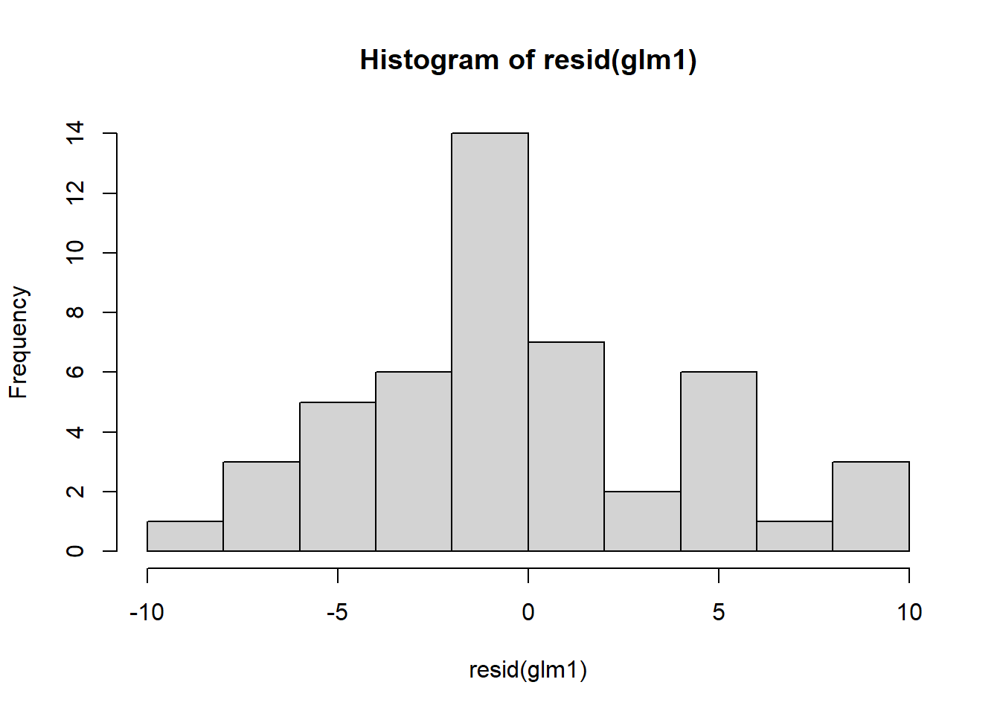
<p class="caption">(\#fig:unnamed-chunk-20-1)Residual plots.</p>
</div>

``` r
plot(resid(glm1)~fitted(glm1))  ## residuals should be evenly dispersed around 0 across the range of x's
abline(h=0)                               # funnel shapes or curvature is bad
```

<div class="figure">
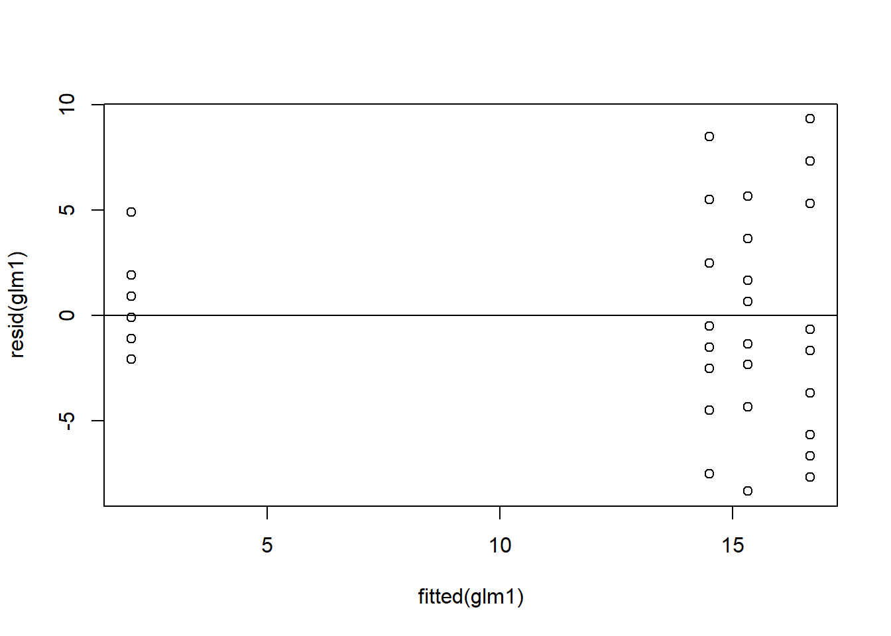
<p class="caption">(\#fig:unnamed-chunk-20-2)Residual plots.</p>
</div>


``` r
qqPlot(resid(glm1))  ## calls from car package, residuals should line up pretty closely to the blue line
```

<div class="figure">

<p class="caption">(\#fig:unnamed-chunk-21-1)QQ and box plots.</p>
</div>

```
## [1] 45 46
```

``` r
# points that drift from line might be outliers
boxplot(resid(glm1) ~ d$spray)  ## variances should be homogeneous for each group
```

<div class="figure">

<p class="caption">(\#fig:unnamed-chunk-21-2)QQ and box plots.</p>
</div>

Above, we see further improvement in the residual variances across treatment types. Diagnosing complex GLMs can be very difficult. Residuals are often *not normally distributed*, even though in theory they should be. We will return to this later.


``` r
emmeans(glm1, ~spray) ## emmeans::emmmeans will rebuild the model for you
```

```
##  spray emmean     SE  df asymp.LCL asymp.UCL
##  A      2.674 0.0758 Inf     2.526      2.82
##  B      2.730 0.0737 Inf     2.586      2.87
##  C      0.734 0.2000 Inf     0.342      1.13
##  F      2.813 0.0707 Inf     2.675      2.95
## 
## Results are given on the log (not the response) scale. 
## Confidence level used: 0.95
```

The emmeans code above will print off the means, SE, and confidence intervals for each treatment group. Note, the coefficients are on the log-scale (look at model specifications of glm1 object).

We can also use `emmeans()` to make pairwise comparisons to directly compare each spray to the others.


``` r
emmeans(glm1, pairwise~spray, type='response')  ## adding 'pairwise' will conduct pairwise contrasts -- ie. compare each group mean to the others
```

```
## $emmeans
##  spray  rate    SE  df asymp.LCL asymp.UCL
##  A     14.50 1.100 Inf     12.50     16.82
##  B     15.33 1.130 Inf     13.27     17.72
##  C      2.08 0.417 Inf      1.41      3.08
##  F     16.67 1.180 Inf     14.51     19.14
## 
## Confidence level used: 0.95 
## Intervals are back-transformed from the log scale 
## 
## $contrasts
##  contrast ratio     SE  df null z.ratio p.value
##  A / B    0.946 0.1000 Inf    1  -0.528  0.9522
##  A / C    6.960 1.4900 Inf    1   9.071  <.0001
##  A / F    0.870 0.0902 Inf    1  -1.343  0.5352
##  B / C    7.360 1.5700 Inf    1   9.364  <.0001
##  B / F    0.920 0.0940 Inf    1  -0.816  0.8468
##  C / F    0.125 0.0265 Inf    1  -9.803  <.0001
## 
## P value adjustment: tukey method for comparing a family of 4 estimates 
## Tests are performed on the log scale
```

Adding the argument 'pairwise' will conduct pairwise contrasts -- ie. compare each group mean to the others. This automatically adjusts p-values using the 'tukey' adjust. This can be changed using 'adjust=XX' within the `emmeans()` function. The type='response' will back-transform (i.e. in this case, exponentiate) to the original scale

Let's compare residuals for normal, log-transformed, and poisson models:


``` r
par(mfrow=c(1,3)) #allow plots to be shown in three
boxplot(resid(lm1) ~ d$spray, main = "Linear") 
boxplot(resid(lm2) ~ d$spray, main = "Log-Linear") 
boxplot(resid(glm1) ~ d$spray, main = "GLM") 
```

<div class="figure">

<p class="caption">(\#fig:unnamed-chunk-24)Residual plots for all models.</p>
</div>

``` r
par(mfrow=c(1,1)) #return to default
```

Let's also compare means for normal, log-transformed, and poisson models:


``` r
emmeans(lm1, ~spray)
```

```
##  spray emmean   SE df lower.CL upper.CL
##  A      14.50 1.26 43   11.961    17.04
##  B      15.33 1.26 43   12.794    17.87
##  C       2.08 1.26 43   -0.456     4.62
##  F      16.67 1.26 43   14.127    19.21
## 
## Confidence level used: 0.95
```

``` r
emmeans(lm2, ~spray, type='response')
```

```
##  spray response    SE df lower.CL upper.CL
##  A        13.83 1.700 43    10.76    17.70
##  B        14.75 1.810 43    11.49    18.85
##  C         1.59 0.298 43     1.06     2.27
##  F        15.70 1.920 43    12.25    20.06
## 
## Confidence level used: 0.95 
## Intervals are back-transformed from the log(mu + 1) scale
```

``` r
emmeans(glm1, ~spray, type='response')
```

```
##  spray  rate    SE  df asymp.LCL asymp.UCL
##  A     14.50 1.100 Inf     12.50     16.82
##  B     15.33 1.130 Inf     13.27     17.72
##  C      2.08 0.417 Inf      1.41      3.08
##  F     16.67 1.180 Inf     14.51     19.14
## 
## Confidence level used: 0.95 
## Intervals are back-transformed from the log scale
```

What model do you think we should go with?

## Overdispersion

In this section we will go over how to deal with overdispersion. While overdispersion is covered more extensively in the lecture portion of the class, we will quickly outline what it is.

Overdispersion is when variation in the data is higher than what would be expected by the distribution. A great example of how overdispersion would biologically come about in a given dataset is found from this [website](http://biometry.github.io/APES//LectureNotes/2016-JAGS/Overdispersion/OverdispersionJAGS.html). To summarize it briefly, imagine if you are collecting tree seedlings within a forest. These seedlings are naturally not uniformly distributed throughout the forest area. Instead they are more likely clumped, where most plots don't have any seedlings but a few have a ton. Therefore your counts of seedlings for a given plot can vary from 0 to numbers that are extremely high. This sort of variation can cause overdispersion to be observed in the model if it is not appropriately accounted for.

Let's load the necessary libraries:


``` r
library(tidyverse)
library(emmeans)
library(car)
library(agridat)
library(glmmTMB)
```

Load in and read about the `beall.webworms` dataset. The variables of interest are the y=count of webworms, spray = spray treatment, and lead = lead pesticide treatment. Don't worry about the block or other variables for now.


``` r
data("beall.webworms")
d1 <- beall.webworms
?beall.webworms
```

```
## starting httpd help server ... done
```


``` r
head(d1)
```

```
##   row col y block trt spray lead
## 1   1   1 1    B1  T1     N    N
## 2   2   1 0    B1  T1     N    N
## 3   3   1 1    B1  T1     N    N
## 4   4   1 3    B1  T1     N    N
## 5   5   1 6    B1  T1     N    N
## 6   6   1 0    B2  T1     N    N
```

Let's examine and plot the data:


``` r
ggplot(d1, aes(x=spray, y=y, fill=lead)) + 
  geom_violin(scale="width", adjust=2) + 
  geom_point(position = position_jitterdodge(jitter.width=.5,
                                             jitter.height=.1,
                                             dodge.width = 1),
             alpha=.1) +
  theme_bw(base_size = 14)
```

<div class="figure">

<p class="caption">(\#fig:unnamed-chunk-29)Plot of webworm data.</p>
</div>

Let's now run a model with the interaction of spray and lead. Its count data, so lets assume a Poisson distribution.


``` r
r3 <- glm(y ~ spray * lead, data=d1, family="poisson")
```

Examine the model summary:


``` r
summary(r3)
```

```
## 
## Call:
## glm(formula = y ~ spray * lead, family = "poisson", data = d1)
## 
## Coefficients:
##              Estimate Std. Error z value Pr(>|z|)    
## (Intercept)   0.33647    0.04688   7.177 7.12e-13 ***
## sprayY       -1.02043    0.09108 -11.204  < 2e-16 ***
## leadY        -0.49628    0.07621  -6.512 7.41e-11 ***
## sprayY:leadY  0.29425    0.13917   2.114   0.0345 *  
## ---
## Signif. codes:  0 '***' 0.001 '**' 0.01 '*' 0.05 '.' 0.1 ' ' 1
## 
## (Dispersion parameter for poisson family taken to be 1)
## 
##     Null deviance: 1955.9  on 1299  degrees of freedom
## Residual deviance: 1720.4  on 1296  degrees of freedom
## AIC: 3125.5
## 
## Number of Fisher Scoring iterations: 6
```

``` r
Anova(r3)
```

```
## Analysis of Deviance Table (Type II tests)
## 
## Response: y
##            LR Chisq Df Pr(>Chisq)    
## spray       188.707  1  < 2.2e-16 ***
## lead         42.294  1  7.853e-11 ***
## spray:lead    4.452  1    0.03485 *  
## ---
## Signif. codes:  0 '***' 0.001 '**' 0.01 '*' 0.05 '.' 0.1 ' ' 1
```

``` r
emmeans(r3, ~spray:lead, type='response') 
```

```
##  spray lead  rate     SE  df asymp.LCL asymp.UCL
##  N     N    1.400 0.0656 Inf     1.277     1.535
##  Y     N    0.505 0.0394 Inf     0.433     0.588
##  N     Y    0.852 0.0512 Inf     0.758     0.959
##  Y     Y    0.412 0.0356 Inf     0.348     0.488
## 
## Confidence level used: 0.95 
## Intervals are back-transformed from the log scale
```

We need to load library(performance) to test for overdispersion:


``` r
library(performance)
```

```
## Warning: package 'performance' was built under R version 4.3.3
```

``` r
check_overdispersion(r3) # overdispersion ratio calculator from performance package
```

```
## # Overdispersion test
## 
##        dispersion ratio =    1.355
##   Pearson's Chi-Squared = 1755.717
##                 p-value =  < 0.001
```

```
## Overdispersion detected.
```

Note that there is overdispersion and the "dispersion ratio = 1.355", which is (approximately) the **Residual deviance** over the **degrees of freedom** from the `summary()` printout.

Now let's implement the negative binomial distribution, which will account for the overdispersion in the data.


``` r
r4 <- glmmTMB(y ~ spray * lead, data=d1, family="nbinom2")
Anova(r4)
```

```
## Analysis of Deviance Table (Type II Wald chisquare tests)
## 
## Response: y
##               Chisq Df Pr(>Chisq)    
## spray      125.5047  1  < 2.2e-16 ***
## lead        26.8005  1  2.256e-07 ***
## spray:lead   3.3942  1    0.06542 .  
## ---
## Signif. codes:  0 '***' 0.001 '**' 0.01 '*' 0.05 '.' 0.1 ' ' 1
```

``` r
emmeans(r4, ~spray:lead, type='response') 
```

```
##  spray lead response     SE  df asymp.LCL asymp.UCL
##  N     N       1.400 0.0855 Inf     1.242     1.578
##  Y     N       0.505 0.0441 Inf     0.425     0.599
##  N     Y       0.852 0.0611 Inf     0.741     0.981
##  Y     Y       0.412 0.0391 Inf     0.342     0.497
## 
## Confidence level used: 0.95 
## Intervals are back-transformed from the log scale
```

Let's use the DHARMa package to simulate residuals for poisson and negative binomial models.


``` r
library(DHARMa)
```

```
## Warning: package 'DHARMa' was built under R version 4.3.3
```

```
## This is DHARMa 0.4.7. For overview type '?DHARMa'. For recent changes, type news(package = 'DHARMa')
```

We can interpret the simulated residuals very similarly to the raw residuals we have previously examined. The residuals should line up along the line in the QQ plot and there should be (roughly) equal scatter in the residuals among the groups. First let's look at simulated residuals from the Poisson model:


``` r
simulateResiduals(r3, plot=T) ## plot simulated residuals
```

```
## DHARMa:testOutliers with type = binomial may have inflated Type I error rates for integer-valued distributions. To get a more exact result, it is recommended to re-run testOutliers with type = 'bootstrap'. See ?testOutliers for details
```

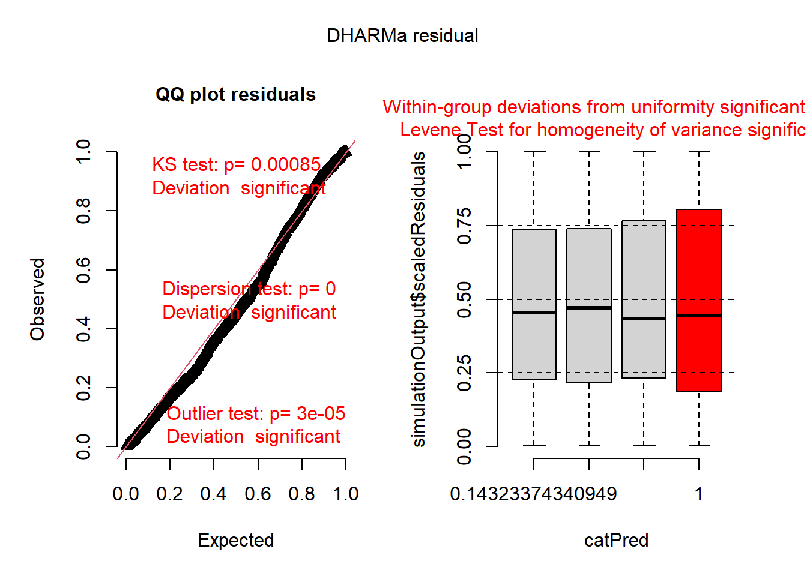

```
## Object of Class DHARMa with simulated residuals based on 250 simulations with refit = FALSE . See ?DHARMa::simulateResiduals for help. 
##  
## Scaled residual values: 0.4574871 0.1249353 0.3765507 0.8898169 0.9947878 0.1384856 0.8427982 0.7401398 0.5451185 0.9247921 0.04867315 0.9158836 0.4210366 0.2450423 0.6110091 0.05695033 0.5344315 0.9367373 0.8666021 0.7861569 ...
```

Histograms of the simulated residuals will be different than before. Here the simulated residuals should be flat. Its ok if the bars bump up and down, but they should be on average flat across the graph.The bars shouldn't be peaked (eg. "normally" distributed) or U-shaped or increasing/decreasing.


``` r
hist(simulateResiduals(r3)) ## histogram should be flat
```


The residuals from the Poisson model look ok, but not perfect. The line in the QQ plot deviates from 1:1 and the variances are a little different among the groups. The histogram looks ok.

Now let's look at residuals for negative binomial model:


``` r
simulateResiduals(r4, plot=T) ## plot simulated residuals
```


```
## Object of Class DHARMa with simulated residuals based on 250 simulations with refit = FALSE . See ?DHARMa::simulateResiduals for help. 
##  
## Scaled residual values: 0.4821899 0.2591288 0.3967079 0.8858496 0.992 0.117201 0.7325008 0.6766148 0.4083655 0.8192085 0.10593 0.8988023 0.621979 0.3468156 0.7885132 0.2689479 0.657901 0.92479 0.7941977 0.8523115 ...
```

``` r
simulateResiduals(r4, hist=T) ## histogram should be flat
```

```
## Object of Class DHARMa with simulated residuals based on 250 simulations with refit = FALSE . See ?DHARMa::simulateResiduals for help. 
##  
## Scaled residual values: 0.4821899 0.2591288 0.3967079 0.8858496 0.992 0.117201 0.7325008 0.6766148 0.4083655 0.8192085 0.10593 0.8988023 0.621979 0.3468156 0.7885132 0.2689479 0.657901 0.92479 0.7941977 0.8523115 ...
```

## Binomial GLM

In this section we will run a GLM with a binomial error distribution. We load the following packages:


``` r
library(tidyverse)
library(emmeans)
library(car)
library(agridat)
library(DHARMa)
library(glmmTMB)
library(viridis)
```

We will use the Titanic survival dataset for the binomial GLM.


``` r
## LOAD TITANIC SURVIVAL DATASET
data("TitanicSurvival")
t1 <- TitanicSurvival %>% filter(age>17) # filter out children
head(t1)
```

```
##                                 survived    sex age passengerClass
## Allen, Miss. Elisabeth Walton        yes female  29            1st
## Allison, Mr. Hudson Joshua Crei       no   male  30            1st
## Allison, Mrs. Hudson J C (Bessi       no female  25            1st
## Anderson, Mr. Harry                  yes   male  48            1st
## Andrews, Miss. Kornelia Theodos      yes female  63            1st
## Andrews, Mr. Thomas Jr                no   male  39            1st
```

Let's quickly plot the data:


``` r
ggplot(t1, aes(x=passengerClass, y=survived, color=sex)) +
  geom_jitter(height=.2, width=0.2)
```

<div class="figure">
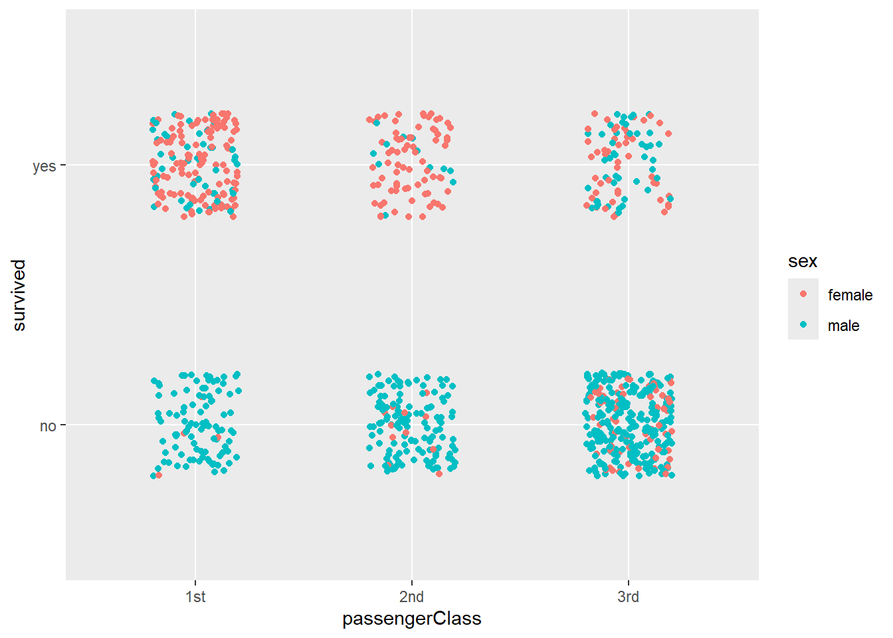
<p class="caption">(\#fig:unnamed-chunk-40)Plot of titanic survival data.</p>
</div>

Now we can construct a GLM to estimate survival as a function of sex and passengerClass while include Age as co-variate.


``` r
tglm1 <- glmmTMB(survived ~ sex * passengerClass + age, data=t1, family = binomial(link = "logit"))
```

Let's look at the ANOVA table and summary of the model:


``` r
## print off anova table
Anova(tglm1)
```

```
## Analysis of Deviance Table (Type II Wald chisquare tests)
## 
## Response: survived
##                       Chisq Df Pr(>Chisq)    
## sex                141.6195  1  < 2.2e-16 ***
## passengerClass      54.3629  2  1.568e-12 ***
## age                  8.0343  1    0.00459 ** 
## sex:passengerClass  42.2193  2  6.795e-10 ***
## ---
## Signif. codes:  0 '***' 0.001 '**' 0.01 '*' 0.05 '.' 0.1 ' ' 1
```

``` r
## print off summary
summary(tglm1)
```

```
##  Family: binomial  ( logit )
## Formula:          survived ~ sex * passengerClass + age
## Data: t1
## 
##      AIC      BIC   logLik deviance df.resid 
##    766.4    799.9   -376.2    752.4      885 
## 
## 
## Conditional model:
##                            Estimate Std. Error z value Pr(>|z|)    
## (Intercept)                4.440407   0.637348   6.967 3.24e-12 ***
## sexmale                   -4.105509   0.540239  -7.599 2.97e-14 ***
## passengerClass2nd         -1.709637   0.609584  -2.805  0.00504 ** 
## passengerClass3rd         -3.957656   0.562162  -7.040 1.92e-12 ***
## age                       -0.025352   0.008944  -2.834  0.00459 ** 
## sexmale:passengerClass2nd -0.203859   0.698880  -0.292  0.77052    
## sexmale:passengerClass3rd  2.655928   0.597514   4.445 8.79e-06 ***
## ---
## Signif. codes:  0 '***' 0.001 '**' 0.01 '*' 0.05 '.' 0.1 ' ' 1
```

Now we can check residuals:


``` r
hist(resid(tglm1)) ## residuals should be normally distributed, even for glm
```

<div class="figure">
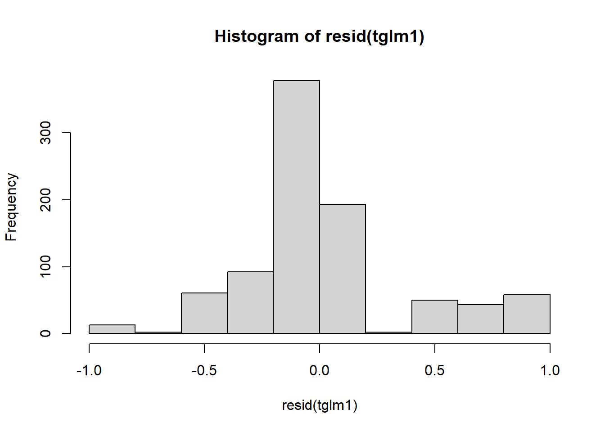
<p class="caption">(\#fig:unnamed-chunk-43-1)Residual plots.</p>
</div>

``` r
plot(resid(tglm1)~fitted(tglm1)) +  ## residuals should be evenly dispersed around 0 across the range of x's
  abline(h=0)                               # funnel shapes or curvature is bad
```

<div class="figure">

<p class="caption">(\#fig:unnamed-chunk-43-2)Residual plots.</p>
</div>

```
## integer(0)
```


``` r
qqPlot(resid(tglm1))  ## residuals should line up pretty closely to the blue line
```

<div class="figure">

<p class="caption">(\#fig:unnamed-chunk-44-1)Residual plots.</p>
</div>

```
## Allison, Mrs. Hudson J C (Bessi        Evans, Miss. Edith Corse 
##                               3                              90
```

``` r
boxplot(resid(tglm1) ~ t1$passengerClass)  ## variances should be homogeneous for each group
```

<div class="figure">

<p class="caption">(\#fig:unnamed-chunk-44-2)Residual plots.</p>
</div>


``` r
## simulate residuals
plot(simulateResiduals(tglm1)) ## plot simulated residuals
```

<div class="figure">
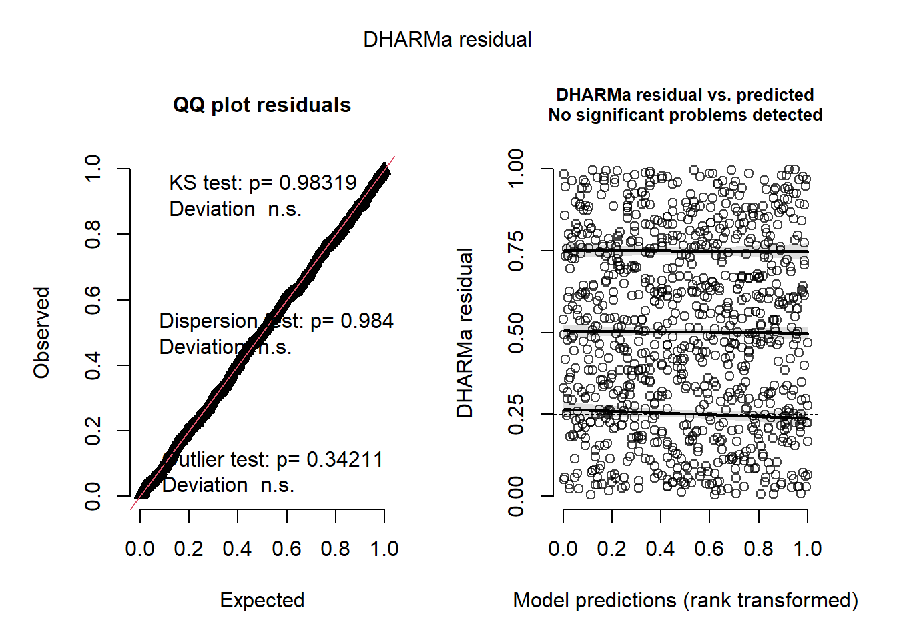
<p class="caption">(\#fig:unnamed-chunk-45-1)Simulated residual plots.</p>
</div>

``` r
hist(simulateResiduals(tglm1)) ## histogram should be flat
```

<div class="figure">

<p class="caption">(\#fig:unnamed-chunk-45-2)Simulated residual plots.</p>
</div>

To make sense of the model output let's use the emmeans package:


``` r
emmeans(tglm1, pairwise ~ sex:passengerClass)
```

```
## $emmeans
##  sex    passengerClass emmean    SE  df asymp.LCL asymp.UCL
##  female 1st             3.592 0.516 Inf     2.580    4.6034
##  male   1st            -0.514 0.192 Inf    -0.890   -0.1371
##  female 2nd             1.882 0.325 Inf     1.246    2.5183
##  male   2nd            -2.427 0.303 Inf    -3.022   -1.8324
##  female 3rd            -0.366 0.203 Inf    -0.764    0.0322
##  male   3rd            -1.815 0.170 Inf    -2.149   -1.4814
## 
## Results are given on the logit (not the response) scale. 
## Confidence level used: 0.95 
## 
## $contrasts
##  contrast                estimate    SE  df z.ratio p.value
##  female 1st - male 1st      4.106 0.540 Inf   7.599  <.0001
##  female 1st - female 2nd    1.710 0.610 Inf   2.805  0.0567
##  female 1st - male 2nd      6.019 0.602 Inf   9.997  <.0001
##  female 1st - female 3rd    3.958 0.562 Inf   7.040  <.0001
##  female 1st - male 3rd      5.407 0.551 Inf   9.810  <.0001
##  male 1st - female 2nd     -2.396 0.377 Inf  -6.354  <.0001
##  male 1st - male 2nd        1.913 0.364 Inf   5.262  <.0001
##  male 1st - female 3rd     -0.148 0.291 Inf  -0.507  0.9959
##  male 1st - male 3rd        1.302 0.270 Inf   4.826  <.0001
##  female 2nd - male 2nd      4.309 0.444 Inf   9.700  <.0001
##  female 2nd - female 3rd    2.248 0.383 Inf   5.872  <.0001
##  female 2nd - male 3rd      3.698 0.367 Inf  10.088  <.0001
##  male 2nd - female 3rd     -2.061 0.362 Inf  -5.699  <.0001
##  male 2nd - male 3rd       -0.612 0.344 Inf  -1.776  0.4812
##  female 3rd - male 3rd      1.450 0.255 Inf   5.678  <.0001
## 
## Results are given on the log odds ratio (not the response) scale. 
## P value adjustment: tukey method for comparing a family of 6 estimates
```

The estimates in the above output are transformed via the link funciton (logit in this case). We can obtain back-transformed means. This will provide the estimated probability of survival for each sex:passengerClass combination.


``` r
emmeans(tglm1, pairwise ~ sex:passengerClass, type="response")      ## type= does contrasts before back-transforming (more appropriate!)
```

```
## $emmeans
##  sex    passengerClass   prob     SE  df asymp.LCL asymp.UCL
##  female 1st            0.9732 0.0135 Inf    0.9296     0.990
##  male   1st            0.3743 0.0450 Inf    0.2911     0.466
##  female 2nd            0.8679 0.0372 Inf    0.7766     0.925
##  male   2nd            0.0811 0.0226 Inf    0.0465     0.138
##  female 3rd            0.4096 0.0491 Inf    0.3178     0.508
##  male   3rd            0.1400 0.0205 Inf    0.1044     0.185
## 
## Confidence level used: 0.95 
## Intervals are back-transformed from the logit scale 
## 
## $contrasts
##  contrast                odds.ratio       SE  df null z.ratio p.value
##  female 1st / male 1st      60.6736  32.8000 Inf    1   7.599  <.0001
##  female 1st / female 2nd     5.5270   3.3700 Inf    1   2.805  0.0567
##  female 1st / male 2nd     411.1691 248.0000 Inf    1   9.997  <.0001
##  female 1st / female 3rd    52.3345  29.4000 Inf    1   7.040  <.0001
##  female 1st / male 3rd     223.0143 123.0000 Inf    1   9.810  <.0001
##  male 1st / female 2nd       0.0911   0.0344 Inf    1  -6.354  <.0001
##  male 1st / male 2nd         6.7767   2.4600 Inf    1   5.262  <.0001
##  male 1st / female 3rd       0.8626   0.2510 Inf    1  -0.507  0.9959
##  male 1st / male 3rd         3.6756   0.9910 Inf    1   4.826  <.0001
##  female 2nd / male 2nd      74.3935  33.1000 Inf    1   9.700  <.0001
##  female 2nd / female 3rd     9.4690   3.6200 Inf    1   5.872  <.0001
##  female 2nd / male 3rd      40.3503  14.8000 Inf    1  10.088  <.0001
##  male 2nd / female 3rd       0.1273   0.0460 Inf    1  -5.699  <.0001
##  male 2nd / male 3rd         0.5424   0.1870 Inf    1  -1.776  0.4812
##  female 3rd / male 3rd       4.2613   1.0900 Inf    1   5.678  <.0001
## 
## P value adjustment: tukey method for comparing a family of 6 estimates 
## Tests are performed on the log odds ratio scale
```

In order to plot we need to create new variable that is 0 or 1, instead of 'yes' or 'no'.


``` r
t1$surv <- if_else(t1$survived=='yes',1,0)
```

Now we can make a plot with regression lines:


``` r
ggplot(t1, aes(x=age, y=surv, color=sex)) + 
  geom_jitter(height=.1, width=0) + 
  geom_smooth(method="glm",
              method.args=list(family="binomial"), 
              formula = y ~ x, se=F, lwd=1.5) +
  facet_wrap(~passengerClass) +
  theme_bw(base_size = 20)
```

<div class="figure">

<p class="caption">(\#fig:unnamed-chunk-49)Plot of survival probabilities by sex and class.</p>
</div>

We can improve the aesthetics of the plot:


``` r
tm <- emmeans(tglm1, ~ sex:passengerClass, type="response") %>% as.data.frame()

plot1 <- ggplot() +
  geom_jitter(data=t1 %>% filter(sex=='female'),
              aes(x=passengerClass, y=surv+.01, color=sex),
              height=0, width=.25, size=1, alpha=.1) +
  geom_jitter(data=t1 %>% filter(sex=='male'), 
              aes(x=passengerClass, y=surv-.01, color=sex), 
              height=0, width=.25, size=1, alpha=.1) +
  geom_errorbar(data=tm,
                aes(x=passengerClass,
                    y=prob, ymin=(prob-SE), 
                    ymax=(prob+SE), color=sex), 
                width=.2, lwd=1.25,
                position = position_dodge(width=0.5)) +
  geom_point(data=tm , 
             aes(x=passengerClass, y=prob, color=sex), 
             size=5, position=position_dodge(width=0.5)) + 
  scale_y_continuous('survival', labels = scales::percent) +
  scale_color_viridis(discrete = T) +
  theme(panel.background = element_blank(),                           
        panel.border = element_rect(color="black",
                                    fill=NA, size=2)) +
  theme(axis.ticks.length=unit(0.3, "cm"),  
        axis.text.x =  element_text(margin=margin(5,5,5,5,"pt"),colour="black"),
        axis.text.y = element_text(margin=margin(5,5,5,5,"pt"),colour="black")) +  ## change axis tick marks to make them a little longer
  #theme(axis.text.x = element_text(angle = 45, vjust = 1, hjust=1)) +
  theme(text = element_text(size=20)) 
```

```
## Warning: The `size` argument of `element_rect()` is deprecated as of ggplot2 3.4.0.
## ℹ Please use the `linewidth` argument instead.
## This warning is displayed once every 8 hours.
## Call `lifecycle::last_lifecycle_warnings()` to see where this warning was
## generated.
```

``` r
plot1
```

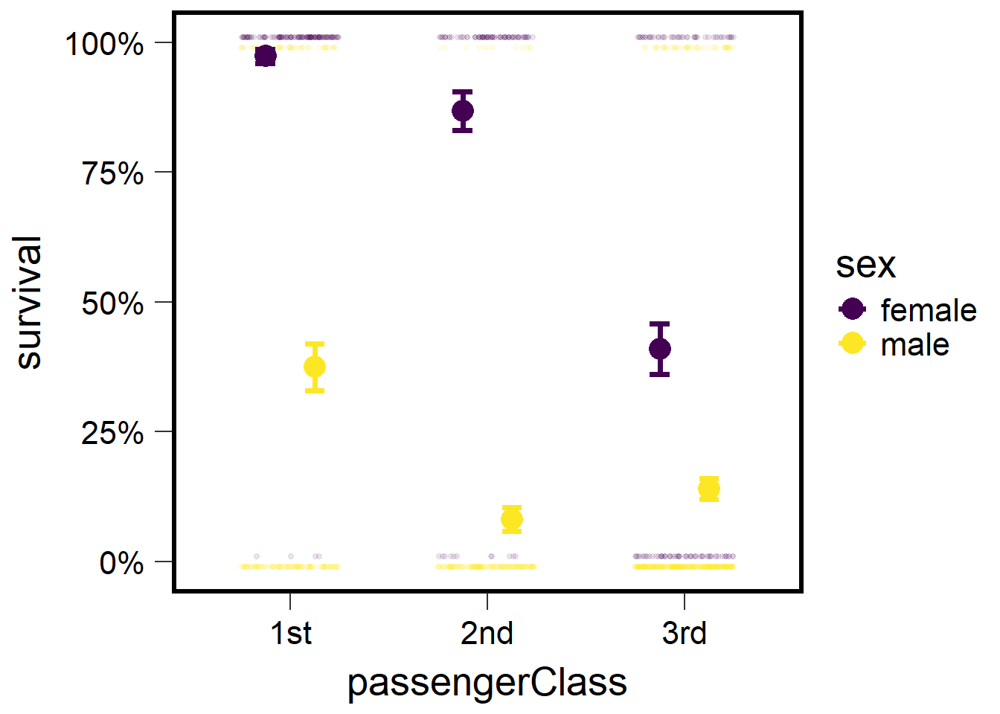


``` r
plot2 <- ggplot() +
  geom_jitter(data=t1 ,
              aes(x=passengerClass, y=surv, 
                  color=passengerClass), 
              height=.01, width=.35, 
              size=1, alpha=.2) +
  geom_errorbar(data=tm ,
                aes(x=passengerClass,
                    y=prob, ymin=(prob-SE),
                    ymax=(prob+SE), 
                    color=passengerClass), 
                width=.2, lwd=1.25) + ## make bars thinner
  geom_point(data=tm , 
             aes(x=passengerClass, 
                 y=prob, color=passengerClass), size=5) +
  facet_wrap(~sex) +
  scale_y_continuous('survival', labels = scales::percent) +
  scale_color_viridis(discrete = T, option = 'C', direction=-1) +
  theme(panel.background = element_blank(),                           
        panel.border = element_rect(color="black", fill=NA, size=2)) +
  theme(axis.ticks.length=unit(0.3, "cm"),  
        axis.text.x = element_text(margin=margin(5,5,5,5,"pt"),colour="black"),
        axis.text.y = element_text(margin=margin(5,5,5,5,"pt"),colour="black")) + 
  theme(text = element_text(size=20)) 
plot2
```

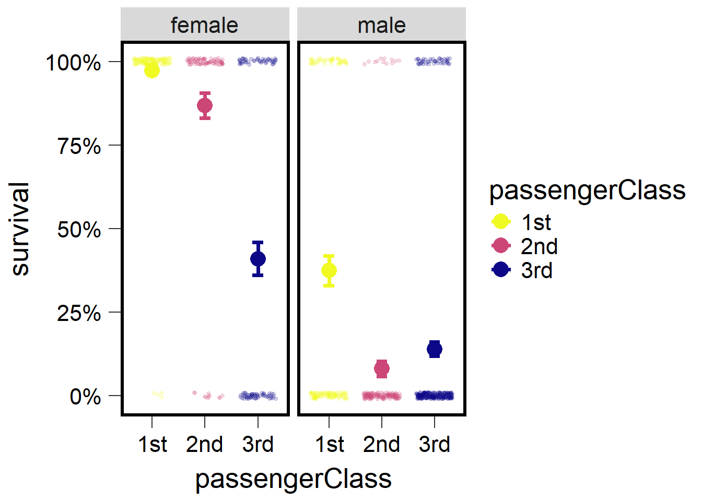

## Gamma GLM

In this section we will learn about implementing the Gamma distribution in R. This distribution is helpful in for modeling a variety of data but is most frequently applied to data that is right skewed but not necessarily count data. The next several examples will illustrate how to generate Gamma distributed data based on several parameters as well as how to implement Gamma GLMs.

### Example 1

Here we generate a distribution using the `rgamma()` function. Remember to set.seed so we get reproducible results.


``` r
set.seed(15)
var1 <- rgamma(1000, shape = 2, scale = .5)
hist(var1, main='mean=1, scale=0.5')
```

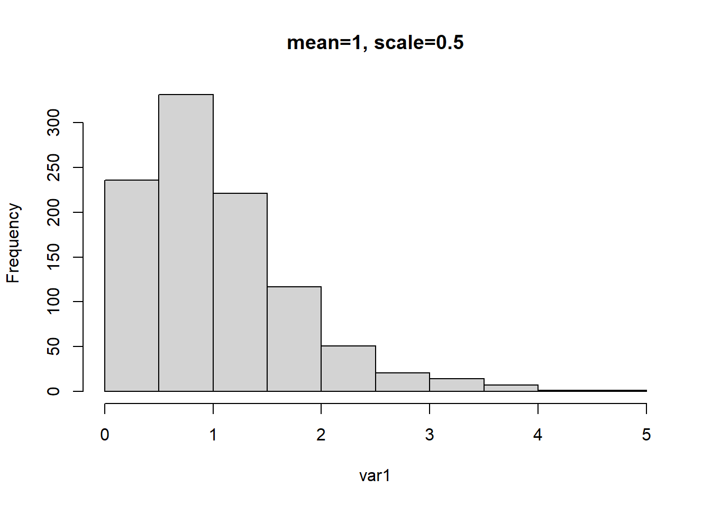

Note that the mean of this distribution should be 1 because the mean is equal to product of the shape parameter and scale parameter. So, 2 multiplied by 0.5 should be 1.


``` r
set.seed(15)
g1 <- glmmTMB(var1 ~ 1, family=Gamma(link="inverse"))
```

```
## Warning in glmmTMB(var1 ~ 1, family = Gamma(link = "inverse")): use of the
## 'data' argument is recommended
```

``` r
g1
```

```
## Formula:          var1 ~ 1
##       AIC       BIC    logLik  df.resid 
## 1822.0994 1831.9149 -909.0497       998 
## 
## Number of obs: 1000
## 
## Dispersion estimate for Gamma family (sigma^2): 0.483 
## 
## Fixed Effects:
## 
## Conditional model:
## (Intercept)  
##      0.9657
```

``` r
## mean should be ~1 with inverse link function
1/0.9657
```

```
## [1] 1.035518
```

In the above example we run a Gamma GLM as an intercept only model. By running an intercept only model we assume no other predictors can predict the response variable. Therefore the output from this model would simply be the mean of the response, which should be \~1 (which it is after applying the right link function to the intercept).


``` r
g1a <- glmmTMB(var1 ~ 1, family=Gamma(link="log"))
```

```
## Warning in glmmTMB(var1 ~ 1, family = Gamma(link = "log")): use of the 'data'
## argument is recommended
```

``` r
g1a
```

```
## Formula:          var1 ~ 1
##       AIC       BIC    logLik  df.resid 
## 1822.0994 1831.9149 -909.0497       998 
## 
## Number of obs: 1000
## 
## Dispersion estimate for Gamma family (sigma^2): 0.483 
## 
## Fixed Effects:
## 
## Conditional model:
## (Intercept)  
##     0.03491
```

``` r
## mean should be ~1 with log link function
exp(0.03491)
```

```
## [1] 1.035527
```

The same is shown above but in this case we use a log link and so to back transform the intercept we exponentiate. Using either the inverse or log-link should give us the same answer.

### Example 2

In the example below we generate another Gamma distributed variable but we change the shape and scale parameter. But because the mean is based on the product of the two, the mean remains as 1.


``` r
set.seed(15)
var1 <- rgamma(1000, shape = 4, scale = .25)
hist(var1, main='mean=1, scale=0.25')
```


``` r
# mean = a (shape) * b (rate)
# mean = 4 * .25 = 1.0

g1 <- glmmTMB(var1 ~ 1, family=Gamma(link="inverse"))
```

```
## Warning in glmmTMB(var1 ~ 1, family = Gamma(link = "inverse")): use of the
## 'data' argument is recommended
```

``` r
g1
```

```
## Formula:          var1 ~ 1
##       AIC       BIC    logLik  df.resid 
## 1281.0616 1290.8771 -638.5308       998 
## 
## Number of obs: 1000
## 
## Dispersion estimate for Gamma family (sigma^2): 0.233 
## 
## Fixed Effects:
## 
## Conditional model:
## (Intercept)  
##      0.9711
```

``` r
## mean should be 1 with inverse link function
1/0.9711
```

```
## [1] 1.02976
```

``` r
g1a <- glmmTMB(var1 ~ 1, family=Gamma(link="log"))
```

```
## Warning in glmmTMB(var1 ~ 1, family = Gamma(link = "log")): use of the 'data'
## argument is recommended
```

``` r
g1a
```

```
## Formula:          var1 ~ 1
##       AIC       BIC    logLik  df.resid 
## 1281.0616 1290.8771 -638.5308       998 
## 
## Number of obs: 1000
## 
## Dispersion estimate for Gamma family (sigma^2): 0.233 
## 
## Fixed Effects:
## 
## Conditional model:
## (Intercept)  
##     0.02937
```

``` r
## mean should be 1 with log link function
exp(0.02937)
```

```
## [1] 1.029806
```

We once again repeat the same exercise as example 1 and see that when the appropriate back transformation based on link functions are applied to the intercept, it results in the original mean.

### Example 3

In this example we change the mean of the distribution to 0.5 by changing the shape and scale parameters to 1 and 0.5 respectively. We then repeat the previous examples and run the inverse and log link Gamma GLMs and observe how the intercepts are backtransformed to approximate the previously set mean value.


``` r
set.seed(15)
var1 <- rgamma(1000, shape = 1, scale = .5)
hist(var1, main='mean=0.5, scale=0.5')
```


``` r
# mean = a (shape) * b (rate)
# mean = 1 * .5 = 0.5

g1 <- glmmTMB(var1 ~ 1, family=Gamma(link="inverse"))
```

```
## Warning in glmmTMB(var1 ~ 1, family = Gamma(link = "inverse")): use of the
## 'data' argument is recommended
```

``` r
g1
```

```
## Formula:          var1 ~ 1
##       AIC       BIC    logLik  df.resid 
##  654.8480  664.6635 -325.4240       998 
## 
## Number of obs: 1000
## 
## Dispersion estimate for Gamma family (sigma^2): 0.968 
## 
## Fixed Effects:
## 
## Conditional model:
## (Intercept)  
##       1.963
```

``` r
## mean should be 1 with inverse link function
1/g1$sdr$par.fixed[1]
```

```
##      beta 
## 0.5095401
```


``` r
g1a <- glmmTMB(var1 ~ 1, family=Gamma(link="log"))
```

```
## Warning in glmmTMB(var1 ~ 1, family = Gamma(link = "log")): use of the 'data'
## argument is recommended
```

``` r
g1a$sdr$par.fixed[1]
```

```
##       beta 
## -0.6742484
```

``` r
## mean should be 1 with log link function
exp(g1a$sdr$par.fixed[1])
```

```
##      beta 
## 0.5095393
```

### Example 4

This example follows the previous examples but with the mean changed to 0.25.


``` r
set.seed(15)
var1 <- rgamma(1000, shape = .25, scale = 1)
hist(var1, main='mean=0.25, scale=1')
```

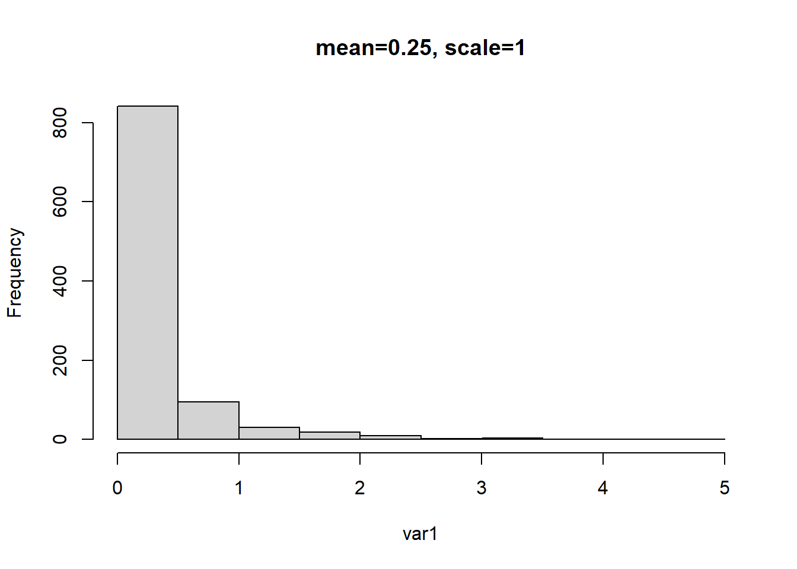

``` r
# mean = a (shape) * b (rate)
# mean = .5 * 1 = 0.5

g1 <- glmmTMB(var1 ~ 1, family=Gamma(link="inverse"))
```

```
## Warning in glmmTMB(var1 ~ 1, family = Gamma(link = "inverse")): use of the
## 'data' argument is recommended
```

``` r
g1
```

```
## Formula:          var1 ~ 1
##       AIC       BIC    logLik  df.resid 
## -3174.013 -3164.197  1589.006       998 
## 
## Number of obs: 1000
## 
## Dispersion estimate for Gamma family (sigma^2): 3.94 
## 
## Fixed Effects:
## 
## Conditional model:
## (Intercept)  
##       3.964
```

``` r
## mean should be 1 with inverse link function
1/g1$sdr$par.fixed[1]
```

```
##      beta 
## 0.2522893
```


``` r
g1a <- glmmTMB(var1 ~ 1, family=Gamma(link="log"))
```

```
## Warning in glmmTMB(var1 ~ 1, family = Gamma(link = "log")): use of the 'data'
## argument is recommended
```

``` r
g1a
```

```
## Formula:          var1 ~ 1
##       AIC       BIC    logLik  df.resid 
## -3174.013 -3164.197  1589.006       998 
## 
## Number of obs: 1000
## 
## Dispersion estimate for Gamma family (sigma^2): 3.94 
## 
## Fixed Effects:
## 
## Conditional model:
## (Intercept)  
##      -1.377
```

``` r
## mean should be 1 with log link function
exp(g1a$sdr$par.fixed[1])
```

```
##      beta 
## 0.2522895
```

## Briefly running Gamma GLMs

In this section we simulate data for two groups:


``` r
set.seed(25)
v1 <- rgamma(100, shape = 3, scale = .5) %>% as.data.frame()
colnames(v1) <- "var"
v1$group <- "one"
head(v1)
```

```
##         var group
## 1 1.0881400   one
## 2 2.4520815   one
## 3 3.5583571   one
## 4 0.9405657   one
## 5 0.9225875   one
## 6 1.4339098   one
```

``` r
v2 <- rgamma(100, shape = 1, scale = .2) %>% as.data.frame()
colnames(v2) <- "var"
v2$group <- "two"
head(v2)
```

```
##          var group
## 1 0.15108136   two
## 2 0.01761541   two
## 3 0.47914554   two
## 4 0.05403794   two
## 5 0.13555345   two
## 6 0.19157853   two
```

Then bind the two groups into one dataset:


``` r
dat1 <- rbind(v1,v2) #mean group 1 = 1.5, group 2 = 0.5
dat1 %>% mutate(obs=rep(1:100,2)) %>% group_by(obs) %>% pivot_wider(names_from = group,values_from = var) %>% 
  ungroup() %>% select(one,two)
```

```
## # A tibble: 100 × 2
##      one     two
##    <dbl>   <dbl>
##  1 1.09  0.151  
##  2 2.45  0.0176 
##  3 3.56  0.479  
##  4 0.941 0.0540 
##  5 0.923 0.136  
##  6 1.43  0.192  
##  7 0.559 0.185  
##  8 1.20  0.0195 
##  9 1.15  0.0725 
## 10 0.854 0.00261
## # ℹ 90 more rows
```

We then check the data distributions:


``` r
hist(dat1$var)
```

<div class="figure">

<p class="caption">(\#fig:unnamed-chunk-62)Histogram.</p>
</div>


``` r
ggplot(dat1, aes(x=var)) + geom_histogram(bins=8, fill="grey", color="black") + 
  facet_wrap(~group, scales="free") + theme_bw(base_size = 16)
```

<div class="figure">
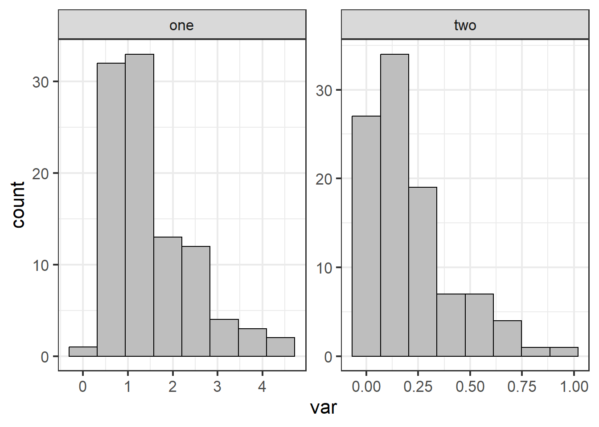
<p class="caption">(\#fig:unnamed-chunk-63)Histogram for each group.</p>
</div>

Then we construct several different models (a Gaussian, a Gamma, and a log-normal) and use AIC to compare models. Obviously we know the data come from a Gamma distribution because we simulated them. However, we will fit these different models to examine model fit using residuals and AIC.


``` r
#### construct model w/ normal distribution
mod0 <- glmmTMB(var ~ group, data=dat1)
plot(simulateResiduals(mod0))
```


``` r
summary(mod0)
```

```
##  Family: gaussian  ( identity )
## Formula:          var ~ group
## Data: dat1
## 
##      AIC      BIC   logLik deviance df.resid 
##    408.0    417.9   -201.0    402.0      197 
## 
## 
## Dispersion estimate for gaussian family (sigma^2): 0.437 
## 
## Conditional model:
##             Estimate Std. Error z value Pr(>|z|)    
## (Intercept)  1.49247    0.06610   22.58   <2e-16 ***
## grouptwo    -1.28086    0.09349  -13.70   <2e-16 ***
## ---
## Signif. codes:  0 '***' 0.001 '**' 0.01 '*' 0.05 '.' 0.1 ' ' 1
```

``` r
emmeans(mod0, ~group, type="response")
```

```
##  group emmean     SE  df lower.CL upper.CL
##  one    1.492 0.0661 197   1.3621    1.623
##  two    0.212 0.0661 197   0.0813    0.342
## 
## Confidence level used: 0.95
```


``` r
#### construct model w/ log-normal distribution
mod0a <- glmmTMB(log(var) ~ group, data=dat1)
plot(simulateResiduals(mod0a))
```

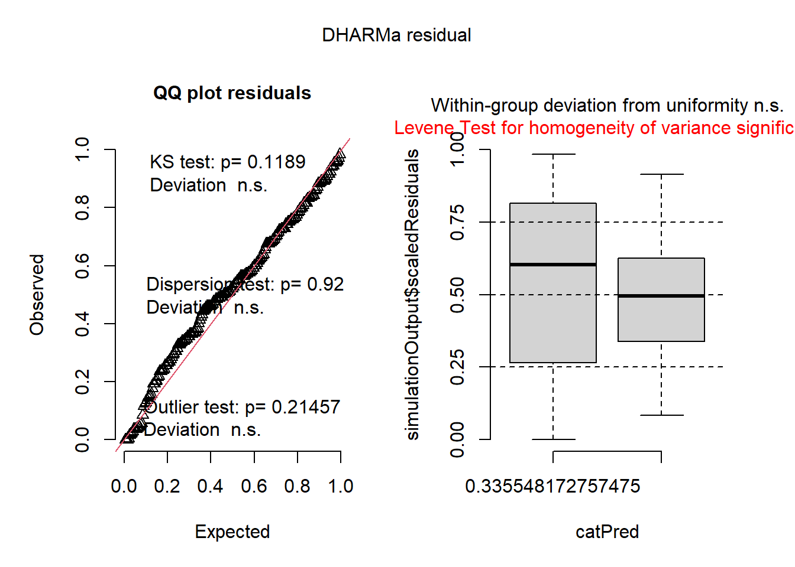

``` r
summary(mod0a)
```

```
##  Family: gaussian  ( identity )
## Formula:          log(var) ~ group
## Data: dat1
## 
##      AIC      BIC   logLik deviance df.resid 
##    585.6    595.5   -289.8    579.6      197 
## 
## 
## Dispersion estimate for gaussian family (sigma^2): 1.06 
## 
## Conditional model:
##             Estimate Std. Error z value Pr(>|z|)    
## (Intercept)   0.2288     0.1030   2.221   0.0264 *  
## grouptwo     -2.3798     0.1457 -16.330   <2e-16 ***
## ---
## Signif. codes:  0 '***' 0.001 '**' 0.01 '*' 0.05 '.' 0.1 ' ' 1
```

``` r
emmeans(mod0a, ~group, type="response")
```

```
##  group response    SE  df lower.CL upper.CL
##  one      1.257 0.130 197    1.026    1.540
##  two      0.116 0.012 197    0.095    0.143
## 
## Confidence level used: 0.95 
## Intervals are back-transformed from the log scale
```


``` r
#### construct model w/ Gamma distribution and inverse link
mod1 <- glmmTMB(var ~ group, data=dat1, family=Gamma(link = "inverse"))
plot(simulateResiduals(mod1))
```


``` r
summary(mod1)
```

```
##  Family: Gamma  ( inverse )
## Formula:          var ~ group
## Data: dat1
## 
##      AIC      BIC   logLik deviance df.resid 
##    160.7    170.6    -77.3    154.7      197 
## 
## 
## Dispersion estimate for Gamma family (sigma^2): 0.693 
## 
## Conditional model:
##             Estimate Std. Error z value Pr(>|z|)    
## (Intercept)  0.67003    0.05577   12.01   <2e-16 ***
## grouptwo     4.05552    0.39726   10.21   <2e-16 ***
## ---
## Signif. codes:  0 '***' 0.001 '**' 0.01 '*' 0.05 '.' 0.1 ' ' 1
```

``` r
emmeans(mod1, ~group, type="response")
```

```
##  group response     SE  df asymp.LCL asymp.UCL
##  one      1.492 0.1240 Inf     1.283     1.783
##  two      0.212 0.0176 Inf     0.182     0.253
## 
## Confidence level used: 0.95 
## Intervals are back-transformed from the inverse scale
```


``` r
#### construct model w/ Gamma distribution and log link
mod2 <- glmmTMB(var ~ group, data=dat1, family=Gamma(link = "log"))
plot(simulateResiduals(mod2))
```

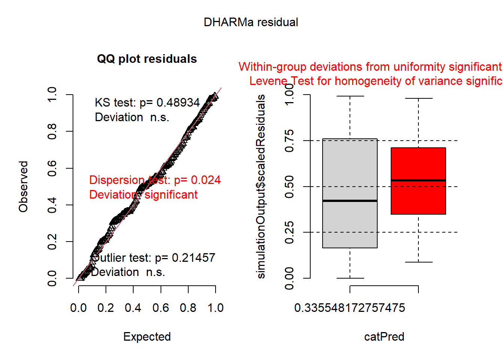

``` r
summary(mod2)
```

```
##  Family: Gamma  ( log )
## Formula:          var ~ group
## Data: dat1
## 
##      AIC      BIC   logLik deviance df.resid 
##    160.7    170.6    -77.3    154.7      197 
## 
## 
## Dispersion estimate for Gamma family (sigma^2): 0.693 
## 
## Conditional model:
##             Estimate Std. Error z value Pr(>|z|)    
## (Intercept)  0.40043    0.08323   4.811  1.5e-06 ***
## grouptwo    -1.95342    0.11771 -16.595  < 2e-16 ***
## ---
## Signif. codes:  0 '***' 0.001 '**' 0.01 '*' 0.05 '.' 0.1 ' ' 1
```

``` r
emmeans(mod2, ~group, type="response")
```

```
##  group response     SE  df asymp.LCL asymp.UCL
##  one      1.492 0.1240 Inf      1.27     1.757
##  two      0.212 0.0176 Inf      0.18     0.249
## 
## Confidence level used: 0.95 
## Intervals are back-transformed from the log scale
```

AIC:


``` r
AIC(mod0,mod0a,mod1,mod2)
```

```
##       df      AIC
## mod0   3 408.0006
## mod0a  3 585.5705
## mod1   3 160.6724
## mod2   3 160.6724
```

Which model is the best ranked model?
