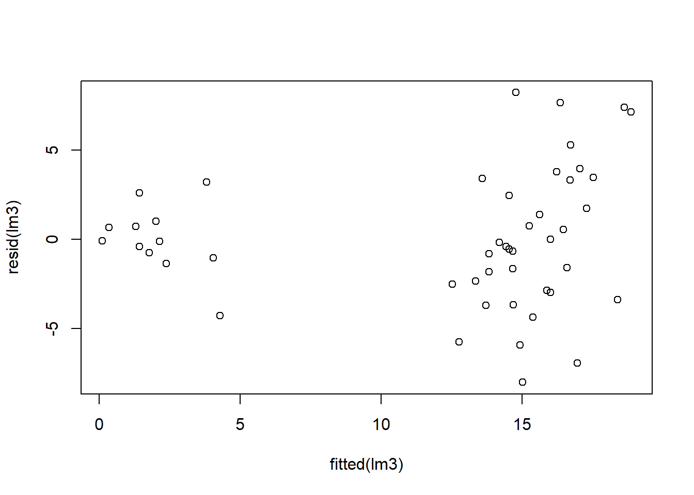
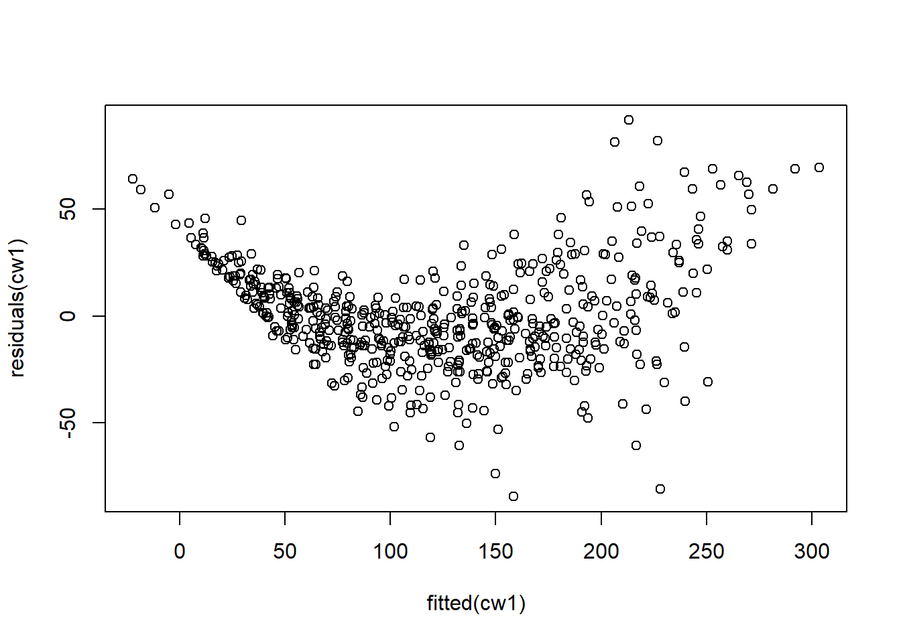

# Mixed-effect models

After completing this module, students will be able to:

* 5.1 Differentiate between fixed and random effects

* 5.2 Interpret output for fixed and random effects in R

* 5.3 Design experiments with blocks, repeated measures, and fixed effect treatments


## Interactions in statistical models

Before we learn about random effects, we will briefly cover interactions in statistical models. We will need the following libraries:


``` r
library(tidyverse)   
library(car) ### helpful for analyzing linear models
library(emmeans) ### helpful for getting means from linear models
library(multcompView)
library(glmmTMB)
library(performance)
```

For this section we will construct data using some code. For this example, we need to "doctor" up a data set. We will use the InsectSprays data set (from previous examples) but we will make a few changes. Don't worry about the changes, but the code below does this. The main one is that we have added a new column to the dataset called 'weeds', which represents the amount of weed cover in the plot.


``` r
# generate a fake dataset to use for the example
set.seed(17)
data("InsectSprays")
d <- InsectSprays %>% filter(spray=='A'|spray=='B'|spray=='C'|spray=='F') %>%
  droplevels()
d$count[13:24] <- d$count[13:24]+5
d$weeds <- abs(round(rnorm(48,2*d$count,10),1))
d$weeds[25:36] <- c(55.3,46.8,30.2,62.3,24.2,33.2,18.2,12.6,39.7,41.0,46.9,42.8)
```

Let's plot the raw data to show the count values as a function of spray types using boxplots:


``` r
ggplot(d, aes(x=spray,y=count)) +
  geom_boxplot(outlier.shape = NA) +
  geom_jitter(height=0,width=.1) 
```

<div class="figure">

<p class="caption">(\#fig:unnamed-chunk-3)Plot of insect count data.</p>
</div>

We want to look at pairwise means between these spray types. To do this we can use the emmeans package and set the pairwise arguments from the `emmeans` function as `pairwise ~ spray`. We need to apply this function to a linear model (basically an ANOVA) that assesses the counts as a function of the spray type. The pairwise comparisons are seen in the 'contrasts' section of the output below:


``` r
anova_means <- emmeans(glmmTMB(count~spray, data=d), pairwise~spray) 
anova_means
```

```
## $emmeans
##  spray emmean   SE df lower.CL upper.CL
##  A      14.50 1.26 43   11.961    17.04
##  B      20.33 1.26 43   17.794    22.87
##  C       2.08 1.26 43   -0.456     4.62
##  F      16.67 1.26 43   14.127    19.21
## 
## Confidence level used: 0.95 
## 
## $contrasts
##  contrast estimate   SE df t.ratio p.value
##  A - B       -5.83 1.78 43  -3.276  0.0108
##  A - C       12.42 1.78 43   6.973  <.0001
##  A - F       -2.17 1.78 43  -1.217  0.6198
##  B - C       18.25 1.78 43  10.249  <.0001
##  B - F        3.67 1.78 43   2.059  0.1830
##  C - F      -14.58 1.78 43  -8.190  <.0001
## 
## P value adjustment: tukey method for comparing a family of 4 estimates
```

It would also be helpful to view counts as a function of weed cover. We can do this using `facet_wrap()` and `geom_smooth`:


``` r
ggplot(d, aes(x=weeds,y=count)) +
  geom_point() +
  facet_wrap(~spray) +
  geom_smooth(method='lm')
```

```
## `geom_smooth()` using formula = 'y ~ x'
```

<div class="figure">

<p class="caption">(\#fig:unnamed-chunk-5)Insect counts plotted against weed cover for the four spray treatments.</p>
</div>

### ANCOVA: multiple intercept model

In the previous example we ran an ANOVA with only a categorical predictor. ANOVAs have long been taught to be used for categorical predictors only if your response variable is continuous. This is not entirely accurate considering that an ANOVA is the same thing as a linear model which can use continuous predictors.

For this part, let's run a model that assesses counts as a function of both a categorical and continuous variable, **spray type** and **weed cover**. This would be a biologically reasonable model to run as we see from the plots above that our counts are not only different based on spray types but also vary along a weed cover gradient where, in most cases, there are higher insect counts associated with higher weed cover.

Our goal should therefore be to assess the effects of spray types on counts while accounting for this relationship between counts and weed cover. We can incorporate both types of predictors in the same linear model format as before. With the inclusion of a continuous variable, an ANOVA is often called an ANCOVA (an analysis of covariance). Here is the basic form of the linear model with a categorical and continous variable:

$$y = \beta_{0} + \beta_{i} + \beta_{1}*x + \varepsilon$$
  $y$ is the **response variable**  
  $\beta_{0}$ is the **intercept**  
  $\beta_{i}$ is the **adjustment to the intercept** for each group $_{i}$ 
  $\beta_{1}$ is the **slope**   
  $x$ is the **predictor variable** and
  $\varepsilon$ are the residuals.  
  
Let's run our ANCOVA model:


``` r
lm1i <- glmmTMB(count ~ spray + weeds, data=d)
```

Let's get an ANOVA table with Type II sums of squares (see Box 5.1 for overview of Sums of Squares and differences with SAS Type III):


``` r
Anova(lm1i, type=2) 
```

```
## Analysis of Deviance Table (Type II Wald chisquare tests)
## 
## Response: count
##         Chisq Df Pr(>Chisq)    
## spray 228.168  3  < 2.2e-16 ***
## weeds  51.318  1  7.854e-13 ***
## ---
## Signif. codes:  0 '***' 0.001 '**' 0.01 '*' 0.05 '.' 0.1 ' ' 1
```

Note: Don't use the base `anova()`! 

If we want to look at the model coefficients we can use `summary()`:


``` r
summary(lm1i) ## model coefficients
```

```
##  Family: gaussian  ( identity )
## Formula:          count ~ spray + weeds
## Data: d
## 
##      AIC      BIC   logLik deviance df.resid 
##    254.7    265.9   -121.4    242.7       42 
## 
## 
## Dispersion estimate for gaussian family (sigma^2):  9.2 
## 
## Conditional model:
##              Estimate Std. Error z value Pr(>|z|)    
## (Intercept)   7.69502    1.29175   5.957 2.57e-09 ***
## sprayB        2.88374    1.30463   2.210   0.0271 *  
## sprayC      -13.64507    1.24977 -10.918  < 2e-16 ***
## sprayF        1.48599    1.24159   1.197   0.2314    
## weeds         0.21271    0.02969   7.164 7.85e-13 ***
## ---
## Signif. codes:  0 '***' 0.001 '**' 0.01 '*' 0.05 '.' 0.1 ' ' 1
```

There is quite a bit in that output and its difficult to piece together. What does it all mean?!?! Really all we want to do is calculate the estimated means for each group once we've accounted for the effect of weed cover. With `emmeans` we can just that -- that is, calculate estimated marginal mean for each group (ie. groups means after accounting for the effect of weeds). We can extract the emmeans means (ie. group means after accounting for the effect of weeds):


``` r
ancova_means <- emmeans(lm1i, pairwise~spray)  
ancova_means
```

```
## $emmeans
##  spray emmean    SE df lower.CL upper.CL
##  A      15.71 0.892 42   13.915    17.51
##  B      18.60 0.908 42   16.765    20.43
##  C       2.07 0.875 42    0.303     3.84
##  F      17.20 0.879 42   15.428    18.97
## 
## Confidence level used: 0.95 
## 
## $contrasts
##  contrast estimate   SE df t.ratio p.value
##  A - B       -2.88 1.30 42  -2.210  0.1370
##  A - C       13.65 1.25 42  10.918  <.0001
##  A - F       -1.49 1.24 42  -1.197  0.6322
##  B - C       16.53 1.26 42  13.107  <.0001
##  B - F        1.40 1.28 42   1.094  0.6952
##  C - F      -15.13 1.24 42 -12.199  <.0001
## 
## P value adjustment: tukey method for comparing a family of 4 estimates
```

If we want to plot these readouts from the emmeans output then we first need to convert this table into a data frame using `as.data.frame()`:


``` r
lm1i_coef <- as.data.frame(emmeans(lm1i, ~spray))
```

Now that we have saved the emmeans outputs into a data.frame we can extract intercepts and add slopes into new dataframe. We can do this by using the `at=list(weeds=0)' in emmeans to specify that we want to means of each spray treatment when the covariate **weeds** is equal to zero (in other words, the intercepts for each group). We also extract the slope manually from the saved model.


``` r
lm1i_coef2 <- as.data.frame(emmeans(lm1i,
                                    ~spray,
                                    at=list(weeds=0)))
lm1i_coef2$slope <- coef(lm1i)[5]
```

We can now plot the data with the fitted model and also color in specific values of importance. We can color code the different intercepts as well as the different means:


``` r
ggplot(data=d, aes(x=weeds,y=count)) +
  geom_point() +
  facet_wrap(~spray) + 
  geom_abline(data=lm1i_coef2,
              aes(intercept=emmean, slope=slope)) +
  geom_point(data=lm1i_coef2,
             aes(x=0,y=emmean),color="red") +
  geom_point(data=lm1i_coef,
             aes(x=mean(d$weeds),y=emmean),
             color="blue", size=2)
```

```
## Warning: Removed 4 rows containing missing values or values outside the scale range
## (`geom_abline()`).
```

<div class="figure">

<p class="caption">(\#fig:unnamed-chunk-12)Plot of insect counts against weed cover for each spray type. Red dots represent intercepts and blue dots represent emmeans.</p>
</div>

+------------------------------------------------------------------------------------------------------------------------------------------------------------------------------------------------------------------------------------------------------------------------------------------------------------------------------------------------------------------------------------------+
| **Box 5.1. Sums of Squares** In `car::Anova()` the Type II sums of squares is the default and is preferred over Type I or III. Type II SS are calculated based on the principal of marginally, meaning the test statistic for each term in the model is calculated after all other terms excluding the term's high-order relatives. How the car package calculates SS is different from SAS. In SAS, Type III SS are almost always preferred. In `car::Anova()` Type II are similar to Type III in SAS, although there are some differences. See the help for `??car::Anova` for additional information. Long story short, Type II SS are preferred in `car::Anova()`. |
+------------------------------------------------------------------------------------------------------------------------------------------------------------------------------------------------------------------------------------------------------------------------------------------------------------------------------------------------------------------------------------------+

### ANCOVA: multiple intercept AND slope model

In the previous example above we ran a ANCOVA to account for variation around the intercept. The idea being: weed cover percentages are associated with insect counts and therefore they need to be accounted for because different spray types were done across a gradient of weed cover. For example, in the previous plot, **Spray A** tended to have plots with low weed cover, whereas **Spray B** tended to have plots with high weed cover (mostly >40%). Therefore, we assumed that insect counts, and therefore the intercepts per spray type, would be different. The previous model does a good job at capturing these different intercepts for each spray type.

There is one problem with the previous model, though. Look at the fitted regression line for **Spray C** -- it doesn't fit that well. The intercept looks way too low, the slope looks too steep, but the emmean estimate looks ok. If we wanted to also account for different slope values across the grass cover gradient then we can do so by including an interaction term between spray type and weeds. This would be done by coding in the interaction as `spray:weeds` into the model predictors as shown below.

This is how we do an ANCOVA with multiple intercept and slopes:


``` r
lm1is <- glmmTMB(count ~ spray + weeds + spray:weeds, data=d)
```

The above code essentially translates to: "Use a linear model to assess count as a function of the additive effects of spray and weeds as well as the interactive effect of the two predictors.

Another shorthand way to code the above would be:


``` r
glmmTMB(count ~ spray * weeds, data=d)
```

```
## Formula:          count ~ spray * weeds
## Data: d
##       AIC       BIC    logLik  df.resid 
##  235.0966  251.9375 -108.5483        39 
## 
## Number of obs: 48
## 
## Dispersion estimate for gaussian family (sigma^2): 5.39 
## 
## Fixed Effects:
## 
## Conditional model:
##  (Intercept)        sprayB        sprayC        sprayF         weeds  
##     5.619629      2.440333     -2.441188      0.613378      0.277584  
## sprayB:weeds  sprayC:weeds  sprayF:weeds  
##    -0.009947     -0.306581      0.018897
```

Let's get an ANOVA table and a summary of the model as we did in the previous examples:


``` r
Anova(lm1is, type=2)
```

```
## Analysis of Deviance Table (Type II Wald chisquare tests)
## 
## Response: count
##               Chisq Df Pr(>Chisq)    
## spray       389.083  3  < 2.2e-16 ***
## weeds        87.510  1  < 2.2e-16 ***
## spray:weeds  33.852  3  2.129e-07 ***
## ---
## Signif. codes:  0 '***' 0.001 '**' 0.01 '*' 0.05 '.' 0.1 ' ' 1
```

``` r
summary(lm1is)
```

```
##  Family: gaussian  ( identity )
## Formula:          count ~ spray + weeds + spray:weeds
## Data: d
## 
##      AIC      BIC   logLik deviance df.resid 
##    235.1    251.9   -108.5    217.1       39 
## 
## 
## Dispersion estimate for gaussian family (sigma^2): 5.39 
## 
## Conditional model:
##               Estimate Std. Error z value Pr(>|z|)    
## (Intercept)   5.619629   1.677717   3.350 0.000809 ***
## sprayB        2.440333   3.111865   0.784 0.432921    
## sprayC       -2.441188   2.545417  -0.959 0.337532    
## sprayF        0.613378   2.227141   0.275 0.783001    
## weeds         0.277584   0.048074   5.774 7.74e-09 ***
## sprayB:weeds -0.009947   0.073238  -0.136 0.891963    
## sprayC:weeds -0.306581   0.067566  -4.537 5.69e-06 ***
## sprayF:weeds  0.018897   0.060668   0.311 0.755434    
## ---
## Signif. codes:  0 '***' 0.001 '**' 0.01 '*' 0.05 '.' 0.1 ' ' 1
```

From the ANOVA table we can see all three terms (the two main effects as well as the interaction) are all highly significant. The `summary()` output is difficult to make sense of. Once again we can use `emmeans` to calculate the estimated marginal mean for each group (ie. groups means after accounting for the effect of weeds):


``` r
ancova_is_means <- emmeans(lm1is, pairwise~spray)  
```

```
## NOTE: Results may be misleading due to involvement in interactions
```

``` r
ancova_is_means
```

```
## $emmeans
##  spray emmean    SE df lower.CL upper.CL
##  A      16.09 0.724 39   14.620    17.55
##  B      18.15 0.808 39   16.517    19.78
##  C       2.09 0.670 39    0.729     3.44
##  F      17.41 0.677 39   16.042    18.78
## 
## Confidence level used: 0.95 
## 
## $contrasts
##  contrast estimate    SE df t.ratio p.value
##  A - B      -2.065 1.080 39  -1.904  0.2432
##  A - C      14.000 0.987 39  14.185  <.0001
##  A - F      -1.326 0.991 39  -1.337  0.5453
##  B - C      16.065 1.050 39  15.305  <.0001
##  B - F       0.739 1.050 39   0.702  0.8958
##  C - F     -15.326 0.953 39 -16.089  <.0001
## 
## P value adjustment: tukey method for comparing a family of 4 estimates
```

In addition to retrieving estimated means we should also calculate and extract the different slope values. We can calculate the slope for each group with `emtrends()`:


``` r
ancova_is_slopes <- emtrends(lm1is, pairwise~spray, var="weeds")  
ancova_is_slopes
```

```
## $emtrends
##  spray weeds.trend     SE df lower.CL upper.CL
##  A           0.278 0.0481 39    0.180    0.375
##  B           0.268 0.0553 39    0.156    0.379
##  C          -0.029 0.0475 39   -0.125    0.067
##  F           0.296 0.0370 39    0.222    0.371
## 
## Confidence level used: 0.95 
## 
## $contrasts
##  contrast estimate     SE df t.ratio p.value
##  A - B     0.00995 0.0732 39   0.136  0.9991
##  A - C     0.30658 0.0676 39   4.537  0.0003
##  A - F    -0.01890 0.0607 39  -0.311  0.9894
##  B - C     0.29663 0.0728 39   4.072  0.0012
##  B - F    -0.02884 0.0665 39  -0.434  0.9723
##  C - F    -0.32548 0.0602 39  -5.407  <.0001
## 
## P value adjustment: tukey method for comparing a family of 4 estimates
```

We can extract the emmeans means (ie. group means after accounting for the effect of weeds):


``` r
lm1is_coef <- as.data.frame(emmeans(lm1is, ~spray))
```

```
## NOTE: Results may be misleading due to involvement in interactions
```

We can also extract the intercepts and add slopes into a new data frame:


``` r
lm1is_coef2a <- as.data.frame(emmeans(lm1is, ~spray, at=list(weeds=0)))
```

```
## NOTE: Results may be misleading due to involvement in interactions
```

``` r
lm1is_coef2b <- as.data.frame(emtrends(lm1is, var="weeds"))
lm1is_coef2 <- full_join(lm1is_coef2a,lm1is_coef2b,by="spray")
```

Finally we can plot the data of the fitted model:


``` r
ggplot(data=d, aes(x=weeds,y=count)) +
  geom_point() +
  facet_wrap(~spray) + 
  geom_abline(data=lm1is_coef2, aes(intercept=emmean,
                                    slope=weeds.trend), lty=2) +
  geom_point(data=lm1is_coef2, 
             aes(x=0,y=emmean),
             color="orange") +
  geom_point(data=lm1is_coef,
             aes(x=mean(d$weeds),y=emmean),
             color="purple", size=2)
```

<div class="figure">

<p class="caption">(\#fig:unnamed-chunk-20)Plot of insect counts against weed cover for each spray type. Orange dots represent intercepts and purple dots represent emmeans.</p>
</div>

Note with the plot above that we can observe the slopes differing in values compared to the previous model that only accounted for varying intercepts. Now, even for **Spray C** the intercept and slope look like good estimates.

Here's an alternative nice plot of the data with weed cover:


``` r
ggplot(d, aes(x=weeds,y=count)) +
  geom_point() + 
  facet_wrap(~spray) + 
  geom_smooth(method='lm', color='black') +
  theme_bw(base_size = 16) +
  labs(x = "Weed Coverage %", y = "Count")
```

```
## `geom_smooth()` using formula = 'y ~ x'
```

<div class="figure">

<p class="caption">(\#fig:unnamed-chunk-21)Plot of insect counts against weed cover for each spray type.</p>
</div>

## Block Designs

### Data prep and Plotting

Let's load the packages and data. Note we are using the InsectSprays data set one again.


``` r
library(tidyverse)
library(car)
library(glmmTMB)
data("InsectSprays")
```

Now we can add our blocks to the data by constructing a vector of factor variables using the `as.factor(rep(c(1:12), 6))`. This code essentially builds 12 different blocks in the data set with each block being comprised of 6 replicates for a total of 72 replicates or samples.


``` r
InsectSprays$block <- as.factor(rep(c(1:12), 6)) 
d <- InsectSprays %>%
  filter(spray=='A'|spray=='B'|spray=='C'|spray=='F')
glimpse(d)
```

```
## Rows: 48
## Columns: 3
## $ count <dbl> 10, 7, 20, 14, 14, 12, 10, 23, 17, 20, 14, 13, 11, 17, 21, 11, 1…
## $ spray <fct> A, A, A, A, A, A, A, A, A, A, A, A, B, B, B, B, B, B, B, B, B, B…
## $ block <fct> 1, 2, 3, 4, 5, 6, 7, 8, 9, 10, 11, 12, 1, 2, 3, 4, 5, 6, 7, 8, 9…
```

We can graph the data by treatment group based on spray type by using a combination of raw data points and boxplots:


``` r
#plot data by treatment group
ggplot(d, aes(x=spray,y=count)) +
  geom_boxplot(outlier.shape = NA) +
  geom_jitter(height=0,width=.1)
```

<div class="figure">

<p class="caption">(\#fig:unnamed-chunk-24)Plot of insect counts.</p>
</div>

A plot by treatment and block (note one observation per block, which is why the boxplots are just a point and line):


``` r
ggplot(d, aes(x=spray,y=count)) +
  geom_boxplot(outlier.shape = NA) +
  geom_jitter(height=0,width=.1) +
  facet_wrap(~block)  #12 blocks
```

<div class="figure">

<p class="caption">(\#fig:unnamed-chunk-25)Plot of insect counts by block.</p>
</div>

### Models with block designs

If we were to ignore the blocked design in our data then we would simply run a linear model of counts as a function of spray type:


``` r
lm1 <- glmmTMB(count~spray, data=d)
Anova(lm1)
```

```
## Analysis of Deviance Table (Type II Wald chisquare tests)
## 
## Response: count
##        Chisq Df Pr(>Chisq)    
## spray 86.656  3  < 2.2e-16 ***
## ---
## Signif. codes:  0 '***' 0.001 '**' 0.01 '*' 0.05 '.' 0.1 ' ' 1
```

We can easily account for the blocking factors by adding the **block** variable to our model as a fixed effect. We can see there is still a significant **Spray** effect and also a significant **block** effect.


``` r
lm2 <- glmmTMB(count~spray+block, data=d)
Anova(lm2)
```

```
## Analysis of Deviance Table (Type II Wald chisquare tests)
## 
## Response: count
##         Chisq Df Pr(>Chisq)    
## spray 141.948  3  < 2.2e-16 ***
## block  30.627 11   0.001262 ** 
## ---
## Signif. codes:  0 '***' 0.001 '**' 0.01 '*' 0.05 '.' 0.1 ' ' 1
```

### Blocks as random effects

In the previous example, we aren't necessarily interested in testing the significance, or estimating parameters, for the **block** effect -- we just want to account for it. Therefore, **block** may be more appropriate fitted as a *random* effect. Another nice thing about the `glmmTMB()` function is that we can also incorporate random effects. In this section we will utilize random effects to account for blocks as opposed to fixed effects in the models prior to this section.

Now let's set up a linear mixed effect model with a block as a random effect (random intercept). The syntax to set this up is relatively similar to how we specify a regular linear model. However to add a random effect we utilize parentheses. More specifically we include the term `(1|block)` to include a random intercept that varies across blocks:


``` r
# block as random effect
lm3 <- glmmTMB(count~spray+(1|block), data=d)
Anova(lm3)
```

```
## Analysis of Deviance Table (Type II Wald chisquare tests)
## 
## Response: count
##        Chisq Df Pr(>Chisq)    
## spray 106.46  3  < 2.2e-16 ***
## ---
## Signif. codes:  0 '***' 0.001 '**' 0.01 '*' 0.05 '.' 0.1 ' ' 1
```

In the ANOVA table above, we can see the results for the **spray** effect. 

+------------------------------------------------------------------------------------------------------------------------------------------------------------------------------------------------------------------------------------------------------------------------------------------------------------------------------------------------------------------------------------------+
| **Box 5.2. Alternative packages for linear mixed models** Another great package for running linear mixed models the `lme4` package. This was actually a precursor to glmmTMB -- for the part, glmmTMB has superceded lme4, although there are a few things that are usefully implemented in lme4 that are not available with glmmTMB objects. One is the extension package `lmerTest` which calculates F-values, Type III SS, and p-values using algorithms borrowed from SAS. The `anova()` function is from the `lmerTest` package and uses Type III SS. See Box 5.1 for a refresher on sums of squares. The results are usually similar between glmmTMB and lme4, but sometimes its useful to be able to obtain F-values for mixed models. |
+------------------------------------------------------------------------------------------------------------------------------------------------------------------------------------------------------------------------------------------------------------------------------------------------------------------------------------------------------------------------------------------+


Now let's compare the model for blocks as fixed vs. random effects:


``` r
# compare summary() for fixed vs. random blocking effect
summary(lm2)
```

```
##  Family: gaussian  ( identity )
## Formula:          count ~ spray + block
## Data: d
## 
##      AIC      BIC   logLik deviance df.resid 
##    285.9    315.9   -127.0    253.9       32 
## 
## 
## Dispersion estimate for gaussian family (sigma^2): 11.6 
## 
## Conditional model:
##             Estimate Std. Error z value Pr(>|z|)    
## (Intercept)  10.3541     1.9052   5.435 5.49e-08 ***
## sprayB        0.8333     1.3913   0.599 0.549213    
## sprayC      -12.4167     1.3913  -8.924  < 2e-16 ***
## sprayF        2.1667     1.3913   1.557 0.119412    
## block2        0.5000     2.4099   0.207 0.835624    
## block3        7.7500     2.4099   3.216 0.001300 ** 
## block4        4.2500     2.4099   1.764 0.077802 .  
## block5        4.0000     2.4099   1.660 0.096946 .  
## block6        2.7500     2.4099   1.141 0.253808    
## block7        2.5000     2.4099   1.037 0.299545    
## block8        4.7500     2.4099   1.971 0.048717 *  
## block9        8.2500     2.4099   3.423 0.000618 ***
## block10       8.7500     2.4099   3.631 0.000282 ***
## block11       3.5000     2.4099   1.452 0.146400    
## block12       2.7500     2.4099   1.141 0.253808    
## ---
## Signif. codes:  0 '***' 0.001 '**' 0.01 '*' 0.05 '.' 0.1 ' ' 1
```

``` r
summary(lm3)
```

```
##  Family: gaussian  ( identity )
## Formula:          count ~ spray + (1 | block)
## Data: d
## 
##      AIC      BIC   logLik deviance df.resid 
##    287.5    298.8   -137.8    275.5       42 
## 
## Random effects:
## 
## Conditional model:
##  Groups   Name        Variance Std.Dev.
##  block    (Intercept)  3.539   1.881   
##  Residual             15.487   3.935   
## Number of obs: 48, groups:  block, 12
## 
## Dispersion estimate for gaussian family (sigma^2): 15.5 
## 
## Conditional model:
##             Estimate Std. Error z value Pr(>|z|)    
## (Intercept)  14.5000     1.2592  11.516  < 2e-16 ***
## sprayB        0.8333     1.6066   0.519    0.604    
## sprayC      -12.4167     1.6066  -7.729 1.09e-14 ***
## sprayF        2.1667     1.6066   1.349    0.177    
## ---
## Signif. codes:  0 '***' 0.001 '**' 0.01 '*' 0.05 '.' 0.1 ' ' 1
```

``` r
coef(lm3)    ## prints model coefficients
```

```
## $block
##    (Intercept)    sprayB    sprayC   sprayF
## 1     12.52003 0.8333361 -12.41666 2.166669
## 2     12.75882 0.8333361 -12.41666 2.166669
## 3     16.22128 0.8333361 -12.41666 2.166669
## 4     14.54975 0.8333361 -12.41666 2.166669
## 5     14.43035 0.8333361 -12.41666 2.166669
## 6     13.83338 0.8333361 -12.41666 2.166669
## 7     13.71398 0.8333361 -12.41666 2.166669
## 8     14.78854 0.8333361 -12.41666 2.166669
## 9     16.46007 0.8333361 -12.41666 2.166669
## 10    16.69886 0.8333361 -12.41666 2.166669
## 11    14.19156 0.8333361 -12.41666 2.166669
## 12    13.83338 0.8333361 -12.41666 2.166669
```

Notice the different outputs above and how they differ between the model types. When blocks are added as a fixed effect in `lm2` we see every block effect in the summary. Whereas for the mixed effect model `lm3`, the effect of block is not printed in the summary; rather, we have to print it out using the `coef()`. The coefficients for the spray treatment types are essentially the same as well as the standard errors between the two models.

Let's check residuals:


``` r
plot(resid(lm2)~fitted(lm2)) # check residuals of fixed-effect block models
```


``` r
plot(resid(lm3)~fitted(lm3)) # check residuals of random-effect block model
```



``` r
hist(resid(lm2))
```


``` r
hist(resid(lm3))
```


Finally, we can compare estimated marginal means:


``` r
emmeans(lm2, pairwise~spray) ## fixed effect block
```

```
## $emmeans
##  spray emmean    SE df lower.CL upper.CL
##  A      14.50 0.984 32  12.4960    16.50
##  B      15.33 0.984 32  13.3293    17.34
##  C       2.08 0.984 32   0.0793     4.09
##  F      16.67 0.984 32  14.6627    18.67
## 
## Results are averaged over the levels of: block 
## Confidence level used: 0.95 
## 
## $contrasts
##  contrast estimate   SE df t.ratio p.value
##  A - B      -0.833 1.39 32  -0.599  0.9316
##  A - C      12.417 1.39 32   8.924  <.0001
##  A - F      -2.167 1.39 32  -1.557  0.4166
##  B - C      13.250 1.39 32   9.523  <.0001
##  B - F      -1.333 1.39 32  -0.958  0.7737
##  C - F     -14.583 1.39 32 -10.481  <.0001
## 
## Results are averaged over the levels of: block 
## P value adjustment: tukey method for comparing a family of 4 estimates
```

``` r
emmeans(lm3, pairwise~spray) ## random effect block
```

```
## $emmeans
##  spray emmean   SE df lower.CL upper.CL
##  A      14.50 1.26 42   11.959    17.04
##  B      15.33 1.26 42   12.792    17.87
##  C       2.08 1.26 42   -0.458     4.62
##  F      16.67 1.26 42   14.126    19.21
## 
## Confidence level used: 0.95 
## 
## $contrasts
##  contrast estimate   SE df t.ratio p.value
##  A - B      -0.833 1.61 42  -0.519  0.9541
##  A - C      12.417 1.61 42   7.729  <.0001
##  A - F      -2.167 1.61 42  -1.349  0.5379
##  B - C      13.250 1.61 42   8.247  <.0001
##  B - F      -1.333 1.61 42  -0.830  0.8400
##  C - F     -14.583 1.61 42  -9.077  <.0001
## 
## P value adjustment: tukey method for comparing a family of 4 estimates
```

The results are similar for the fixed and random effect model, so what's the difference? We will discuss the advantages of random effects in lecture and cover other aspects in the sections below.

## Variance components

One of the major differences for mixed-effect models is that we can calculate the **variance component** of the random effects. We will go through how to do this in lecture, but basically the **variance component** is how much variation there is among the intercepts of the levels of the random effect. In the InsectSprays example, if the block had very little effect on the insect counts (all blocks are about the same), the variance component would be low (near zero). However, if there was a large amount of variation among the blocks (some blocks as very few insects and some had a lot), the variance component would be high. The concept of variance components is closely related to the **coefficient of determination** or $R^2$. 

### R2

Let's review the $R^2$ using some fake data we will make up. The code below will make a dataset with 8 sites. At each site, temperature (temp) was measured, so just one temp per site. Body size was measured on 5 insects per site, with each measured indivdual getting a unique ID. Make and view the dataset below:


``` r
set.seed(10)
fakedata <- data.frame(Site=factor(40), ID=factor(40), temp=double(40), size=double(40), stringsAsFactors = F)
fakedata$Site <- rep(1:8, each=5)
fakedata$ID <- rep(1:5, times=8)
fakedata$temp <- rep(c(10,18,12,15,8,11,10,16), each=5)
fakedata$size <- round(rnorm(40, (2*fakedata$temp), 8), 1)

head(fakedata)
```

```
##   Site ID temp size
## 1    1  1   10 20.1
## 2    1  2   10 18.5
## 3    1  3   10  9.0
## 4    1  4   10 15.2
## 5    1  5   10 22.4
## 6    2  1   18 39.1
```

``` r
hist(fakedata$size)
```


Make a plot of the data:


``` r
ggplot(fakedata, aes(x=temp, y=size)) + 
  geom_point() + 
  geom_smooth(method="lm") + 
  theme_bw(base_size=16)
```

```
## `geom_smooth()` using formula = 'y ~ x'
```

<div class="figure">

<p class="caption">(\#fig:unnamed-chunk-33)Size plotted against temp.</p>
</div>

Calculate R2 for linear model and linear mixed model. Obe nice thing about the simple `lm()` function is that it is easy to obtain the R2.

``` r
lm1 <- lm(size ~ temp , data=fakedata)
summary(lm1) # look at R2 from MuMIn package
```

```
## 
## Call:
## lm(formula = size ~ temp, data = fakedata)
## 
## Residuals:
##     Min      1Q  Median      3Q     Max 
## -13.101  -5.146   0.216   5.060  12.193 
## 
## Coefficients:
##             Estimate Std. Error t value Pr(>|t|)    
## (Intercept)  -6.4118     4.5097  -1.422    0.163    
## temp          2.2515     0.3492   6.447 1.39e-07 ***
## ---
## Signif. codes:  0 '***' 0.001 '**' 0.01 '*' 0.05 '.' 0.1 ' ' 1
## 
## Residual standard error: 7.157 on 38 degrees of freedom
## Multiple R-squared:  0.5224,	Adjusted R-squared:  0.5098 
## F-statistic: 41.57 on 1 and 38 DF,  p-value: 1.39e-07
```

For the mixed model, where is the R2?

``` r
lmm1 <- glmmTMB(size ~ temp + (1|Site), data=fakedata)
summary(lmm1)
```

```
##  Family: gaussian  ( identity )
## Formula:          size ~ temp + (1 | Site)
## Data: fakedata
## 
##      AIC      BIC   logLik deviance df.resid 
##    273.4    280.2   -132.7    265.4       36 
## 
## Random effects:
## 
## Conditional model:
##  Groups   Name        Variance Std.Dev.
##  Site     (Intercept) 11.84    3.441   
##  Residual             36.83    6.068   
## Number of obs: 40, groups:  Site, 8
## 
## Dispersion estimate for gaussian family (sigma^2): 36.8 
## 
## Conditional model:
##             Estimate Std. Error z value Pr(>|z|)    
## (Intercept)  -6.4119     6.1743  -1.038    0.299    
## temp          2.2515     0.4781   4.709 2.49e-06 ***
## ---
## Signif. codes:  0 '***' 0.001 '**' 0.01 '*' 0.05 '.' 0.1 ' ' 1
```


Load `performance` package to calculate R2 for mixed models. Note that we get two values, $R^2m$ and $R^2c$. $R^2m$ is the marginal $R^2$ for the fixed-effects and $R^2c$ is the conditional $R^2$ for the fixed plus random effects. The `MuMIn` package also has a function `r.squaredGLMM()` that calculates $R^2m$ and $R^2c$. Usually the results are identical, but sometimes not (as $R^2$ for generalized mixed models are still being developed). So, use a bit of caution. For example, be suspitous if you see a very high $R^2m$ (>0.9).


``` r
library(performance)
r2(lmm1)
```

```
## # R2 for Mixed Models
## 
##   Conditional R2: 0.643
##      Marginal R2: 0.529
```

### Chick weight example

Load in the ChickWeight dataset. It contains weight (g) of small chickens grown on four different diets. Chickens were weighed every few days for 21 days.

``` r
data("ChickWeight")
ChickWeight$Diet <- as.factor(ChickWeight$Diet)
?ChickWeight
```

```
## starting httpd help server ... done
```

``` r
head(ChickWeight)
```

```
## Grouped Data: weight ~ Time | Chick
##   weight Time Chick Diet
## 1     42    0     1    1
## 2     51    2     1    1
## 3     59    4     1    1
## 4     64    6     1    1
## 5     76    8     1    1
## 6     93   10     1    1
```


Plot out data

``` r
ggplot(ChickWeight, aes(x=Time,y=weight))+
  geom_point()+
  facet_wrap(~Diet)+
  geom_smooth(method="lm")+
  theme_bw(base_size = 16)
```

```
## `geom_smooth()` using formula = 'y ~ x'
```

<div class="figure">

<p class="caption">(\#fig:unnamed-chunk-38)Chick weight by week on the four different diets.</p>
</div>
Construct a regular linear model ignoring chick

``` r
cw0 <- glmmTMB(weight ~ Time * Diet , data=ChickWeight)
Anova(cw0)
```

```
## Analysis of Deviance Table (Type II Wald chisquare tests)
## 
## Response: weight
##              Chisq Df Pr(>Chisq)    
## Time      1761.751  1  < 2.2e-16 ***
## Diet       113.477  3  < 2.2e-16 ***
## Time:Diet   70.601  3  3.173e-15 ***
## ---
## Signif. codes:  0 '***' 0.001 '**' 0.01 '*' 0.05 '.' 0.1 ' ' 1
```


Examine means at time 20

``` r
emmeans(cw0, pairwise~Diet, at=list(Time=20)) # All contrasts are significant
```

```
## NOTE: Results may be misleading due to involvement in interactions
```

```
## $emmeans
##  Diet emmean   SE  df lower.CL upper.CL
##  1       168 3.95 569      160      176
##  2       201 5.17 569      191      211
##  3       247 5.17 569      237      257
##  4       225 5.30 569      215      235
## 
## Confidence level used: 0.95 
## 
## $contrasts
##  contrast      estimate   SE  df t.ratio p.value
##  Diet1 - Diet2    -33.0 6.50 569  -5.084  <.0001
##  Diet1 - Diet3    -78.9 6.50 569 -12.144  <.0001
##  Diet1 - Diet4    -57.3 6.61 569  -8.674  <.0001
##  Diet2 - Diet3    -45.9 7.30 569  -6.283  <.0001
##  Diet2 - Diet4    -24.3 7.40 569  -3.279  0.0061
##  Diet3 - Diet4     21.6 7.40 569   2.923  0.0189
## 
## P value adjustment: tukey method for comparing a family of 4 estimates
```


Construct a new model with chick as fixed effect

``` r
cw1a <- glmmTMB(weight ~ Time * Diet + Chick , data=ChickWeight)
```

```
## dropping columns from rank-deficient conditional model: Chick^47, Chick^48, Chick^49
```

``` r
summary(cw1a) ## look for R2
```

```
##  Family: gaussian  ( identity )
## Formula:          weight ~ Time * Diet + Chick
## Data: ChickWeight
## 
##      AIC      BIC   logLik deviance df.resid 
##   5431.7   5671.5  -2660.8   5321.7      523 
## 
## 
## Dispersion estimate for gaussian family (sigma^2):  584 
## 
## Conditional model:
##              Estimate Std. Error z value Pr(>|z|)    
## (Intercept)  196.2615    49.3936   3.973 7.08e-05 ***
## Time           6.6906     0.2474  27.047  < 2e-16 ***
## Diet2       -133.6647    29.8694  -4.475 7.64e-06 ***
## Diet3         93.6606   132.3998   0.707  0.47931    
## Diet4       -800.0810   318.8249  -2.509  0.01209 *  
## Chick.L     1502.0057   538.9094   2.787  0.00532 ** 
## Chick.Q     1070.1507   554.1817   1.931  0.05348 .  
## Chick.C      673.7465   362.1979   1.860  0.06286 .  
## Chick^4       43.8753    67.7943   0.647  0.51751    
## Chick^5     -618.1626   301.4119  -2.051  0.04028 *  
## Chick^6     -595.7249   280.7504  -2.122  0.03385 *  
## Chick^7      -39.1387    18.4354  -2.123  0.03375 *  
## Chick^8      451.8890   195.4582   2.312  0.02078 *  
## Chick^9      364.8086   177.0176   2.061  0.03932 *  
## Chick^10      16.9198    44.0390   0.384  0.70083    
## Chick^11    -178.3482    81.8023  -2.180  0.02924 *  
## Chick^12    -177.5333    99.0864  -1.792  0.07318 .  
## Chick^13    -116.1829    65.5923  -1.771  0.07651 .  
## Chick^14     -20.6745    14.3656  -1.439  0.15010    
## Chick^15      89.9792    50.4586   1.783  0.07455 .  
## Chick^16     163.1248    88.2217   1.849  0.06445 .  
## Chick^17     146.0524    72.1376   2.025  0.04290 *  
## Chick^18       6.7008    18.7118   0.358  0.72026    
## Chick^19    -200.1907    93.3114  -2.145  0.03192 *  
## Chick^20    -200.9105    95.0470  -2.114  0.03453 *  
## Chick^21     -20.5819    14.9446  -1.377  0.16845    
## Chick^22     145.1502    67.9424   2.136  0.03265 *  
## Chick^23     156.5127    75.6180   2.070  0.03847 *  
## Chick^24      61.5087    38.2141   1.610  0.10749    
## Chick^25     -36.2350    12.3280  -2.939  0.00329 ** 
## Chick^26     -36.5757    33.8045  -1.082  0.27926    
## Chick^27     -82.5708    51.0420  -1.618  0.10573    
## Chick^28     -98.9502    50.2965  -1.967  0.04914 *  
## Chick^29     -24.8506    16.0039  -1.553  0.12048    
## Chick^30      78.3099    42.4720   1.844  0.06521 .  
## Chick^31     156.3767    77.9511   2.006  0.04485 *  
## Chick^32      12.0154     8.0104   1.500  0.13362    
## Chick^33      60.8397    26.7850   2.271  0.02312 *  
## Chick^34      87.6695    40.1077   2.186  0.02883 *  
## Chick^35      17.7933    10.1954   1.745  0.08094 .  
## Chick^36      42.9841    25.7234   1.671  0.09472 .  
## Chick^37     -27.0019    16.9516  -1.593  0.11119    
## Chick^38      96.3421    50.8375   1.895  0.05808 .  
## Chick^39    -189.9712    92.6935  -2.049  0.04042 *  
## Chick^40     -95.4900    59.2927  -1.610  0.10729    
## Chick^41      92.7147    49.5890   1.870  0.06153 .  
## Chick^42     -52.6442    19.0304  -2.766  0.00567 ** 
## Chick^43     -96.4086    33.2667  -2.898  0.00375 ** 
## Chick^44     -60.4537    24.9001  -2.428  0.01519 *  
## Chick^45    -102.5664    45.1616  -2.271  0.02314 *  
## Chick^46     -13.8247    13.8978  -0.995  0.31986    
## Chick^47           NA         NA      NA       NA    
## Chick^48           NA         NA      NA       NA    
## Chick^49           NA         NA      NA       NA    
## Time:Diet2     1.9185     0.4088   4.693 2.69e-06 ***
## Time:Diet3     4.7322     0.4088  11.576  < 2e-16 ***
## Time:Diet4     2.9653     0.4142   7.159 8.11e-13 ***
## ---
## Signif. codes:  0 '***' 0.001 '**' 0.01 '*' 0.05 '.' 0.1 ' ' 1
```

There are some problems with this model. Basically, there are so many levels of *chick* that the model errors out (runs out of degrees of freedom). This causes the Hessian matrix warning.

Examine means at time 20 for the new model with the chick fixed-effect.

``` r
emmeans(cw1a, pairwise~Diet, at=list(Time=20)) # Contrasts similar to above
```

```
## NOTE: A nesting structure was detected in the fitted model:
##     Chick %in% Diet
```

```
## NOTE: Results may be misleading due to involvement in interactions
```

```
## $emmeans
##  Diet emmean   SE  df lower.CL upper.CL
##  1       165 3.07 523      159      171
##  2       201 3.69 523      194      208
##  3       247 3.69 523      239      254
##  4       224 3.80 523      217      232
## 
## Results are averaged over the levels of: Chick 
## Confidence level used: 0.95 
## 
## $contrasts
##  contrast      estimate   SE  df t.ratio p.value
##  Diet1 - Diet2    -35.4 4.80 523  -7.383  <.0001
##  Diet1 - Diet3    -81.3 4.80 523 -16.951  <.0001
##  Diet1 - Diet4    -58.9 4.88 523 -12.052  <.0001
##  Diet2 - Diet3    -45.9 5.22 523  -8.798  <.0001
##  Diet2 - Diet4    -23.5 5.30 523  -4.428  0.0001
##  Diet3 - Diet4     22.4 5.30 523   4.236  0.0002
## 
## Results are averaged over the levels of: Chick 
## P value adjustment: tukey method for comparing a family of 4 estimates
```


Construct model with chick as a random (block) effect. No more warnings when chick is a random effect!

``` r
cw1 <- glmmTMB(weight ~ Time * Diet + (1|Chick), data=ChickWeight)
summary(cw1) ## look for variance component. Where is R2 ???
```

```
##  Family: gaussian  ( identity )
## Formula:          weight ~ Time * Diet + (1 | Chick)
## Data: ChickWeight
## 
##      AIC      BIC   logLik deviance df.resid 
##   5508.0   5551.6  -2744.0   5488.0      568 
## 
## Random effects:
## 
## Conditional model:
##  Groups   Name        Variance Std.Dev.
##  Chick    (Intercept) 498.0    22.32   
##  Residual             638.4    25.27   
## Number of obs: 578, groups:  Chick, 50
## 
## Dispersion estimate for gaussian family (sigma^2):  638 
## 
## Conditional model:
##             Estimate Std. Error z value Pr(>|z|)    
## (Intercept)  31.5079     5.9114   5.330 9.82e-08 ***
## Time          6.7130     0.2573  26.086  < 2e-16 ***
## Diet2        -2.8807    10.1920  -0.283    0.777    
## Diet3       -13.2565    10.1920  -1.301    0.193    
## Diet4        -0.3930    10.2008  -0.039    0.969    
## Time:Diet2    1.8962     0.4267   4.444 8.85e-06 ***
## Time:Diet3    4.7098     0.4267  11.037  < 2e-16 ***
## Time:Diet4    2.9494     0.4323   6.823 8.91e-12 ***
## ---
## Signif. codes:  0 '***' 0.001 '**' 0.01 '*' 0.05 '.' 0.1 ' ' 1
```

Examine means at time 20 for the new model with the chick random-effect

``` r
emmeans(cw1, pairwise~Diet, at=list(Time=20)) # Contrasts similar to above
```

```
## NOTE: Results may be misleading due to involvement in interactions
```

```
## $emmeans
##  Diet emmean   SE  df lower.CL upper.CL
##  1       166 5.89 568      154      177
##  2       201 8.04 568      185      217
##  3       247 8.04 568      231      263
##  4       224 8.10 568      208      240
## 
## Confidence level used: 0.95 
## 
## $contrasts
##  contrast      estimate    SE  df t.ratio p.value
##  Diet1 - Diet2    -35.0  9.97 568  -3.516  0.0027
##  Diet1 - Diet3    -80.9  9.97 568  -8.120  <.0001
##  Diet1 - Diet4    -58.6 10.00 568  -5.852  <.0001
##  Diet2 - Diet3    -45.9 11.40 568  -4.035  0.0004
##  Diet2 - Diet4    -23.6 11.40 568  -2.063  0.1665
##  Diet3 - Diet4     22.3 11.40 568   1.958  0.2055
## 
## P value adjustment: tukey method for comparing a family of 4 estimates
```

Print off only variance component

``` r
cvar <- VarCorr(cw1)
print(cvar, comp=c("Variance","Std.Dev."))
```

```
## 
## Conditional model:
##  Groups   Name        Variance Std.Dev.
##  Chick    (Intercept) 498.02   22.316  
##  Residual             638.41   25.267
```


Print off anova table. 

``` r
Anova(cw1) ## Anova() from car package.
```

```
## Analysis of Deviance Table (Type II Wald chisquare tests)
## 
## Response: weight
##              Chisq Df Pr(>Chisq)    
## Time      3088.536  1  < 2.2e-16 ***
## Diet        20.221  3  0.0001527 ***
## Time:Diet  131.333  3  < 2.2e-16 ***
## ---
## Signif. codes:  0 '***' 0.001 '**' 0.01 '*' 0.05 '.' 0.1 ' ' 1
```


Examine model residuals. Residuals are not great, but we'll fix this later. For now we will proceed with caution.

``` r
plot(resid(cw1)~fitted(cw1)) 
```

<div class="figure">

<p class="caption">(\#fig:unnamed-chunk-47)Residual plots.</p>
</div>

Examine emmeans and contrasts

``` r
emmeans(cw1, pairwise~Diet, at=list(Time=20)) # 4 of 6 differ at time 20
```

```
## NOTE: Results may be misleading due to involvement in interactions
```

```
## $emmeans
##  Diet emmean   SE  df lower.CL upper.CL
##  1       166 5.89 568      154      177
##  2       201 8.04 568      185      217
##  3       247 8.04 568      231      263
##  4       224 8.10 568      208      240
## 
## Confidence level used: 0.95 
## 
## $contrasts
##  contrast      estimate    SE  df t.ratio p.value
##  Diet1 - Diet2    -35.0  9.97 568  -3.516  0.0027
##  Diet1 - Diet3    -80.9  9.97 568  -8.120  <.0001
##  Diet1 - Diet4    -58.6 10.00 568  -5.852  <.0001
##  Diet2 - Diet3    -45.9 11.40 568  -4.035  0.0004
##  Diet2 - Diet4    -23.6 11.40 568  -2.063  0.1665
##  Diet3 - Diet4     22.3 11.40 568   1.958  0.2055
## 
## P value adjustment: tukey method for comparing a family of 4 estimates
```

Calculate R2 for the mixed-model

``` r
r2(cw1)
```

```
## # R2 for Mixed Models
## 
##   Conditional R2: 0.873
##      Marginal R2: 0.773
```

Question: How much of the variance in weight is explained by Diet and Time? How much by Chick?
Harder question: calculate the R2c by hand based (based on lecture notes) on the R2m and variance components (just to check)


## Split-plot and nested designs


``` r
library(tidyverse)
library(glmmTMB)
library(emmeans)
library(MuMIn)
library(agridat) ## install and load package for datasets
library(multcomp) ## install and load package for multiple comparisons
```

Some experimental treatments are easier to apply than others. Or, some treatments work better in bigger plots while others work better in smaller plots. For these logistical reasons (and others), ecologists often design their experiments with some nestedness. Lets take a look at the dataset below as an example. The 'gomez.multilocsplitplot' dataset contains data on rice yield from an experiment that manipulated nitrogen (6 levels) and genotype (2 levels). Logistically, it is much easier to apply nitrogen to big plots and then plant the two genotypes within those plots (see lecture notes for sketch of design). The experiment was setup at three locations (blocks). 

Based on the experimental design, do we have the same number of independent plots (ie. true replicates) for the nitrogen treatment and the genotype treatment? Remember, nitrogen was added to big (whole) plots and then the genotypes were planted within that (split-plots). So, what we have is a **split-plot design**. Let's take a look at how to analyze these data.

Load the rice data and process for analyses.

``` r
data("gomez.multilocsplitplot")
gomez.multilocsplitplot$nitro <- as.factor(gomez.multilocsplitplot$nitro)
gomez <- gomez.multilocsplitplot
head(gomez)
```

```
##   loc nitro rep gen yield
## 1  L1     0  R1  G1  1979
## 2  L1    30  R1  G1  4572
## 3  L1    60  R1  G1  5630
## 4  L1    90  R1  G1  7153
## 5  L1   120  R1  G1  7223
## 6  L1   150  R1  G1  7239
```

``` r
?gomez.multilocsplitplot
```


``` r
ggplot(gomez, aes(x=gen, y=yield, fill=nitro))+
  geom_boxplot(outlier.shape = NA)+
  geom_point(position = position_jitterdodge(jitter.height=0,jitter.width=.1))+
  facet_wrap(~loc)
```

<div class="figure">

<p class="caption">(\#fig:unnamed-chunk-52)Boxplot of gomez rice data.</p>
</div>

One addition aspect of the experiment is that there were additional replicates planted within each plot. This technically creates another level of nestedness, which we need to deal with. For now, we will average the data by loc, nitro, gen to account for pseudo-replication (n = 36 plots total).


``` r
gomez_summarized <- gomez %>% group_by(loc,nitro,gen) %>% summarize(yield=mean(yield, na.rm=T))
```

```
## `summarise()` has grouped output by 'loc', 'nitro'. You can override using the
## `.groups` argument.
```

Now we are ready to fit a linear model to the data. To see the difference between no block, blocking, and split-plot designs, we will make a model for each of these. Take a look at the anova table for each, keeping an eye especially of the DF values. 

Start with a regular two-way anova using summarized dataset -- no blocking. 

``` r
mm0 <- glmmTMB(yield ~ gen*nitro, data=gomez_summarized)
Anova(mm0)
```

```
## Analysis of Deviance Table (Type II Wald chisquare tests)
## 
## Response: yield
##              Chisq Df Pr(>Chisq)    
## gen        11.6485  1  0.0006426 ***
## nitro     170.7516  5  < 2.2e-16 ***
## gen:nitro   1.4288  5  0.9211385    
## ---
## Signif. codes:  0 '***' 0.001 '**' 0.01 '*' 0.05 '.' 0.1 ' ' 1
```

Two-way anova with block as a random effect

``` r
mm1 <- glmmTMB(yield ~ gen*nitro+(1|loc), data=gomez_summarized)
Anova(mm1)
```

```
## Analysis of Deviance Table (Type II Wald chisquare tests)
## 
## Response: yield
##              Chisq Df Pr(>Chisq)    
## gen        12.5997  1  0.0003858 ***
## nitro     184.6953  5  < 2.2e-16 ***
## gen:nitro   1.5455  5  0.9077652    
## ---
## Signif. codes:  0 '***' 0.001 '**' 0.01 '*' 0.05 '.' 0.1 ' ' 1
```


Two-way anova with block and nitro nested within block as random effects.

``` r
mm2 <- glmmTMB(yield ~ gen*nitro+(1|loc/nitro), data=gomez_summarized)
```

```
## Warning in finalizeTMB(TMBStruc, obj, fit, h, data.tmb.old): Model convergence
## problem; non-positive-definite Hessian matrix. See vignette('troubleshooting')
```

``` r
Anova(mm2)
```

```
## Analysis of Deviance Table (Type II Wald chisquare tests)
## 
## Response: yield
##              Chisq Df Pr(>Chisq)    
## gen        28.6780  1  8.547e-08 ***
## nitro     107.1280  5  < 2.2e-16 ***
## gen:nitro   3.5214  5     0.6201    
## ---
## Signif. codes:  0 '***' 0.001 '**' 0.01 '*' 0.05 '.' 0.1 ' ' 1
```

Summary for split-plot model

``` r
summary(mm2)
```

```
##  Family: gaussian  ( identity )
## Formula:          yield ~ gen * nitro + (1 | loc/nitro)
## Data: gomez_summarized
## 
##      AIC      BIC   logLik deviance df.resid 
##       NA       NA       NA       NA       21 
## 
## Random effects:
## 
## Conditional model:
##  Groups    Name        Variance  Std.Dev.
##  nitro:loc (Intercept) 1.586e+05 398.2967
##  loc       (Intercept) 5.281e-01   0.7267
##  Residual              1.085e+05 329.4078
## Number of obs: 36, groups:  nitro:loc, 18; loc, 3
## 
## Dispersion estimate for gaussian family (sigma^2): 1.09e+05 
## 
## Conditional model:
##                Estimate Std. Error z value Pr(>|z|)    
## (Intercept)     3392.67     298.41  11.369  < 2e-16 ***
## genG2            305.88     268.96   1.137    0.255    
## nitro30         1652.82     422.02   3.916 8.99e-05 ***
## nitro60         2380.84     422.02   5.642 1.69e-08 ***
## nitro90         2993.67     422.02   7.094 1.31e-12 ***
## nitro120        3119.38     422.02   7.392 1.45e-13 ***
## nitro150        2794.73     422.02   6.622 3.54e-11 ***
## genG2:nitro30    464.86     380.37   1.222    0.222    
## genG2:nitro60    275.19     380.37   0.723    0.469    
## genG2:nitro90    532.03     380.37   1.399    0.162    
## genG2:nitro120    24.67     380.37   0.065    0.948    
## genG2:nitro150   396.02     380.37   1.041    0.298    
## ---
## Signif. codes:  0 '***' 0.001 '**' 0.01 '*' 0.05 '.' 0.1 ' ' 1
```

emmeans for just for nitro and genotype)

``` r
emmeans(mm2, pairwise~nitro)
```

```
## NOTE: Results may be misleading due to involvement in interactions
```

```
## $emmeans
##  nitro emmean  SE df lower.CL upper.CL
##  0       3546 266 21     2992     4100
##  30      5431 266 21     4877     5985
##  60      6064 266 21     5510     6618
##  90      6805 266 21     6251     7359
##  120     6677 266 21     6123     7231
##  150     6538 266 21     5984     7092
## 
## Results are averaged over the levels of: gen 
## Confidence level used: 0.95 
## 
## $contrasts
##  contrast            estimate  SE df t.ratio p.value
##  nitro0 - nitro30       -1885 377 21  -5.004  0.0007
##  nitro0 - nitro60       -2518 377 21  -6.685  <.0001
##  nitro0 - nitro90       -3260 377 21  -8.652  <.0001
##  nitro0 - nitro120      -3132 377 21  -8.313  <.0001
##  nitro0 - nitro150      -2993 377 21  -7.944  <.0001
##  nitro30 - nitro60       -633 377 21  -1.681  0.5582
##  nitro30 - nitro90      -1374 377 21  -3.648  0.0163
##  nitro30 - nitro120     -1246 377 21  -3.309  0.0342
##  nitro30 - nitro150     -1107 377 21  -2.940  0.0735
##  nitro60 - nitro90       -741 377 21  -1.968  0.3922
##  nitro60 - nitro120      -613 377 21  -1.628  0.5904
##  nitro60 - nitro150      -474 377 21  -1.259  0.8030
##  nitro90 - nitro120       128 377 21   0.340  0.9993
##  nitro90 - nitro150       267 377 21   0.709  0.9788
##  nitro120 - nitro150      139 377 21   0.369  0.9990
## 
## Results are averaged over the levels of: gen 
## P value adjustment: tukey method for comparing a family of 6 estimates
```

``` r
emmeans(mm2, pairwise~gen)
```

```
## NOTE: Results may be misleading due to involvement in interactions
```

```
## $emmeans
##  gen emmean  SE df lower.CL upper.CL
##  G1    5550 122 21     5296     5803
##  G2    6138 122 21     5884     6391
## 
## Results are averaged over the levels of: nitro 
## Confidence level used: 0.95 
## 
## $contrasts
##  contrast estimate  SE df t.ratio p.value
##  G1 - G2      -588 110 21  -5.355  <.0001
## 
## Results are averaged over the levels of: nitro
```

### Additional nesting
Above we dealt with the extra replicates by averaging them to avoid pseudo-replication. However, we can ully embrace the nestedness and include plot as a random effect instead of averaging (n=108 data points, use them all!). Let's do this now and compare the results to the model `mm2` above.

Two-way anova with block, nitro, and gen nested within block as random effects, using the full dataset.

``` r
mm3 <- glmmTMB(yield ~ gen*nitro+(1|loc/nitro/gen), data=gomez)
```

```
## Warning in finalizeTMB(TMBStruc, obj, fit, h, data.tmb.old): Model convergence
## problem; non-positive-definite Hessian matrix. See vignette('troubleshooting')
```

``` r
Anova(mm3) ## identical to averaged model in mm2
```

```
## Analysis of Deviance Table (Type II Wald chisquare tests)
## 
## Response: yield
##              Chisq Df Pr(>Chisq)    
## gen        16.6251  1  4.554e-05 ***
## nitro     243.6201  5  < 2.2e-16 ***
## gen:nitro   2.0375  5     0.8439    
## ---
## Signif. codes:  0 '***' 0.001 '**' 0.01 '*' 0.05 '.' 0.1 ' ' 1
```

``` r
summary(mm3)  ## additional variance component, so no information sacrificed
```

```
##  Family: gaussian  ( identity )
## Formula:          yield ~ gen * nitro + (1 | loc/nitro/gen)
## Data: gomez
## 
##      AIC      BIC   logLik deviance df.resid 
##       NA       NA       NA       NA       92 
## 
## Random effects:
## 
## Conditional model:
##  Groups        Name        Variance  Std.Dev. 
##  gen:nitro:loc (Intercept) 3.756e+00 1.938e+00
##  nitro:loc     (Intercept) 2.267e-08 1.506e-04
##  loc           (Intercept) 7.300e-01 8.544e-01
##  Residual                  5.618e+05 7.495e+02
## Number of obs: 108, groups:  gen:nitro:loc, 36; nitro:loc, 18; loc, 3
## 
## Dispersion estimate for gaussian family (sigma^2): 5.62e+05 
## 
## Conditional model:
##                Estimate Std. Error z value Pr(>|z|)    
## (Intercept)     3392.52     249.85  13.578  < 2e-16 ***
## genG2            306.14     353.34   0.866    0.386    
## nitro30         1652.49     353.34   4.677 2.91e-06 ***
## nitro60         2380.66     353.34   6.738 1.61e-11 ***
## nitro90         2994.36     353.34   8.475  < 2e-16 ***
## nitro120        3119.27     353.34   8.828  < 2e-16 ***
## nitro150        2795.04     353.34   7.910 2.56e-15 ***
## genG2:nitro30    464.71     499.69   0.930    0.352    
## genG2:nitro60    275.15     499.69   0.551    0.582    
## genG2:nitro90    531.64     499.69   1.064    0.287    
## genG2:nitro120    24.81     499.69   0.050    0.960    
## genG2:nitro150   395.80     499.69   0.792    0.428    
## ---
## Signif. codes:  0 '***' 0.001 '**' 0.01 '*' 0.05 '.' 0.1 ' ' 1
```

Now look at emmeans for nitro and gen

``` r
emmeans(mm3, pairwise~nitro)
```

```
## NOTE: Results may be misleading due to involvement in interactions
```

```
## $emmeans
##  nitro emmean  SE df lower.CL upper.CL
##  0       3546 177 92     3195     3896
##  30      5430 177 92     5080     5781
##  60      6064 177 92     5713     6415
##  90      6806 177 92     6455     7157
##  120     6677 177 92     6326     7028
##  150     6539 177 92     6188     6889
## 
## Results are averaged over the levels of: gen 
## Confidence level used: 0.95 
## 
## $contrasts
##  contrast            estimate  SE df t.ratio p.value
##  nitro0 - nitro30       -1885 250 92  -7.544  <.0001
##  nitro0 - nitro60       -2518 250 92 -10.079  <.0001
##  nitro0 - nitro90       -3260 250 92 -13.049  <.0001
##  nitro0 - nitro120      -3132 250 92 -12.534  <.0001
##  nitro0 - nitro150      -2993 250 92 -11.979  <.0001
##  nitro30 - nitro60       -633 250 92  -2.535  0.1247
##  nitro30 - nitro90      -1375 250 92  -5.505  <.0001
##  nitro30 - nitro120     -1247 250 92  -4.990  <.0001
##  nitro30 - nitro150     -1108 250 92  -4.435  0.0004
##  nitro60 - nitro90       -742 250 92  -2.970  0.0428
##  nitro60 - nitro120      -613 250 92  -2.455  0.1486
##  nitro60 - nitro150      -475 250 92  -1.900  0.4088
##  nitro90 - nitro120       129 250 92   0.514  0.9955
##  nitro90 - nitro150       267 250 92   1.070  0.8922
##  nitro120 - nitro150      139 250 92   0.555  0.9936
## 
## Results are averaged over the levels of: gen 
## P value adjustment: tukey method for comparing a family of 6 estimates
```

``` r
emmeans(mm3, pairwise~gen)
```

```
## NOTE: Results may be misleading due to involvement in interactions
```

```
## $emmeans
##  gen emmean  SE df lower.CL upper.CL
##  G1    5549 102 92     5347     5752
##  G2    6138 102 92     5935     6340
## 
## Results are averaged over the levels of: nitro 
## Confidence level used: 0.95 
## 
## $contrasts
##  contrast estimate  SE df t.ratio p.value
##  G1 - G2      -588 144 92  -4.077  0.0001
## 
## Results are averaged over the levels of: nitro
```

Examine pairwise comparisons as compact letter displays (ie. CLD, sometimes called tukey groupings). Treatments that share the same number in the ".group" column do not differ significantly, while treatments that with different numbers are significantly different. Oftentimes people use letters rather than numbers. In certain cases the CLD can be convenient, although most times it is better to directly report the contrasts. Nevertheless, lets go through an example here.

First calculate the emmeans and then the CLD.

``` r
mm3em <- emmeans(mm3, pairwise~nitro)
```

```
## NOTE: Results may be misleading due to involvement in interactions
```

``` r
cld(mm3em)
```

```
##  nitro emmean  SE df lower.CL upper.CL .group
##  0       3546 177 92     3195     3896  1    
##  30      5430 177 92     5080     5781   2   
##  60      6064 177 92     5713     6415   23  
##  150     6539 177 92     6188     6889    34 
##  120     6677 177 92     6326     7028    34 
##  90      6806 177 92     6455     7157     4 
## 
## Results are averaged over the levels of: gen 
## Confidence level used: 0.95 
## P value adjustment: tukey method for comparing a family of 6 estimates 
## significance level used: alpha = 0.05 
## NOTE: If two or more means share the same grouping symbol,
##       then we cannot show them to be different.
##       But we also did not show them to be the same.
```


Extract means and make plot of nitrogen emmeans with CLD. I have manually added the letters based on the `cld()` table above.

``` r
n1 <- emmeans(mm3, ~nitro) %>% as.data.frame()
```

```
## NOTE: Results may be misleading due to involvement in interactions
```

``` r
ggplot(n1, aes(x=nitro, y=emmean)) + 
  geom_point(size=5) + 
  geom_errorbar(aes(ymin=lower.CL, ymax=upper.CL), width=0, lwd=2) + 
  ylab("yield (g) +/- 95% CI") + 
  theme_bw(base_size = 20)+
  annotate("text", x=c(1,2,3,4,5,6), y=7750, label=c("A","B","B","B","B","B"), size=10)
```

<div class="figure">

<p class="caption">(\#fig:unnamed-chunk-62)Rice yield in different nitrogen treatments. Letters indicate significant differences based on tukey-adjusted p-values.</p>
</div>

### R CHALLENGE

In this challenge we are interested in answering the question: Do grazing or Nitrogen affect insect abundance? The experiment measured insect abundances in experimental plots with nitrogen addition (control, low, medium, and high amounts of N added) and different grazing regimes (not grazed and grazed). See the image below for the physical layout of the plots.  

<div class="figure" style="text-align: center">

<p class="caption">(\#fig:unnamed-chunk-63)Example of two sites of the nitrogen x grazing experimental design.</p>
</div>
Based on the experimental design, complete the questions below:

  1. Construct an appropriate linear model
  
  2. Model assumptions met?
  
  3. Do grazing or Nitrogen affect insect abundance?
  
  4. How do the results change depending on whether you include a block or split-plot?
  
  4a. How big is the blocking and split-plot effect?

Load dataset and reorder levels. 

``` r
d1 <-read_csv("InsectData.csv")
```

```
## Rows: 48 Columns: 4
## ── Column specification ────────────────────────────────────────────────────────
## Delimiter: ","
## chr (3): N_Add, site, grazed
## dbl (1): abund
## 
## ℹ Use `spec()` to retrieve the full column specification for this data.
## ℹ Specify the column types or set `show_col_types = FALSE` to quiet this message.
```

``` r
head(d1)
```

```
## # A tibble: 6 × 4
##   abund N_Add  site  grazed
##   <dbl> <chr>  <chr> <chr> 
## 1    25 High.N A     YES   
## 2    24 Low.N  A     YES   
## 3    20 Med.N  A     YES   
## 4    17 No.N   A     YES   
## 5    20 High.N A     NO    
## 6    22 Low.N  A     NO
```

``` r
d1$N_Add <- factor(d1$N_Add, levels=c("No.N","Low.N","Med.N","High.N"))  ## reorder factor levels
```

Couple plots to begin

``` r
ggplot(d1, aes(x=abund)) + 
  geom_histogram(aes(y=..density..), color="white", fill="grey",bins=8)+
  geom_density(alpha=.5, color="red", lwd=1.5) +
  labs(title="histogram of raw data") +
  theme_bw() + theme(text = element_text(size=18))
```

```
## Warning: The dot-dot notation (`..density..`) was deprecated in ggplot2 3.4.0.
## ℹ Please use `after_stat(density)` instead.
## This warning is displayed once every 8 hours.
## Call `lifecycle::last_lifecycle_warnings()` to see where this warning was
## generated.
```


``` r
ggplot(d1, aes(y=abund, x=grazed, fill=N_Add))+
  geom_boxplot()+
  geom_point(position = position_jitterdodge(jitter.height=0,jitter.width=.1), 
             size=3, stroke=1.5, pch=21, color="grey")+
  scale_fill_manual(values=c("white","grey90","grey50","grey25"))+    
  theme_bw(base_size = 18)
```


## Repeated Measures

Many reseach projects involve collecting data on the same units through time. For example, plant ecologists may be interested in monitoring changes is plant richness in plots through time or stream biogeochemists often monitor seasonal changes in stream chemistry. These **repeated measures** are a unique case of nestedness and therefore many on the principles we learned about regarding **split-plots** also apply here. Basically, the unit being repeatedly sampled (e.g. plot or stream) is the **whole plot** while *time* is the **split-plot**. There are some more complexities of repeated measures, sometimes called **temporal autocorrelation**, that we will get to in this section. First, lets load packages and look at the chick weight data from before.   

LOAD AND PROCESSES DATA

``` r
library(tidyverse)
library(car)
library(emmeans)
library(viridis)
library(MuMIn)
library(glmmTMB) 
```


``` r
data("ChickWeight")
ChickWeight$Diet <- as.factor(ChickWeight$Diet)
?ChickWeight
```

Plot out the chick weight data

``` r
ggplot(data=ChickWeight)+
  geom_point(data=ChickWeight, aes(x=Time,y=weight, color=as.numeric(Chick)))+
  scale_color_viridis() +
  facet_wrap(~Diet)+
  geom_smooth(data=ChickWeight, method="lm",aes(x=Time,y=weight))+
  theme_bw(base_size = 16)
```

```
## `geom_smooth()` using formula = 'y ~ x'
```

<div class="figure">

<p class="caption">(\#fig:unnamed-chunk-68)Chick weight data.</p>
</div>

We've used the chick weight data before, but to refresh there are 50 chicks each given one of four diets. Chicks are weighed through time and we are interested in comparing the growth rate or final weight among the four diets. We will start by making the same model we used in Section 5.3.2 for looking at variance components. The model has weight as the response variable, time as the (fixed-effect) predictor and Chick as a random (block) effect. 


``` r
cw1 <- glmmTMB(weight ~ Time * Diet + (1|Chick), data=ChickWeight)
summary(cw1) 
```

```
##  Family: gaussian  ( identity )
## Formula:          weight ~ Time * Diet + (1 | Chick)
## Data: ChickWeight
## 
##      AIC      BIC   logLik deviance df.resid 
##   5508.0   5551.6  -2744.0   5488.0      568 
## 
## Random effects:
## 
## Conditional model:
##  Groups   Name        Variance Std.Dev.
##  Chick    (Intercept) 498.0    22.32   
##  Residual             638.4    25.27   
## Number of obs: 578, groups:  Chick, 50
## 
## Dispersion estimate for gaussian family (sigma^2):  638 
## 
## Conditional model:
##             Estimate Std. Error z value Pr(>|z|)    
## (Intercept)  31.5079     5.9114   5.330 9.82e-08 ***
## Time          6.7130     0.2573  26.086  < 2e-16 ***
## Diet2        -2.8807    10.1920  -0.283    0.777    
## Diet3       -13.2565    10.1920  -1.301    0.193    
## Diet4        -0.3930    10.2008  -0.039    0.969    
## Time:Diet2    1.8962     0.4267   4.444 8.85e-06 ***
## Time:Diet3    4.7098     0.4267  11.037  < 2e-16 ***
## Time:Diet4    2.9494     0.4323   6.823 8.91e-12 ***
## ---
## Signif. codes:  0 '***' 0.001 '**' 0.01 '*' 0.05 '.' 0.1 ' ' 1
```

``` r
Anova(cw1) 
```

```
## Analysis of Deviance Table (Type II Wald chisquare tests)
## 
## Response: weight
##              Chisq Df Pr(>Chisq)    
## Time      3088.536  1  < 2.2e-16 ***
## Diet        20.221  3  0.0001527 ***
## Time:Diet  131.333  3  < 2.2e-16 ***
## ---
## Signif. codes:  0 '***' 0.001 '**' 0.01 '*' 0.05 '.' 0.1 ' ' 1
```

Remember that the residuals from this model look weird. The histogram is great, but the residuals ~ fitted plot has funneling and curvature.

``` r
hist(resid(cw1)) ## resids from first model
```

<div class="figure">

<p class="caption">(\#fig:unnamed-chunk-70-1)Histograms of residuals.</p>
</div>

``` r
plot(residuals(cw1)~fitted(cw1)) ## resids from first model
```

<div class="figure">

<p class="caption">(\#fig:unnamed-chunk-70-2)Histograms of residuals.</p>
</div>


One of the 'unique' aspects of temporal data is that measurements closer in time are likely to be much more highly correlated than time points further apart. For example, if we correlate all the chick weights from week 2 with week 4, they will be very highly correlated, whereas week 2 vs week 10 will be less correlated:

<div class="figure">

<p class="caption">(\#fig:unnamed-chunk-71)Correlations of chick weights between different weeks.</p>
</div>

We can capture that temporal autocorrelation by fitting a special covariation or correlation structure via a random effect (more about this in lecture). Below is a model incorporating an **autoregressive covariance** (ar1) structure to account for the temporal autocorrelation:


``` r
cw1ar <- glmmTMB(weight ~ Time * Diet + ar1(0 + as.factor(Time)|Chick), data=ChickWeight)
```

In the `summary()` output notice that for the 'Chick' random effect, we have the usual variance component plus now we also get a correlation coeffiect "Corr", which is 0.97, which is very high indicating strong temporal autocorrelation. The parameter estimates are a little different, but everything else is similar to the previous model.


``` r
summary(cw1ar)
```

```
##  Family: gaussian  ( identity )
## Formula:          weight ~ Time * Diet + ar1(0 + as.factor(Time) | Chick)
## Data: ChickWeight
## 
##      AIC      BIC   logLik deviance df.resid 
##   4484.3   4532.2  -2231.1   4462.3      567 
## 
## Random effects:
## 
## Conditional model:
##  Groups   Name             Variance  Std.Dev.  Corr      
##  Chick    as.factor(Time)0 1.651e+03 4.063e+01 0.97 (ar1)
##  Residual                  2.620e-07 5.118e-04           
## Number of obs: 578, groups:  Chick, 50
## 
## Dispersion estimate for gaussian family (sigma^2): 2.62e-07 
## 
## Conditional model:
##             Estimate Std. Error z value Pr(>|z|)    
## (Intercept)  40.3595     9.0781   4.446 8.76e-06 ***
## Time          6.0679     0.3465  17.510  < 2e-16 ***
## Diet2        -0.9268    15.7205  -0.059 0.952989    
## Diet3        -2.3392    15.7239  -0.149 0.881736    
## Diet4        -1.0019    15.7209  -0.064 0.949183    
## Time:Diet2    2.2042     0.5837   3.776 0.000159 ***
## Time:Diet3    4.8553     0.5837   8.319  < 2e-16 ***
## Time:Diet4    3.1306     0.5864   5.339 9.36e-08 ***
## ---
## Signif. codes:  0 '***' 0.001 '**' 0.01 '*' 0.05 '.' 0.1 ' ' 1
```

``` r
Anova(cw1ar)
```

```
## Analysis of Deviance Table (Type II Wald chisquare tests)
## 
## Response: weight
##              Chisq Df Pr(>Chisq)    
## Time      1459.447  1  < 2.2e-16 ***
## Diet        11.624  3    0.00879 ** 
## Time:Diet   75.942  3  2.277e-16 ***
## ---
## Signif. codes:  0 '***' 0.001 '**' 0.01 '*' 0.05 '.' 0.1 ' ' 1
```

Let's take a look at the residuals:

``` r
hist(residuals(cw1ar)) ## hist looks ok
```

<div class="figure">

<p class="caption">(\#fig:unnamed-chunk-74-1)Histograms of residuals.</p>
</div>

``` r
plot(residuals(cw1ar)~fitted(cw1ar)) ## resids look great 
```

<div class="figure">

<p class="caption">(\#fig:unnamed-chunk-74-2)Histograms of residuals.</p>
</div>

They look great! It seems that the model that accounts for temporal autocorrelation fits much better than just incorporating chick as a regular random effect. We can also compare the AIC of the two models to make sure. Indeed, it is much lower for the ar1 model.


``` r
AIC(cw0,cw1ar)
```

```
##       df      AIC
## cw0    9 5728.997
## cw1ar 11 4484.270
```

Now we can look at the emmeans for the two models. Notice the estimates are similar, but the SE is much higher for the AR1 model. This changes the p-values for the contrasts a little bit too. It is important we interpret the results from the AR1 model because it is much better, even though the SEs are higher.

``` r
emmeans(cw1, pairwise~Diet, at=list(Time=20)) # Yes, 4 of 6 differ at time 20
```

```
## NOTE: Results may be misleading due to involvement in interactions
```

```
## $emmeans
##  Diet emmean   SE  df lower.CL upper.CL
##  1       166 5.89 568      154      177
##  2       201 8.04 568      185      217
##  3       247 8.04 568      231      263
##  4       224 8.10 568      208      240
## 
## Confidence level used: 0.95 
## 
## $contrasts
##  contrast      estimate    SE  df t.ratio p.value
##  Diet1 - Diet2    -35.0  9.97 568  -3.516  0.0027
##  Diet1 - Diet3    -80.9  9.97 568  -8.120  <.0001
##  Diet1 - Diet4    -58.6 10.00 568  -5.852  <.0001
##  Diet2 - Diet3    -45.9 11.40 568  -4.035  0.0004
##  Diet2 - Diet4    -23.6 11.40 568  -2.063  0.1665
##  Diet3 - Diet4     22.3 11.40 568   1.958  0.2055
## 
## P value adjustment: tukey method for comparing a family of 4 estimates
```

``` r
emmeans(cw1ar, pairwise~Diet, at=list(Time=20)) # Yes, 4 of 6 differ at time 20
```

```
## NOTE: Results may be misleading due to involvement in interactions
```

```
## $emmeans
##  Diet emmean    SE  df lower.CL upper.CL
##  1       162  9.15 567      144      180
##  2       205 12.60 567      180      230
##  3       256 12.60 567      232      281
##  4       223 12.70 567      198      248
## 
## Confidence level used: 0.95 
## 
## $contrasts
##  contrast      estimate   SE  df t.ratio p.value
##  Diet1 - Diet2    -43.2 15.6 567  -2.766  0.0298
##  Diet1 - Diet3    -94.8 15.6 567  -6.072  <.0001
##  Diet1 - Diet4    -61.6 15.6 567  -3.938  0.0005
##  Diet2 - Diet3    -51.6 17.9 567  -2.888  0.0210
##  Diet2 - Diet4    -18.5 17.9 567  -1.030  0.7317
##  Diet3 - Diet4     33.2 17.9 567   1.851  0.2506
## 
## P value adjustment: tukey method for comparing a family of 4 estimates
```

### R CHALLANGE - REPEATED MEASURES

Take a look at the 'harris.wateruse' dataset. The dataset contains information on water use by two species of horticultural trees (S1 and S2). The dataset also contains two age groups, although we will focus on just one group (A1). 10 trees of each species were assessed for water usage for approximately every 5 days over the course of a year. There are some missing values.


``` r
library(agridat)
wat <- harris.wateruse %>% filter(age=='A1')
head(wat)
```

```
##   species age tree day water
## 1      S2  A1  T01 161  0.92
## 2      S2  A1  T01 166  0.93
## 3      S2  A1  T01 170  0.86
## 4      S2  A1  T01 174  0.95
## 5      S2  A1  T01 178  0.90
## 6      S2  A1  T01 184  1.11
```

``` r
str(wat)
```

```
## 'data.frame':	520 obs. of  5 variables:
##  $ species: Factor w/ 2 levels "S1","S2": 2 2 2 2 2 2 2 2 2 2 ...
##  $ age    : Factor w/ 2 levels "A1","A2": 1 1 1 1 1 1 1 1 1 1 ...
##  $ tree   : Factor w/ 40 levels "T01","T02","T03",..: 1 1 1 1 1 1 1 1 1 1 ...
##  $ day    : int  161 166 170 174 178 184 189 194 199 206 ...
##  $ water  : num  0.92 0.93 0.86 0.95 0.9 1.11 NA 1.25 1.14 1.07 ...
```

Plot data

``` r
ggplot(data=wat, aes(x=day, y=water, color=species))+
  geom_point()+
  scale_color_viridis(discrete = T, end=.8) +
  theme_bw(base_size = 16)
```

<div class="figure">

<p class="caption">(\#fig:unnamed-chunk-78)Plot of water usage by two horticultural tree species through time.</p>
</div>

To Do:

  1. Fit several models, one that accounts for tree ID as a regular random effect and one that accounts for temporal autocorrelation. Additionally, it seems like there is some non-linearity so try a quadratic term. Choose the right fixed effects to answer the question: do the species differ in water use and does this change through time?
  
  2. Examine the residuals and AIC for your models. Which is best? If your model has temporal autocorrelation, how strong is it?
  
  3. Does water use differ between the species at these two time points: 175 days and 275 days?


## Additional LMM reading
For those of you interested in other aspects of GLMMs, we will cover other ways we tangle with statistics and data with them in the next module. However, even with another module dedicated to GLMMs we will be barely scratching the surface. If you want more information on what else we can do with these powerful models check out the box below!

+-----------------------------------------------------------------------------------------------------------------------------------------------------------------------------------------------------------------------------------------------------------------------------------------------------------------------------------------------------------------------------------------------------------------------------------------------------------------------------------------------------------------------------------------------------------------------------------------------------------+
| **Box 1. Mixed Models.**                                                                                                                                                                                                                                                                                                                                                                                                                                                                                                                                                                                  |
|                                                                                                                                                                                                                                                                                                                                                                                                                                                                                                                                                                                                           |
| Mixed-effect models are powerful tools that can help gain stronger inference or predictive power in your analyses. This is especially seen in experimental or hierarchically structured designs of studies. These models have been used to account for pseudoreplication effects but please be wary of this! Because models that don't have the proper random effect structures may actually not be accounting for the pseudoreplication! For more insight into this please read this [paper](https://arnqvist.org/tree_2020.pdf).                                                                        |
|                                                                                                                                                                                                                                                                                                                                                                                                                                                                                                                                                                                                           |
| So what else can be done with GLMMs? One thing it allows is the modeling of specific spatial and temporal structures to account for spatial or temporal autocorrelation! This is a problem with ecological data. In the context of spatial autocorrelation, patterns in your data may be a result of things being generally more similar to one another due to the spatial distance between data points than due to actual biological processes. GLMMs can account for this! For a crash course on this, check this [link](https://cran.r-project.org/web/packages/glmmTMB/vignettes/covstruct.html) out! |
+-----------------------------------------------------------------------------------------------------------------------------------------------------------------------------------------------------------------------------------------------------------------------------------------------------------------------------------------------------------------------------------------------------------------------------------------------------------------------------------------------------------------------------------------------------------------------------------------------------------+
