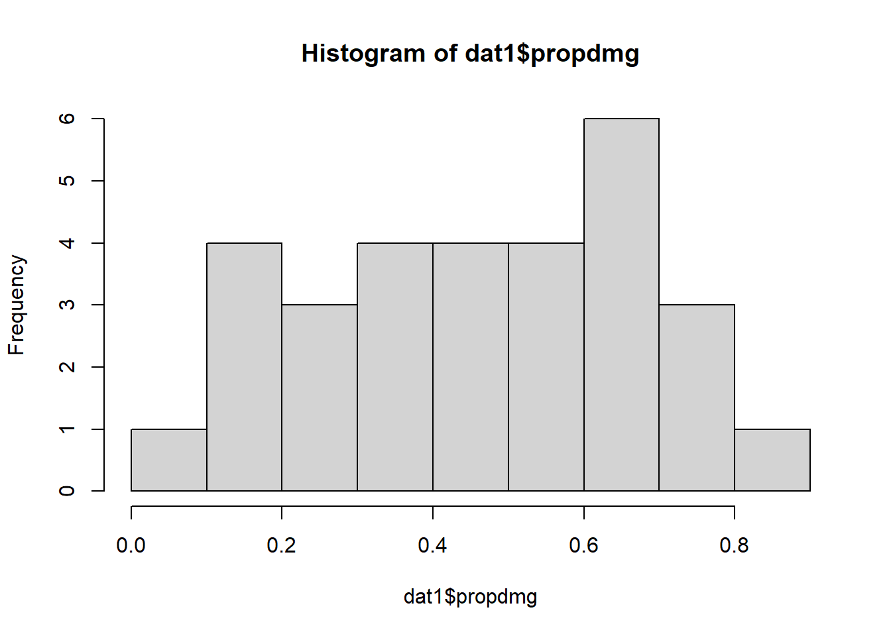
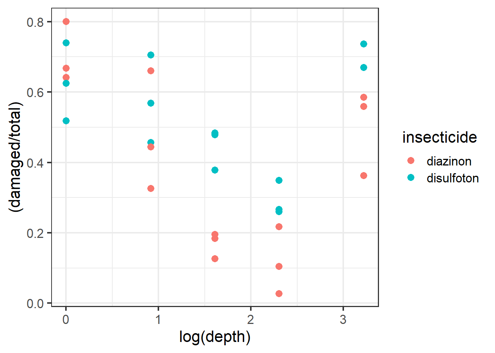
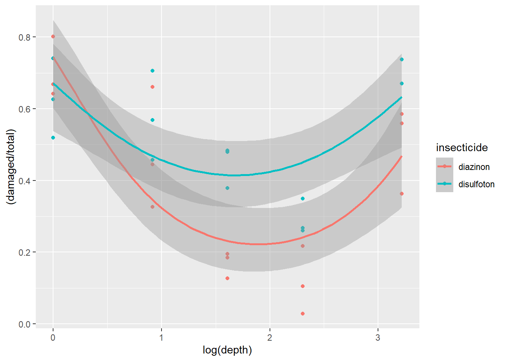
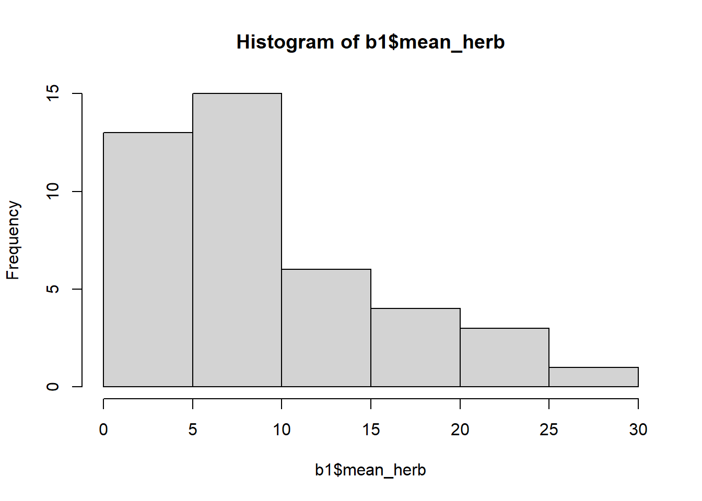
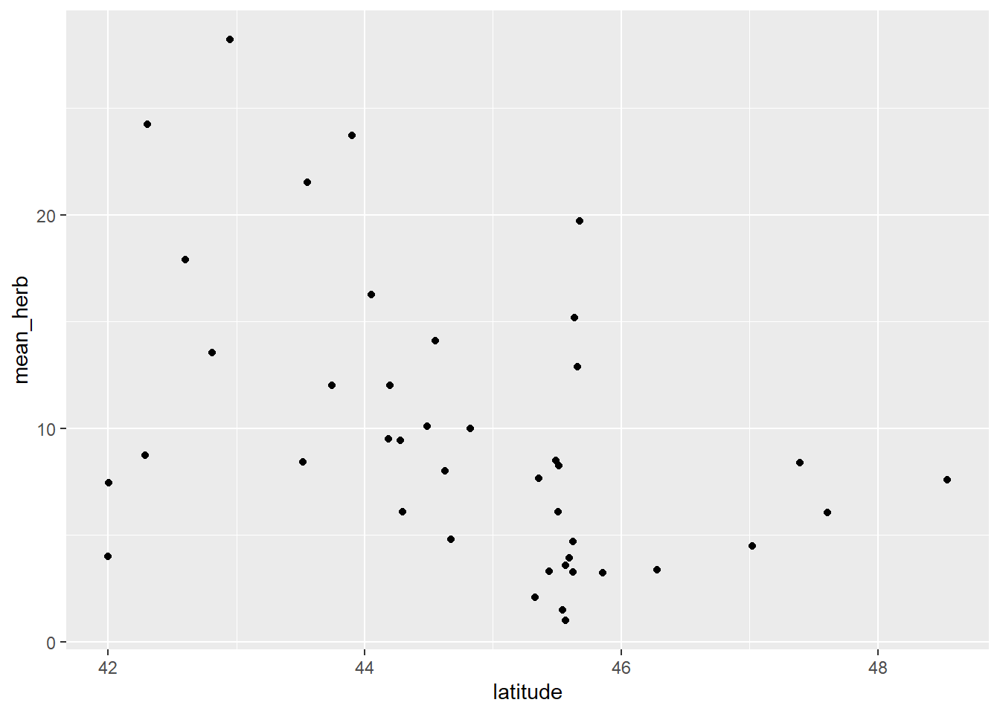
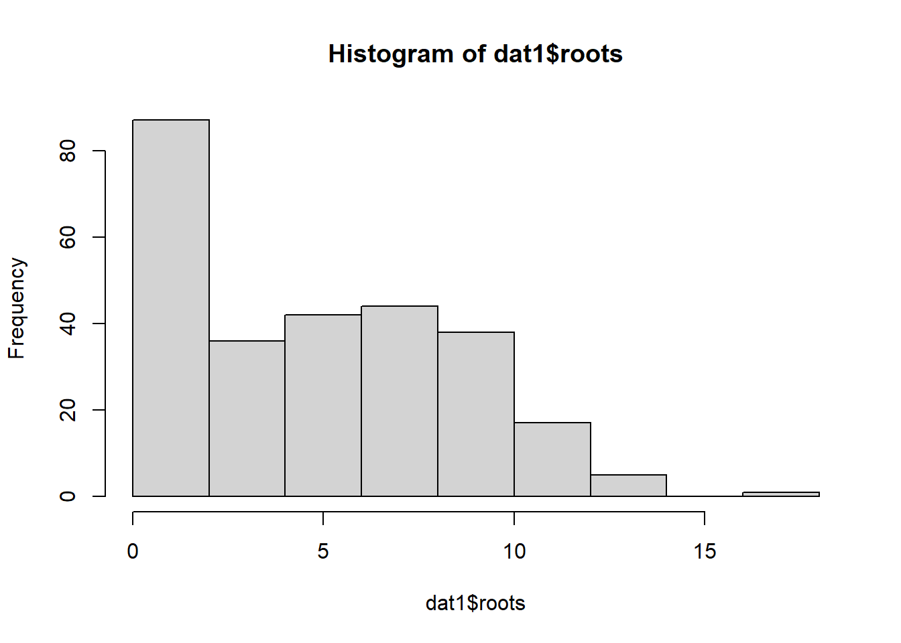
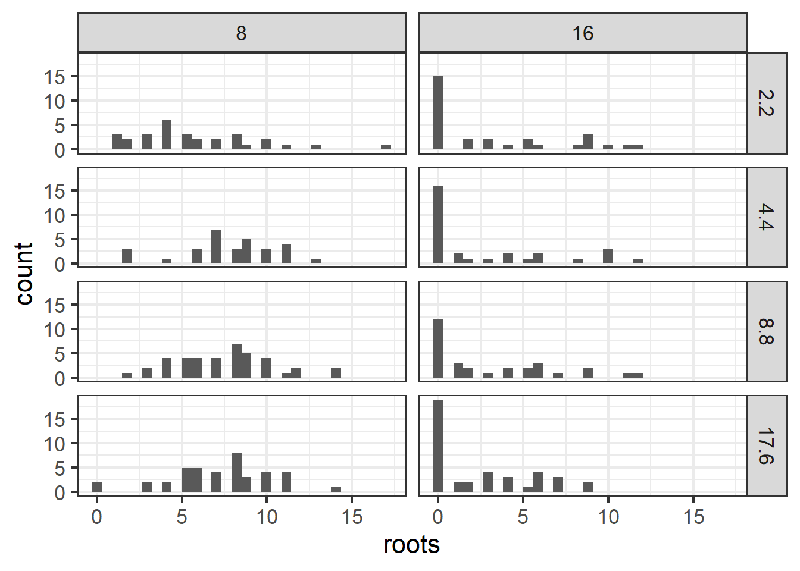
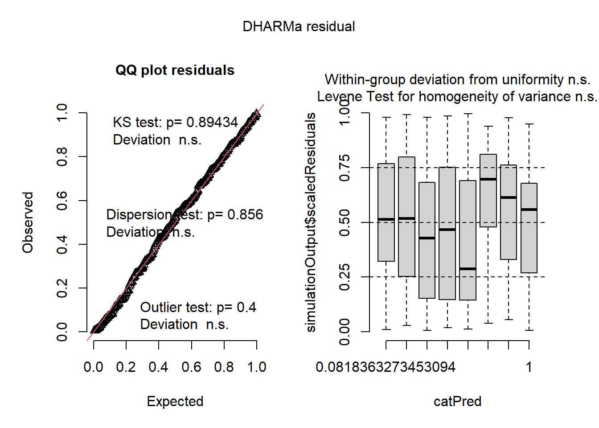

# Generalized linear mixed models

After completing this module, students will be able to:

* 6.1 Construct models with both fixed and random effects and non-normal distributions

## Poisson and NB GLMMs

In this module we will go over a variety of advanced models. We will start with Poisson generalized linear mixed effect models. The poisson error distribution is often used to model count data and because of this it is a popular tool for most biologist or ecologists as biological or ecological data is often in the form of counts (e.g., species richness). Let's first load the libraries we will need:


``` r
library(tidyverse)
library(emmeans)
library(car)
library(agridat)
library(glmmTMB)
library(DHARMa)
library(performance)
library(MuMIn)
library(bbmle)
library(aods3)
library(boot)
```

Let's load in the primary data set we will be working with and read about the `beall.webworms` data set. The variables of interest are the y-count of webworms, spray- spray treatment, and lead-lead treatment. Don't worry about the blocks or other variables for now.


``` r
data("beall.webworms")
d1 <- beall.webworms
?beall.webworms  ## info about the beall.webworms dataset
```

```
## starting httpd help server ... done
```

We can also glimpse the first several rows of the data:


``` r
head(d1) ## view data set
```

```
##   row col y block trt spray lead
## 1   1   1 1    B1  T1     N    N
## 2   2   1 0    B1  T1     N    N
## 3   3   1 1    B1  T1     N    N
## 4   4   1 3    B1  T1     N    N
## 5   5   1 6    B1  T1     N    N
## 6   6   1 0    B2  T1     N    N
```

Let's examine a plot of data where we look at the raw data points as well as violin plots of the y response variable on the y axis and the x-axis as the spray treatment and lead treatment type:


``` r
ggplot(d1, aes(x=spray, y=y, fill=lead)) +
  geom_violin(scale="width", adjust=2) + 
  geom_point(position = position_jitterdodge(jitter.width=.5,
                                             jitter.height=.1,
                                             dodge.width = 1),
             alpha=.1)+
  facet_wrap(~block)
```


Here we create two models, r1 and r2. They were previously used in module 4C. So let's first create r1. `r1` will be a Poisson GLM with the repose variable of y being ,modeled as a function of both the additive and interactive effects of spray and lead treatments.


``` r
r1 <- glm(y ~ spray * lead, data=d1, family="poisson")
summary(r1)
```

```
## 
## Call:
## glm(formula = y ~ spray * lead, family = "poisson", data = d1)
## 
## Coefficients:
##              Estimate Std. Error z value Pr(>|z|)    
## (Intercept)   0.33647    0.04688   7.177 7.12e-13 ***
## sprayY       -1.02043    0.09108 -11.204  < 2e-16 ***
## leadY        -0.49628    0.07621  -6.512 7.41e-11 ***
## sprayY:leadY  0.29425    0.13917   2.114   0.0345 *  
## ---
## Signif. codes:  0 '***' 0.001 '**' 0.01 '*' 0.05 '.' 0.1 ' ' 1
## 
## (Dispersion parameter for poisson family taken to be 1)
## 
##     Null deviance: 1955.9  on 1299  degrees of freedom
## Residual deviance: 1720.4  on 1296  degrees of freedom
## AIC: 3125.5
## 
## Number of Fisher Scoring iterations: 6
```

``` r
Anova(r1)
```

```
## Analysis of Deviance Table (Type II tests)
## 
## Response: y
##            LR Chisq Df Pr(>Chisq)    
## spray       188.707  1  < 2.2e-16 ***
## lead         42.294  1  7.853e-11 ***
## spray:lead    4.452  1    0.03485 *  
## ---
## Signif. codes:  0 '***' 0.001 '**' 0.01 '*' 0.05 '.' 0.1 ' ' 1
```

``` r
emmeans(r1, ~spray:lead, type='response') 
```

```
##  spray lead  rate     SE  df asymp.LCL asymp.UCL
##  N     N    1.400 0.0656 Inf     1.277     1.535
##  Y     N    0.505 0.0394 Inf     0.433     0.588
##  N     Y    0.852 0.0512 Inf     0.758     0.959
##  Y     Y    0.412 0.0356 Inf     0.348     0.488
## 
## Confidence level used: 0.95 
## Intervals are back-transformed from the log scale
```

We check overdispersion in the model with the `check_overdisperson` wrapper:


``` r
check_overdispersion(r1) # overdispersion ratio calculator from performance
```

```
## # Overdispersion test
## 
##        dispersion ratio =    1.355
##   Pearson's Chi-Squared = 1755.717
##                 p-value =  < 0.001
```

```
## Overdispersion detected.
```

Now let's implement the second model, `r2`, a negative binomial error distribution. While most of the information regarding this error distribution and its comparison to the Poisson should be covered in the main lecture material a brief explanation on when and why you may implement the negative binomial is as follows:

1.  The Poisson distribution assumes that the mean and the variance of the distribution are the same, so as the mean increases the variance increases the same amount. The negative binomial assumes that these two components are different, usually with the variance being greater than the mean (often the case with real world data).

2.  Poisson models can result in over-dispersion because the variance in real data is often greater than the means. This issue can lead to several problems such as but not limited to: poor model convergence, weak effect sizes of model coefficients, or p-values that are way too low.

3.  The negative binomial distribution can be used in the cases above to improve model fit or reach model convergence. Oftentimes it performs better than the poisson even if both models converge successfully. Visually examining simulated residuals is usually the best way to assess model fit. Another way is to compare AIC (Akaike information criterion) of Poisson vs negative binomial models.


``` r
r2 <- glmmTMB(y ~ spray * lead, data=d1, family="nbinom2")
Anova(r2)
```

```
## Analysis of Deviance Table (Type II Wald chisquare tests)
## 
## Response: y
##               Chisq Df Pr(>Chisq)    
## spray      125.5047  1  < 2.2e-16 ***
## lead        26.8005  1  2.256e-07 ***
## spray:lead   3.3942  1    0.06542 .  
## ---
## Signif. codes:  0 '***' 0.001 '**' 0.01 '*' 0.05 '.' 0.1 ' ' 1
```

``` r
emmeans(r2, ~spray:lead, type='response') 
```

```
##  spray lead response     SE  df asymp.LCL asymp.UCL
##  N     N       1.400 0.0855 Inf     1.242     1.578
##  Y     N       0.505 0.0441 Inf     0.425     0.599
##  N     Y       0.852 0.0611 Inf     0.741     0.981
##  Y     Y       0.412 0.0391 Inf     0.342     0.497
## 
## Confidence level used: 0.95 
## Intervals are back-transformed from the log scale
```

Now let's simulate residuals for poisson:


``` r
plot(simulateResiduals(r1))
```

```
## DHARMa:testOutliers with type = binomial may have inflated Type I error rates for integer-valued distributions. To get a more exact result, it is recommended to re-run testOutliers with type = 'bootstrap'. See ?testOutliers for details
```


``` r
hist(simulateResiduals(r1)) ## histogram should be flat
```


Here are the residuals for the negative binomial model:

``` r
plot(simulateResiduals(r2))
```


``` r
hist(simulateResiduals(r2)) ## histogram should be flat
```


We can also compare the AIC:

``` r
AIC(r1,r2)
```

```
##    df      AIC
## r1  4 3125.478
## r2  5 3052.969
```

### Improving the models: What's next?

How can we improve the models? What's next? Are there any aspects of the experimental design missing from the model that we should maybe account for similar to the grass cover predictor from the previous module?

We did notice some dispersion issues in the previous model and one way we can wrestle and address this is to implement an individual-level random effect to use for overdispersed Poission GLMs. For more information of this approach please see [this paper](https://peerj.com/articles/616/).

To do this we can construct models that includes any missing factors. In the case of overdispersed Poission GLMs we can create an observation level random effect variable by simple creating another column titled `obs` and filling it with unique number for each observation such as a sequence of numbers from 1 to the number of observations we have in the dataset:


``` r
d1$obs <- 1:length(d1$y) ## makes a unique number for each row in dataset
```

We can also create other models that include different random effects that account for blocks. In total let's run 6 different models. For the sake of clarity we have built a table to showcase the 6 different models and we have also coded them in:

| Model name | Response | Fixed Effect(s) |              Random Effect(s)               | Error Distribution |
|:------------:|:------------:|:------------:|:-----------------:|:------------:|
|     r0     |    y     |  spray \* lead  |                    none                     |      Gaussian      |
|     r1     |    y     |  spray \* lead  |                    none                     |      Poisson       |
|     r2     |    y     |  spray \* lead  |                    none                     |   Neg. Binomial    |
|     r3     |    y     |  spray \* lead  | Obs. level random effect for overdispersion |      Poisson       |
|     r4     |    y     |  spray \* lead  |             Block random effect             |   Neg. Binomial    |
|     r5     |    y     |  spray \* lead  |  Both Obs. level and Block random effects   |      Poisson       |


``` r
r0 <- glmmTMB(y ~ spray * lead, data=d1, family="gaussian")              ### gaussian glm just to see how bad it really is
r1 <- glmmTMB(y ~ spray * lead, data=d1, family="poisson")               ### poisson glm
r2 <- glmmTMB(y ~ spray * lead, data=d1, family="nbinom2")               ### nb glm
r3 <- glmmTMB(y ~ spray * lead + (1|obs), data=d1, family="poisson")     ### overdispersed poisson glm
r4 <- glmmTMB(y ~ spray * lead + (1|block), data=d1, family="nbinom2")   ### nb w/ block
r5 <- glmmTMB(y ~ spray * lead + (1|obs) + (1|block), data=d1, family="poisson")   ### OD poisson w/ block
```

Six models above differ only distribution and random effects. Fixed effects are the same. We can now use the AIC framework for selecting the most appropriate or most plausible model, distribution, and random effect structure. One key thing to remember is that the more complex models will be penalized in the calculation of AIC values:


``` r
#### for model selection, use AIC or likihood ratio test
model.sel(r0,r1,r2,r3,r4,r5) ## from MuMIn
```

```
## Model selection table 
##    cnd((Int)) dsp((Int)) cnd(led) cnd(spr) cnd(led:spr) family    random df
## r4     0.2835          +        +        +            + n2(lg)      c(b)  6
## r5     0.1399          +        +        +            + ps(lg) c(o)+c(b)  6
## r3     0.1042          +        +        +            + ps(lg)      c(o)  5
## r2     0.3365          +        +        +            + n2(lg)            5
## r1     0.3365          +        +        +            + ps(lg)            4
## r0     1.4000          +        +        +            + gs(id)            5
##       logLik   AICc  delta weight
## r4 -1497.706 3007.5   0.00  0.903
## r5 -1499.931 3011.9   4.45  0.097
## r3 -1518.031 3046.1  38.63  0.000
## r2 -1521.484 3053.0  45.54  0.000
## r1 -1558.739 3125.5 118.03  0.000
## r0 -1929.308 3868.7 861.18  0.000
## Abbreviations:
##  family: gs(id) = 'gaussian(identity)', n2(lg) = 'nbinom2(log)', 
##          ps(lg) = 'poisson(log)'
## Models ranked by AICc(x) 
## Random terms: 
##  c(b): cond(1 | block)
##  c(o): cond(1 | obs)
```

``` r
AICtab(r0,r1,r2,r3,r4,r5,base=T,logLik=T,weights=T)    ## from bbmle
```

```
##    logLik  AIC     dLogLik dAIC    df weight
## r4 -1497.7  3007.4   431.6     0.0 6  0.903 
## r5 -1499.9  3011.9   429.4     4.5 6  0.097 
## r3 -1518.0  3046.1   411.3    38.7 5  <0.001
## r2 -1521.5  3053.0   407.8    45.6 5  <0.001
## r1 -1558.7  3125.5   370.6   118.1 4  <0.001
## r0 -1929.3  3868.6     0.0   861.2 5  <0.001
```

Looks like the best model according to AIC was r4, the negative binomial GLMM with a random effect for blocks. Of course we would also want to check the model residuals and glance at the parameter estimates and SE to make sure they look reasonable.

## Binomial GLMMs

In this section we look at the binomial distribution. We often implement this distribution when we have a binary outcome in our data. For example survival is often coded as a binary where the only results can be that there is survival or there is no survival. Let's load in the data we will use:


``` r
data("wheatley.carrot")
?wheatley.carrot
```

Let's clean up the data by filtering out any insecticide value that was coded as 'nil'. Let's also create a new variable called `propdmg` which stand for damage proportion. This new variable is calculated by dividing the number of damaged plants (`damaged`) by the number of total plants (`total)`.


``` r
dat1 <- wheatley.carrot %>% filter(insecticide!='nil')
dat1$propdmg <- dat1$damaged/dat1$total
head(dat1) 
```

```
##   treatment insecticide depth rep damaged total    propdmg
## 1       T01    diazinon   1.0  R1     120   187 0.64171123
## 2       T02    diazinon   2.5  R1      60   184 0.32608696
## 3       T03    diazinon   5.0  R1      35   179 0.19553073
## 4       T04    diazinon  10.0  R1       5   178 0.02808989
## 5       T05    diazinon  25.0  R1      66   182 0.36263736
## 6       T06  disulfoton   1.0  R1      97   187 0.51871658
```

Let's visualize the distribution of the new variable as well:


``` r
hist(dat1$propdmg)
```



Now let's plot out some of the data. Let's visualize the damage proportion across different depths as well as the insecticide variable (diazinon vs. disulfoton). Because the variable depth is so wide ranging it'll be easier for us to visualize the axis if depth is log-transformed.


``` r
ggplot(dat1, aes(x=log(depth),
                 y=(damaged/total), color=insecticide)) +
  geom_point(size=3) + 
  theme_bw(base_size = 16)
```

<div class="figure">

<p class="caption">(\#fig:unnamed-chunk-17)Plot of carrot data.</p>
</div>

It would be useful to also plot a line of best fit across these data points. Note that for plotting we can use the "beta_family" although for analysis we use "binomial".


``` r
ggplot(dat1, aes(x=log(depth), y=(damaged/total), color=insecticide)) +
  geom_point(size=3) +
  geom_smooth(method='glm',
              method.args=list(family="beta_family"),
              formula = y~x) +
  theme_bw(base_size = 16)
```

```
## Warning: deviance residuals not defined for family 'beta': returning NA
## Warning: deviance residuals not defined for family 'beta': returning NA
```

<div class="figure">

<p class="caption">(\#fig:unnamed-chunk-18)Plot of carrot data with best fit line.</p>
</div>

From the plot above it looks like the best fit lines do not necessarily fit or follow the raw data well. Look at the red beta line above and notice how the line and the confidence intervals do not overlap with almost 3 different types of depth groups. This is one of the more important parts of visualizing your data before using models because we now see potential evidence that our data follow a possible non-linear trend.

To confirm this we can use ggplot2 to plot a more non-linear trend line while using the Beta family. To do this we have to switch the formula used in the `formula` argument of `geom_smooth` from `y~x` to `y~x+I(x^2)`. This change essentially means that the model used to fit the trend line is actually a quadratic model (notice the extra squared term).

| More on quadratic models                                                                                                                                                                                                                                                                                                                                                                                                                                                                                                                                                                    |
|------------------------------------------------------------------------|
| Note: A quadratic model is part of larger family of models called polynomial models. Polynomial models are used to model non-linear trends BUT they are still essentially linear regressions. One way to think about these sort of models is that we are essentially modeling the trends to have distinct slopes. Keep in mind, the interpretations of the models can be complicated and are often misinterpreted! Some decent resources for helping you understand these models can be found (here)[<https://www.datatechnotes.com/2018/02/polynomial-regression-curve-fitting-in-r.html>] |


``` r
ggplot(dat1, aes(x=log(depth), y=(damaged/total),
                 color=insecticide)) + geom_point() +
  geom_smooth(method='glm', 
              method.args=list(family="beta_family"), 
              formula = y~x+I(x^2))
```

```
## Warning: deviance residuals not defined for family 'beta': returning NA
## Warning: deviance residuals not defined for family 'beta': returning NA
```

<div class="figure">

<p class="caption">(\#fig:unnamed-chunk-19)Plot of carrot data with quadratic fit.</p>
</div>

Once we plot the new trend line and its potential non-linearity we see a generally better fit with less data points not overlapping with the confidence intervals.

Now let's build two different binomial error distributed GLMMs with different set ups that relate to either a linear assumption of the data or a non-linear assumption. To do this there are several key differences between what we have done before till now:

1.  Our response variable needs to be binary but need to account for damaged plants and non-damaged plants. This can be calculated by subtracting the number of damaged plants from the total number of plants: `total-damaged`. To combine the values of the damaged and the non damaged we use the function `cbind()` which combines the two into one vector that the model can use for a response variable: `cbind(damaged,total-damaged)`.
2.  We need to model a quadratic model for `mod2`. In order to do this we will essentially follow the same formula as we did with the ggplot above. So for `mod2` our quadratic predictor of depth would be: `depth + I(depth^2)`. Notice we do not add a quadratic component to the predictor `insecticide` as we did not see a non-linear trend with this variable.


``` r
mod1 <- glmmTMB(cbind(damaged,total-damaged) ~ insecticide * depth + (1|rep), data=dat1, family='binomial')

mod2 <- glmmTMB(cbind(damaged,total-damaged) ~ insecticide * depth + I(depth^2) + (1|rep), data=dat1, family='binomial')
```

For easier syntax interpretation note above that mod2 is applying a non-linear modification where we include depth and depth squared. The "\^" is another way of saying raise depth to the 2nd power. The I() isolate this and tells the R interpreter that the model is including a second order fixed effect. For more info check ?formula.

We can plot residuals:


``` r
plot(simulateResiduals(mod1))
```


``` r
plot(simulateResiduals(mod2))
```


Which of the two is better? Remember, the *best* model might not be perfect.

Finally, we can also run ANOVAs on the models:


``` r
Anova(mod1)
```

```
## Analysis of Deviance Table (Type II Wald chisquare tests)
## 
## Response: cbind(damaged, total - damaged)
##                    Chisq Df Pr(>Chisq)    
## insecticide       91.449  1  < 2.2e-16 ***
## depth              2.543  1  0.1107873    
## insecticide:depth 14.525  1  0.0001383 ***
## ---
## Signif. codes:  0 '***' 0.001 '**' 0.01 '*' 0.05 '.' 0.1 ' ' 1
```

``` r
Anova(mod2)
```

```
## Analysis of Deviance Table (Type II Wald chisquare tests)
## 
## Response: cbind(damaged, total - damaged)
##                    Chisq Df Pr(>Chisq)    
## insecticide       111.62  1  < 2.2e-16 ***
## depth             563.71  1  < 2.2e-16 ***
## I(depth^2)        594.17  1  < 2.2e-16 ***
## insecticide:depth  15.85  1  6.858e-05 ***
## ---
## Signif. codes:  0 '***' 0.001 '**' 0.01 '*' 0.05 '.' 0.1 ' ' 1
```

## Beta Distributions

In this section we show an example of applying the beta family using true proportions (or percentages). The beta family has major utility when modeling proportion data as in the past the most suitable distributions would have been the gamma distribution or a arcsin transformation of the y response variable.

First let's load data from a case study. The study by Lynn et al. examined herbivory on several plant species at 42 different sites spanning a large latitudinal gradient. They are interested to know if there is more herbivore damage near the equator. If you are interested in the data the paper for this is found (here)[<https://onlinelibrary.wiley.com/doi/10.1111/ecog.06114>].Let's take a look but filter species to just one for simplicity:


``` r
b1 <-read_csv("LynnETAL_2022_Ecography_sodCaseStudy.csv") %>%
  filter(species=='SALA')
```

```
## Rows: 301 Columns: 18
## ── Column specification ────────────────────────────────────────────────────────
## Delimiter: ","
## chr  (7): study, family, species_name, species, meas_year, site, notes
## dbl (11): latitude, longitude, o_lat, o_long, mean_herb, na_wdcpc, mat, iso,...
## 
## ℹ Use `spec()` to retrieve the full column specification for this data.
## ℹ Specify the column types or set `show_col_types = FALSE` to quiet this message.
```

``` r
head(b1)
```

```
## # A tibble: 6 × 18
##   study     family species_name species meas_year site  latitude longitude o_lat
##   <chr>     <chr>  <chr>        <chr>   <chr>     <chr>    <dbl>     <dbl> <dbl>
## 1 RivkinET… Alism… Sagittaria … SALA    2015      ACT-…     44.5     -77.3    NA
## 2 RivkinET… Alism… Sagittaria … SALA    2015      BPV-…     45.7     -77.6    NA
## 3 RivkinET… Alism… Sagittaria … SALA    2015      BSM-…     44.8     -76.1    NA
## 4 RivkinET… Alism… Sagittaria … SALA    2015      BTC-…     44.2     -76.8    NA
## 5 RivkinET… Alism… Sagittaria … SALA    2015      CBT-…     47.4     -79.7    NA
## 6 RivkinET… Alism… Sagittaria … SALA    2015      CFR-…     44.7     -77.1    NA
## # ℹ 9 more variables: o_long <dbl>, mean_herb <dbl>, na_wdcpc <dbl>, mat <dbl>,
## #   iso <dbl>, dtr <dbl>, precip <dbl>, aet <dbl>, notes <chr>
```


Let's examine a histogram of the response variable `mean_herb`:


``` r
hist(b1$mean_herb) ## examine histogram. Data are entered as percentage (0-100%)
```



Let's plot out the data. Note: data was collected at 42 unique sites (one data point per site).


``` r
ggplot(b1 , aes(x=latitude, y=mean_herb)) +
  geom_point()
```

<div class="figure">

<p class="caption">(\#fig:unnamed-chunk-25)Plot of herbivory data.</p>
</div>

We see a potential decreasing of mean_herb across a latitudinal gradient (from latitude 42 to \~48 degrees).

Now we need to convert `mean_herb` to a proportion and then do a small transformation to remove 0s and 1s:


``` r
b1$mean_herb1 <- (b1$mean_herb/100)
b1$mean_herb1 <- (b1$mean_herb1*(length(b1$mean_herb1)-1)+.5)/length(b1$mean_herb1)
```

Let's plot this along with a trend line applying the beta family as done previously above:


``` r
ggplot(b1, aes(x=latitude, y=mean_herb1)) + geom_point() +
  geom_smooth(method='glm', 
              method.args=list(family="beta_family"),
              formula = y~x)
```

```
## Warning: deviance residuals not defined for family 'beta': returning NA
```

<div class="figure">

<p class="caption">(\#fig:unnamed-chunk-27)Plot of herbivory by latitude with best fit line.</p>
</div>

Now let's build a GLMM with a beta distribution. Implementing this model structure is relatively simple with `glmmTMB`. In the code below we simply specify the family argument with `beta_family.`


``` r
bm1 <- glmmTMB(mean_herb1 ~ latitude, data=b1, family='beta_family')
Anova(bm1)
```

```
## Analysis of Deviance Table (Type II Wald chisquare tests)
## 
## Response: mean_herb1
##           Chisq Df Pr(>Chisq)   
## latitude 9.1383  1   0.002503 **
## ---
## Signif. codes:  0 '***' 0.001 '**' 0.01 '*' 0.05 '.' 0.1 ' ' 1
```

Let's check the summary:


``` r
summary(bm1)
```

```
##  Family: beta  ( logit )
## Formula:          mean_herb1 ~ latitude
## Data: b1
## 
##      AIC      BIC   logLik deviance df.resid 
##   -126.9   -121.7     66.5   -132.9       39 
## 
## 
## Dispersion parameter for beta family (): 30.5 
## 
## Conditional model:
##             Estimate Std. Error z value Pr(>|z|)   
## (Intercept)  5.69631    2.58221   2.206   0.0274 * 
## latitude    -0.17525    0.05797  -3.023   0.0025 **
## ---
## Signif. codes:  0 '***' 0.001 '**' 0.01 '*' 0.05 '.' 0.1 ' ' 1
```

The model indicates a strong statistical effect of latitude on `mean_herb` with lower values of `mean_herb` tracking an increase in latitude.

Plot and check residuals:


``` r
plot(simulateResiduals(bm1)) 
```


The QQ plot is good. The residuals versus prediction plot and line is not ideal but is probably ok.

### R CHALLENGE

1.  For this part of the problem set you will use real data (Rivkin et al. 2018 Am J Bot). If you want to know more about the study, follow this (link)[<https://bsapubs.onlinelibrary.wiley.com/doi/full/10.1002/ajb2.1098>].

Herbivory data was collected from 43 populations of an aquatic plant across a latitudinal gradient in Canada. At each population, many plants (\~5-15) were examined for herbivory damage. Some additional covariates were recorded, such as competition around the plant (1-3 from less to more) and plant height (cm).

Read in data, look at the data structure, and plot the variable of interest, lead damage:


``` r
d1 <-read.csv("ajb21098-sup-0002-appendixs2.csv")
head(d1)
```

```
##   Population Latitude Longitude Competition Individual PlantHeight LeafDamage
## 1     ACT-ON 44.54829 -77.32384           2          4        41.0 0.02000000
## 2     ACT-ON 44.54829 -77.32384           2          6        43.0 0.03000000
## 3     ACT-ON 44.54829 -77.32384           2         18        17.5 0.04000000
## 4     ACT-ON 44.54829 -77.32384           2          2        37.0 0.06666667
## 5     ACT-ON 44.54829 -77.32384           2          3        48.0 0.07000000
## 6     ACT-ON 44.54829 -77.32384           2         12        39.5 0.08000000
##   LarvalAbundance
## 1               0
## 2               0
## 3               0
## 4               1
## 5               0
## 6               0
```

``` r
hist(d1$LeafDamage)
```


Let's remove 0's and 1's (see Smithson & Verkuilen 2006 (here)[<https://psycnet.apa.org/doiLanding?doi=10.1037%2F1082-989X.11.1.54>] or Douma & Weedon 2018 (here)[<https://besjournals.onlinelibrary.wiley.com/doi/full/10.1111/2041-210X.13234>]):


``` r
d1$LeafDamage <- (d1$LeafDamage*(length(d1$LeafDamage)-1)+.5)/length(d1$LeafDamage)
```

Now plot data where we have a proportion value of leaf damage on the y-axis along the x-axis of latitude. Let's also fit a best fit line using the beta family:


``` r
ggplot(d1 , aes(x=Latitude, y=LeafDamage)) +
  geom_point() +
  geom_smooth(method='glm', 
              method.args=list(family="beta_family"),
              formula = y~x)
```

```
## Warning: deviance residuals not defined for family 'beta': returning NA
```


Question: Does herbivory increase towards the equator? How do residuals look? Any way to improve them?

2.  For this part of the problem set we will use the Rats data set with only females. Half treated with a drug and the other half were untreated. Then they were checked for tumors. Does the drug reduce probability of developing tumor? After 50 days? After 100 days?

Load data:


``` r
library(survival)
```

```
## Warning: package 'survival' was built under R version 4.3.3
```

```
## 
## Attaching package: 'survival'
```

```
## The following object is masked from 'package:boot':
## 
##     aml
```

``` r
rats <- (survival::rats) %>% filter(sex=='f') 
?rats
head(rats)
```

```
##   litter rx time status sex
## 1      1  1  101      0   f
## 2      1  0   49      1   f
## 3      1  0  104      0   f
## 4      3  1  104      0   f
## 5      3  0  102      0   f
## 6      3  0  104      0   f
```

Plot data:


``` r
ggplot(rats , aes(x=time, y=status)) + 
  geom_point() +
  geom_smooth(method='glm', 
              method.args=list(family="binomial"), 
              formula = y~x) + 
  facet_wrap(~rx)
```


## Zero-Inflated Models

In this section we will go over applying zero-inflated models. While the main lecture should have covered these types of models in depth, let's quickly review some main points when it comes to these models:

1.  In biological data, especially in ecology, zeros are often widespread in the dataset. However these zeroes and what they represent, i.e. absence of species, are not necessarily 'true'. For example, in a survey of species I may not have found species A at specific sites but that may not be because species A truly does not exist in those sites but instead those zeros may be due to poor sampling methods or sampling mistakes. Therefore the underlying thought is that many of these zeros in these datasets are technically 'false zeros' that should be modeled separately from the rest of the data.
2.  Therefore, because there are likely to be two distinct processes that generate zeros in a dataset a zero-inflated model will apply two types of models. The first model is a logit model that will model the excess zeros while the second model can be a count model such as a poisson or negative binomial GLM.

Now let's load the data (wheatley carrot infection by carrot fly larvae):


``` r
data("ridout.appleshoots")
```

Let's clean up the data and check out the distribution of the data in question:


``` r
dat1 <- ridout.appleshoots %>% mutate(photo=as.factor(photo))
hist(dat1$roots)
```



Now let's run several models: a Poisson, a negative binomial, and a negative binomial with a general intercept for zero inflation:


``` r
## poisson model
mod1 <- glmmTMB(roots ~ photo * bap , data=dat1, family='poisson')
plot(simulateResiduals(mod1))
```


``` r
## negative binomial model
mod2 <- glmmTMB(roots ~ photo * bap , data=dat1, family='nbinom2')
plot(simulateResiduals(mod2))
```


``` r
## negative binomial w/ a general intercept for zero inflation (ie. ZI equal for all observations)
mod3 <- glmmTMB(roots ~ photo * bap , data=dat1, family='nbinom2', zi=~1)
plot(simulateResiduals(mod3))
```


``` r
summary(mod3) ## back-transform ZI intercept (exp(p)/(1+exp(p)))
```

```
##  Family: nbinom2  ( log )
## Formula:          roots ~ photo * bap
## Zero inflation:         ~1
## Data: dat1
## 
##      AIC      BIC   logLik deviance df.resid 
##   1342.4   1364.0   -665.2   1330.4      264 
## 
## 
## Dispersion parameter for nbinom2 family (): 12.6 
## 
## Conditional model:
##              Estimate Std. Error z value Pr(>|z|)    
## (Intercept)  1.895659   0.072535  26.134   <2e-16 ***
## photo16     -0.029863   0.135890  -0.220   0.8261    
## bap          0.008760   0.006724   1.303   0.1927    
## photo16:bap -0.032083   0.013065  -2.456   0.0141 *  
## ---
## Signif. codes:  0 '***' 0.001 '**' 0.01 '*' 0.05 '.' 0.1 ' ' 1
## 
## Zero-inflation model:
##             Estimate Std. Error z value Pr(>|z|)    
## (Intercept)   -1.226      0.151  -8.125 4.49e-16 ***
## ---
## Signif. codes:  0 '***' 0.001 '**' 0.01 '*' 0.05 '.' 0.1 ' ' 1
```

``` r
inv.logit(fixef(mod3)$zi) ## use inv.logit from boot package to backtransform
```

```
## (Intercept) 
##   0.2267941
```

The zero-inflated model is much better than without, so there is definately some zero-inflation. To understand the zero-inflation parameter (-1.226) we need to back-transform it. The zero-inflated model uses a logit-link fuction, which is seperate from the distribution and link function of the main model (although in this example with the beta family, it also has a logit-link). We can do this manually or use the `inv.logit` function from the boot package. We get a value of 0.22, meaning there is a 22% change any observation will be a zero beyond what is expected by the main model assuming a beta distribution. We don't really know what causes the extra zeros, but this model does an ok job of caturing them.

Maybe we can do a little better though. What do we expect to cause the zero inflation? We can check out further details in the data's metadata:


``` r
??ridout.appleshoots
```

The metadata state that "Almost all of the shoots in the 8 hour photoperiod rooted. Under the 16 hour photoperiod only about half rooted." Perhaps the photoperiod treatment is a better predictor of extra zeros?


``` r
ggplot(dat1, aes(x=roots)) + 
  geom_histogram() +
  facet_grid(bap~photo) + 
  theme_bw(base_size=16)
```

```
## `stat_bin()` using `bins = 30`. Pick better value with `binwidth`.
```

<div class="figure">

<p class="caption">(\#fig:unnamed-chunk-43)Plot of apple shoot data.</p>
</div>

Now let's run a negative binomial with zero inflation modeled as a function of treatment:


``` r
mod4 <- glmmTMB(roots ~ photo * bap , data=dat1, family='nbinom2', zi=~photo)
summary(mod4)
```

```
##  Family: nbinom2  ( log )
## Formula:          roots ~ photo * bap
## Zero inflation:         ~photo
## Data: dat1
## 
##      AIC      BIC   logLik deviance df.resid 
##   1252.3   1277.5   -619.2   1238.3      263 
## 
## 
## Dispersion parameter for nbinom2 family (): 13.8 
## 
## Conditional model:
##              Estimate Std. Error z value Pr(>|z|)    
## (Intercept)  1.898347   0.071568  26.525   <2e-16 ***
## photo16     -0.023525   0.130488  -0.180   0.8569    
## bap          0.008222   0.006689   1.229   0.2190    
## photo16:bap -0.029492   0.012427  -2.373   0.0176 *  
## ---
## Signif. codes:  0 '***' 0.001 '**' 0.01 '*' 0.05 '.' 0.1 ' ' 1
## 
## Zero-inflation model:
##             Estimate Std. Error z value Pr(>|z|)    
## (Intercept)  -4.4000     0.8446  -5.210 1.89e-07 ***
## photo16       4.2831     0.8627   4.965 6.87e-07 ***
## ---
## Signif. codes:  0 '***' 0.001 '**' 0.01 '*' 0.05 '.' 0.1 ' ' 1
```


Plot residuals:


``` r
plot(simulateResiduals(mod4))
```




Now let's compare all models with AIC. Which one was the best? Why do you think?


``` r
### check with AIC
AIC(mod1,mod2,mod3,mod4)
```

```
##      df      AIC
## mod1  4 1575.916
## mod2  5 1412.415
## mod3  6 1342.435
## mod4  7 1252.333
```

## Model App exercise

This shinyapp will allow you to practice and implement a variety of model types to fit randomly generated data. You can test yourself by randomly generating data and then choosing which models you would apply based on plots of the data as well as the data structure (e.g. count data vs. binary).


``` r
knitr::include_app("https://leoohyama.shinyapps.io/adv_residuals/",
                   height = 1000)
```

<iframe src="https://leoohyama.shinyapps.io/adv_residuals/?showcase=0" width="100%" height="1000" data-external="1"></iframe>
